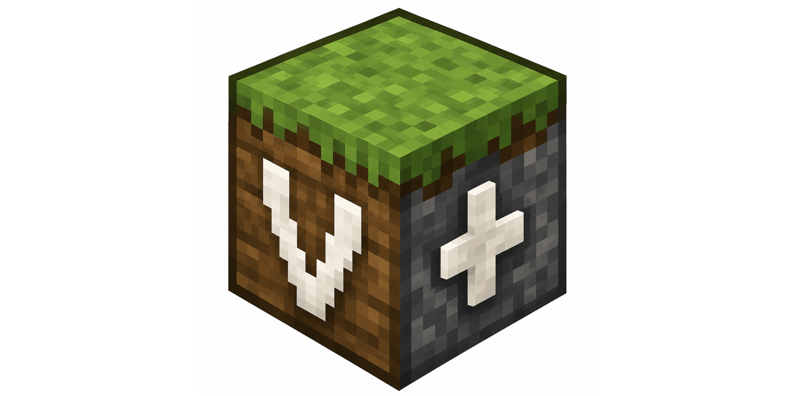

# VanillaPlusAdditions



A Minecraft NeoForge mod that enhances vanilla gameplay with useful additions while maintaining the original feel.

> 🤖 **AI Collaboration Notice**: This project was developed in collaboration with the Warp AI assistant (powered by Claude 3.5 Sonnet). The AI helped with code implementation, documentation, and project structure. While the core ideas and direction came from human creativity, the AI's assistance made this project more robust and feature-complete. We believe in transparency about AI usage while celebrating the potential of human-AI collaboration in software development.

## 🎯 Features

### 🔥 Hostile Zombified Piglins
- Makes zombified piglins always hostile in the Nether
- Configurable detection range and anger duration
- Smart targeting system with player switching

### 💀 Wither Skeleton Enforcer
- Prevents normal skeletons from spawning in Nether fortresses
- Replaces them with Wither Skeletons if enabled
- Server-wide broadcast messages for blocked spawns (in debug mode)
- TODO - Config to enable it only in Nether fortresses or the entire Nether

### ✨ MobGlow Command
- Make specific mob types glow for easier tracking
- Configurable duration (including infinite)
- Clear glow effects by type or all at once
- Perfect for server administration and debugging

### 🍎 Food Effects

Enhances food items with additional potion effects and thirst restoration.

- **Custom Potion Effects**: Add any potion effect to any item via configuration.
- **Tough As Nails Support**: 
  - Thirst restoration for drinks and food.
  - Heating/Cooling effect tooltips for items that provide them.
  - Optional dependency: works automatically if Tough As Nails is installed.
- **Always Edible**: Items configured with effects automatically become edible even if the player is full.
- **Probability System**: Effects can have a specific chance to occur (e.g., 25% chance for a gold apple to restore thirst).
- **Extensive Defaults**: Includes many default effects for Vanilla, Create, and Tough As Nails items.

### 🐦‍🔥 Better Mobs

- Enhances mob variety and challenge
- Mobs can now spawn with customizable armor and potion effects
- Configurable spawn chances and equipment tiers
- Different settings based on Y-Levels or Nether/End dimensions
- TODO - Better levels configuration (for twilight forest, etc.)

### 🐱 Cat Guardian

Turns tamed cats into active base defenders, with food bowls and an automatable feeding station.

- **Cat Bowls & Feeding Station**: Associate tamed cats with a bowl (shift-right-click). Fed cats (fish) actively guard the area and attack hostile mobs within the guard radius (default 32 blocks XZ / 16 Y, configurable).
- **Cat Armor**: Iron, Gold, Diamond and Netherite — increase attack damage and absorb incoming damage.
- **Loot & XP Collection**: Cats gather drops from kills into an internal inventory; XP from their kills is buffered and, at a feeding station, converted into Bottles o' Enchanting (hopper/Create-automatable).
- **Smart Guard AI**:
  - Returns to base after combat and re-engages nearby threats; low-health cats flee home to heal (and ignore mobs until safe).
  - Dives after underwater mobs (e.g. Drowned) with water breathing, and swims against currents toward its goal.
  - Climbs ~1.5-block ledges and walks over fences to reach targets / get home.
  - **Creepers are one-shot** at point-blank range (they fear cats, lore-friendly) — no explosion.
  - Never teleports to its owner while on guard duty.
- **Engineering Goggles overlay** (Create): looking at a guardian cat outlines the cat and its current target; looking at a bowl/station shows the associated-cat count (and, when enabled, the guard radius). Toggle the boxes with a rebindable keybind (default Numpad +).
- **Cat Inventory GUI** (ctrl-click): equip armor, view food/XP/armor bars.
- Fully localized (EN, DE, DE-AT dialect, ES, FR, CS).

### 🐺 Battle Dogs

- **Wolf Armor**: Iron, Gold, Diamond and Netherite, rendered by the vanilla wolf armor layer.
- Increases the wolf's attack damage by material tier.
- Equip by right-click, remove with shears.

### 🐟 Flying Fish

- A new aquatic mob with spawn egg, bucket, and cooked food variant.
- **Flying Fish Boots**: skim faster across the water surface and gain short leaps while sprinting on water.

### 🪦 Death Coords Logger

- Logs player death coordinates to
    - all players
    - TODO - only the deceased player
    - TODO - the server console
- Operators can teleport to death locations by clicking the message

### 📦 Stackables

- Makes non-stackable items stackable (e.g., stews, potions)
- Increases stack sizes for modded items (Tough as Nails support included)
- Configurable stack sizes for vanilla items:
  - Potions, splash potions, lingering potions (default: 16)
  - Mushroom stew, rabbit stew, beetroot soup, suspicious stew (default: 64)
- Auto-detection for Tough as Nails items:
  - All juice types (apple, melon, cactus, sweet berry, chorus fruit, glow berry, pumpkin)
  - Water bottles (dirty, purified)
  - Ice cream and Charc-Os
  - Empty canteens (all types)
- **Note**: Filled canteens with durability cannot be made stackable due to Minecraft limitations.

### 🔨 Free Anvil Repair

Pure anvil repairs cost **no XP levels** — only plain repairing is free; combining enchanted items, applying books and renaming keep vanilla costs.

- **Material repair** (e.g. diamond pickaxe + diamonds) and **combine repair** of two same-type items (when the sacrifice is unenchanted).
- Even gear that hit the "Too Expensive!" prior-work cap becomes repairable again; free repairs don't bump the prior-work penalty by default.
- **Extra repair materials** (`extra_repair_materials`, Quark-style `item=material`): out of the box **netherite gear repairs with diamonds** and **Create's diving gear** with its base material (copper / diamonds). Add your own combos; entries for uninstalled items are skipped.
- Config: `free_material_repair`, `free_combine_repair`, `increase_prior_work_penalty`, `extra_repair_materials`.

### 👻 Haunted House

Creates an atmospheric and spooky experience in configured structures (default: Witch Villas).

#### Features:
- 🧙 **Witch Spawn Boosting**: Increases witch population in target structures
  - Default 50% chance to replace mob spawns with witches
  - Ensures sufficient witches for replacement mechanic
  - Configurable via `witch_spawn_boost_chance`

- 👻 **Invisible Entity Replacement**: Replaces witches with invisible Murmurs (currently zombies for testing)
  - Default 10% of witches become invisible entities
  - Entities remain invisible until a player looks directly at them
  - Advanced line-of-sight detection with raycast verification
  - Combined effect: ~5% of all mob spawns become invisible entities
  - Configurable via `target_mobs` list

- 🌫️ **Atmospheric Fog**: Creates spooky ambiance inside structures
  - Applies darkness effect (natural cave-like fog)
  - Configurable on/off via `enable_fog_effect` (default: true)
  - Adjustable intensity (0-5) via `fog_effect_amplifier` (default: 0)
  - Automatically dissipates when leaving structure

- ⚙️ **Fully Configurable**:
  - Target structures list (default: `nova_structures:witch_villa`)
  - Mob replacement rates per entity type
  - Witch spawn boost percentage
  - Fog effect toggle and intensity
  - Comprehensive debug logging

#### Requirements:
- Alex's Mobs mod (alexsmobs) - for Murmur entity
- Dungeons and Taverns mod (mr_dungeons_andtaverns) - for Witch Villa structure

#### Status:
**Disabled by default** - Module requires Alex's Mobs and Dungeons and Taverns mods to function. 
Will automatically enable when both required mods are detected.

#### Configuration Example:
```toml
[haunted_house]
    enabled = true
    debug_logging = true
    witch_spawn_boost_chance = 50.0
    enable_fog_effect = true
    fog_effect_amplifier = 0
    target_mobs = ["minecraft:witch:10"]
    target_structures = ["nova_structures:witch_villa"]
```

## 🔧 Configuration

Each module has its own configuration options. See our detailed guides:
- [Module Configuration Guide](docs/MODULE_CONFIG_GUIDE.md)
- [Debug Logging Configuration](docs/DEBUG_LOGGING_CONFIG.md)
- [MobGlow Command Guide](docs/MOBGLOW_MODULE_GUIDE.md)

## 🚀 Installation

1. Download the latest version from [Releases](https://github.com/Gerry3010/vanillaplusadditions/releases)
2. Install NeoForge for Minecraft 1.21
3. Place the jar file in your mods folder
4. Start Minecraft and enjoy!

## 🧩 Module dependencies (other mods)

**None of these mods are required to run VanillaPlusAdditions** — since v1.0.0-beta.25 all of
them are optional dependencies. Modules that integrate with another mod detect it at runtime
and degrade gracefully when it is missing. All modules not listed here are pure vanilla.

| Module | Integrates with | Without that mod |
|---|---|---|
| `arm_target_overlay` | [Create](https://modrinth.com/mod/create) | Overlay inactive (it visualizes Create's Mechanical Arm targets) |
| `item_vault_viewer` | Create | Module skips initialization entirely (it views Create's Item Vaults) |
| `end_oxygen` | Create *(optional)* | Fully functional — Create backtanks just can't supply air in the End |
| `debug_overlay` | Create *(optional)* | Goggles check falls back to the `vanillaplusadditions:arm_goggles` item tag |
| `cat_guardian` | [Sable](https://modrinth.com/mod/sable) *(optional)* | Cat bowl / feeding station use plain block variants (no ship-assembly awareness) |
| `block_glow` | Sable *(optional)* | No difference — the integration only additionally highlights blocks *inside* Sable sub-levels (ships), which don't exist without Sable |
| `food_effects` | [Tough As Nails](https://modrinth.com/mod/tough-as-nails) *(optional)* | Thirst-related food effects are skipped |
| `bluemap_signs` | [BlueMap](https://modrinth.com/plugin/bluemap) (server) | Module stays inert (`[bm]` signs do nothing) |
| `haunted_house` | [Dungeons and Taverns](https://modrinth.com/datapack/dungeons-and-taverns) | Module skips initialization (needs the witch villa structure) |

**Standalone module jars** (`vpa_<module>.jar` from the releases) additionally require
`vpa_core.jar`; `vpa_cat_guardian` also needs `vpa_debug_overlay` + `vpa_flying_fish`, and the
two chunk loaders (`vpa_minecart_chunk_loading`, `vpa_stationary_chunk_loader`) need
`vpa_debug_overlay`. The all-in-one bundle jar has no such requirements (never install bundle
and standalone jars together).

## 🔨 Development

### Prerequisites
- JDK 21
- Gradle 8.4+
- Git

### Setup
```bash
# Clone the repository
git clone https://github.com/Gerry3010/vanillaplusadditions.git
cd vanillaplusadditions

# Setup development environment
./gradlew build
```

### Test Environments
The project includes test server and client setups:
```bash
# Test server
cd test-server
./build-and-test.sh

# Test client
cd test-client
./launch-client.sh
```

## 🤝 Contributing

Contributions are welcome! Please read our [Contributing Guidelines](CONTRIBUTING.md) first.

## 📝 License

This project is licensed under the MIT License - see the [LICENSE](LICENSE) file for details.

## 🌟 Credits

- **Developer**: Gerald Hofbauer
- **AI Assistant**: Warp AI (Claude 3.5 Sonnet)
- **Framework**: [NeoForge](https://neoforged.net/)

## 📚 Documentation

- [Module System Overview](docs/MODULE_SYSTEM.md)
- [Configuration System](docs/CONFIGURATION_SYSTEM_SUMMARY.md)
- [Testing Guide](docs/TESTING.md)
- [Companion Armor & Cat Guardian Systems](docs/COMPANION_ARMOR.md)
- [Cat Guardian](docs/cat_guardian.md)
- [Arm Target Overlay](docs/arm_target_overlay.md)
- [Block Glow](docs/block_glow.md)
- [Chunk Reset Command](docs/chunk_reset.md)
- [Custom Crafting Recipes](docs/custom_crafting_recipes.md)
- [End Oxygen](docs/end_oxygen.md)
- [Mob Drops](docs/mob_drops.md)
- [Overpacked Slowdown Override](docs/overpacked_slowdown.md)
- [Texture Kill](docs/texture_kill.md)
- [Warp AI Development (WARP)](WARP.md)

## 🐛 Debug Logging

VanillaPlusAdditions includes a sophisticated debug logging system:
- Global and per-module control
- Detailed log messages for troubleshooting
- See [Debug Logging Guide](docs/DEBUG_LOGGING_CONFIG.md)

## 🔗 Links

- [GitHub Repository](https://github.com/Gerry3010/vanillaplusadditions)
- [Issue Tracker](https://github.com/Gerry3010/vanillaplusadditions/issues)
- [NeoForge](https://neoforged.net/)

## 💬 About AI Assistance

This project demonstrates the potential of human-AI collaboration in software development. The AI assistant helped with:

- Code implementation
- Documentation writing
- Project structure
- CI/CD setup
- Testing frameworks
- Bug fixes

While the AI provided technical assistance, all creative decisions, feature ideas, and project direction came from human input. We believe this transparency about AI usage is important for the open-source community.