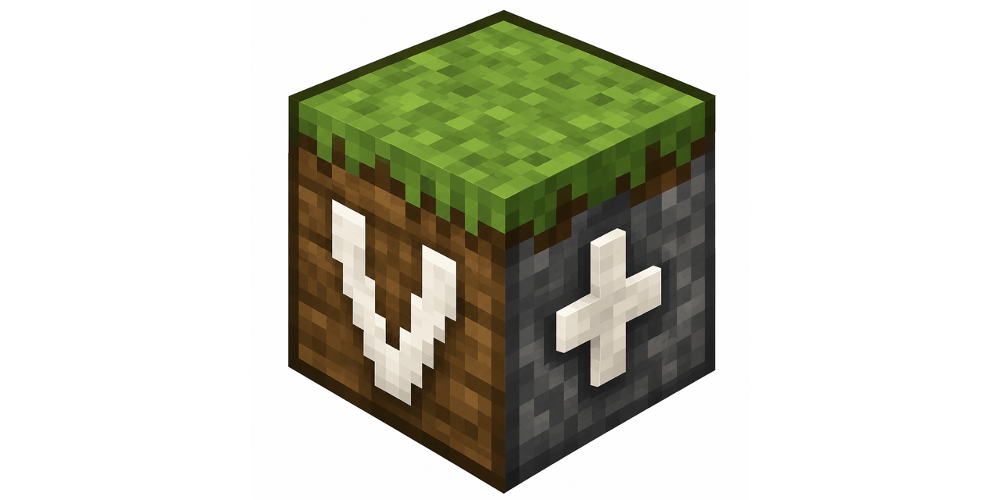
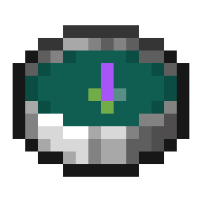
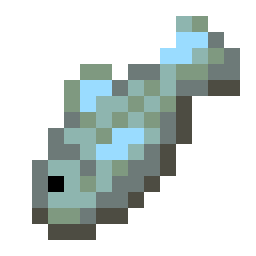
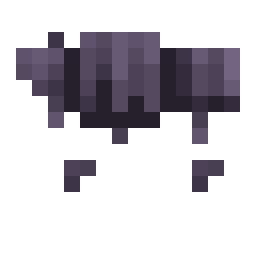

# VanillaPlusAdditions



[](https://www.minecraft.net/)
[](https://neoforged.net/)
[](#-modules)
[](https://github.com/GeraldHofbauerWeb/vanillaplusadditions/releases/latest)
[](https://github.com/GeraldHofbauerWeb/vanillaplusadditions/actions/workflows/code-quality.yml)
[](LICENSE)

**48 small fixes and additions that keep Minecraft feeling like Minecraft.** Nothing here adds a
new dimension or a tech tree. Each module scratches one itch — a compass that stops forgetting its
lodestone, cats that actually guard your base, a rail that keeps the chunks loaded while your
minecart is somewhere else.

**Every module can be switched off, and most can be installed on their own.** Take the all-in-one
jar and disable what you do not want, or take just the two module jars you came for.

> 🤖 **AI collaboration notice**: this project was built together with AI coding assistants. The
> ideas and direction are human; the AI helped with implementation, documentation and structure.
> We would rather say so than not.

## 🚀 Install

1. Install **NeoForge for Minecraft 1.21.1**.
2. Take **either** the all-in-one jar **or** the individual module jars you want — never both.
   They are declared incompatible on purpose, because installing both registers everything twice.
3. Drop the jars into `mods/` and start the game. A config file appears on first launch; see the
   [Configuration Guide](docs/guides/configuration.md).

Every module jar also needs [`vpa_core.jar`](https://github.com/GeraldHofbauerWeb/vanillaplusadditions/releases/latest/download/vpa_core.jar),
and a few need one more module jar — the table says which.

## 🧩 Modules

Pick a row. **Requires** is what the module cannot work without; anything under *better with* is
optional and the module degrades gracefully without it.

<!-- vpa:table:start -->
| Module | Docs | Download | Requires |
|---|---|---|---|
| **Vanilla Plus Additions** — every module in one jar | [All modules](#-modules) | [`vanillaplusadditions.jar`](https://github.com/GeraldHofbauerWeb/vanillaplusadditions/releases/latest/download/vanillaplusadditions.jar) | NeoForge 21.1+ · Minecraft 1.21.1 |
| **🐾 Companions & Guardians** | | | |
| **Axolotl Guardian**<br><sub>`axolotl_guardian`</sub> | [Docs](docs/modules/axolotl_guardian.md) | [`vpa_axolotl_guardian.jar`](https://github.com/GeraldHofbauerWeb/vanillaplusadditions/releases/latest/download/vpa_axolotl_guardian.jar)<br><sub>+ `vpa_debug_overlay`</sub> | —<br><sub>better with: [Sable](https://modrinth.com/mod/sable), [JEI](https://modrinth.com/mod/jei), [Create](https://modrinth.com/mod/create)</sub> |
| **Battle Dogs**<br><sub>`battle_dogs`</sub> | [Docs](docs/modules/battle_dogs.md) | [`vpa_battle_dogs.jar`](https://github.com/GeraldHofbauerWeb/vanillaplusadditions/releases/latest/download/vpa_battle_dogs.jar) | —<br><sub>better with: [JEI](https://modrinth.com/mod/jei)</sub> |
| **Cat Guardian**<br><sub>`cat_guardian`</sub> | [Docs](docs/modules/cat_guardian.md) | [`vpa_cat_guardian.jar`](https://github.com/GeraldHofbauerWeb/vanillaplusadditions/releases/latest/download/vpa_cat_guardian.jar)<br><sub>+ `vpa_debug_overlay`, `vpa_flying_fish`</sub> | —<br><sub>better with: [Sable](https://modrinth.com/mod/sable), [Create](https://modrinth.com/mod/create), [JEI](https://modrinth.com/mod/jei)</sub> |
| **Pet Potions**<br><sub>`pet_potions`</sub> | [Docs](docs/modules/pet_potions.md) | [`vpa_pet_potions.jar`](https://github.com/GeraldHofbauerWeb/vanillaplusadditions/releases/latest/download/vpa_pet_potions.jar) | — |
| **Wolf Mount**<br><sub>`wolf_mount`</sub> | [Docs](docs/modules/wolf_mount.md) | [`vpa_wolf_mount.jar`](https://github.com/GeraldHofbauerWeb/vanillaplusadditions/releases/latest/download/vpa_wolf_mount.jar) | —<br><sub>better with: Grim Kingdoms: structures & ruins, Creeper Overhaul</sub> |
| **👹 Mobs & Spawning** | | | |
| **Better Mobs**<br><sub>`better_mobs`</sub> | [Docs](docs/modules/better_mobs.md) | [`vpa_better_mobs.jar`](https://github.com/GeraldHofbauerWeb/vanillaplusadditions/releases/latest/download/vpa_better_mobs.jar) | — |
| **Enhanced AI Leader Loot**<br><sub>`enhanced_ai_leader_loot`</sub> | [Docs](docs/modules/enhanced_ai_leader_loot.md) | [`vpa_enhanced_ai_leader_loot.jar`](https://github.com/GeraldHofbauerWeb/vanillaplusadditions/releases/latest/download/vpa_enhanced_ai_leader_loot.jar) | **[Enhanced AI](https://modrinth.com/mod/enhanced-ai)** |
| **Haunted House**<br><sub>`haunted_house`</sub> | [Docs](docs/modules/haunted_house.md) | [`vpa_haunted_house.jar`](https://github.com/GeraldHofbauerWeb/vanillaplusadditions/releases/latest/download/vpa_haunted_house.jar) | **[Dungeons and Taverns](https://modrinth.com/mod/dungeons-and-taverns)**<br><sub>better with: [Alex's Mobs](https://modrinth.com/mod/alexs-mobs), nova_structures</sub> |
| **Hostile Endermen**<br><sub>`hostile_endermen`</sub> | [Docs](docs/modules/hostile_endermen.md) | [`vpa_hostile_endermen.jar`](https://github.com/GeraldHofbauerWeb/vanillaplusadditions/releases/latest/download/vpa_hostile_endermen.jar) | —<br><sub>better with: [Enderman Overhaul](https://modrinth.com/mod/enderman-overhaul), [Enhanced AI](https://modrinth.com/mod/enhanced-ai)</sub> |
| **Hostile Zombified Piglins**<br><sub>`hostile_zombified_piglins`</sub> | [Docs](docs/modules/hostile_zombified_piglins.md) | [`vpa_hostile_zombified_piglins.jar`](https://github.com/GeraldHofbauerWeb/vanillaplusadditions/releases/latest/download/vpa_hostile_zombified_piglins.jar) | — |
| **Mob Drops**<br><sub>`mob_drops`</sub> | [Docs](docs/modules/mob_drops.md) | [`vpa_mob_drops.jar`](https://github.com/GeraldHofbauerWeb/vanillaplusadditions/releases/latest/download/vpa_mob_drops.jar) | — |
| **Mob Glow Command**<br><sub>`mob_glow`</sub> | [Docs](docs/modules/mob_glow.md) | [`vpa_mob_glow.jar`](https://github.com/GeraldHofbauerWeb/vanillaplusadditions/releases/latest/download/vpa_mob_glow.jar) | — |
| **Wither Skeleton Enforcer**<br><sub>`wither_skeleton`</sub> | [Docs](docs/modules/wither_skeleton.md) | [`vpa_wither_skeleton.jar`](https://github.com/GeraldHofbauerWeb/vanillaplusadditions/releases/latest/download/vpa_wither_skeleton.jar) | —<br><sub>better with: [YUNG's Better Nether Fortresses](https://modrinth.com/mod/yungs-better-nether-fortresses)</sub> |
| **🧱 Blocks, Rails & Create Companions** | | | |
| **Conduit Attack Range**<br><sub>`conduit_attack_range`</sub> | [Docs](docs/modules/conduit_attack_range.md) | [`vpa_conduit_attack_range.jar`](https://github.com/GeraldHofbauerWeb/vanillaplusadditions/releases/latest/download/vpa_conduit_attack_range.jar) | — |
| **Copycat Pathfinding**<br><sub>`copycat_pathfinding`</sub> | [Docs](docs/modules/copycat_pathfinding.md) | [`vpa_copycat_pathfinding.jar`](https://github.com/GeraldHofbauerWeb/vanillaplusadditions/releases/latest/download/vpa_copycat_pathfinding.jar) | **[Create](https://modrinth.com/mod/create)** 6.0+ |
| **Create Water Wheel Unstucker**<br><sub>`create_water_wheel_unstucker`</sub> | [Docs](docs/modules/create_water_wheel_unstucker.md) | [`vpa_create_water_wheel_unstucker.jar`](https://github.com/GeraldHofbauerWeb/vanillaplusadditions/releases/latest/download/vpa_create_water_wheel_unstucker.jar) | **[Create](https://modrinth.com/mod/create)** 6.0+ |
| **End Conduit**<br><sub>`end_conduit`</sub> | [Docs](docs/modules/end_conduit.md) | [`vpa_end_conduit.jar`](https://github.com/GeraldHofbauerWeb/vanillaplusadditions/releases/latest/download/vpa_end_conduit.jar) | — |
| **Minecart Chunk Loading**<br><sub>`minecart_chunk_loading`</sub> | [Docs](docs/modules/minecart_chunk_loading.md) | [`vpa_minecart_chunk_loading.jar`](https://github.com/GeraldHofbauerWeb/vanillaplusadditions/releases/latest/download/vpa_minecart_chunk_loading.jar)<br><sub>+ `vpa_debug_overlay`</sub> | —<br><sub>better with: [Create](https://modrinth.com/mod/create), [Create Aeronautics](https://modrinth.com/mod/create-aeronautics)</sub> |
| **Mob Cart Loader**<br><sub>`mob_cart_loader`</sub> | [Docs](docs/modules/mob_cart_loader.md) | [`vpa_mob_cart_loader.jar`](https://github.com/GeraldHofbauerWeb/vanillaplusadditions/releases/latest/download/vpa_mob_cart_loader.jar) | —<br><sub>better with: [Create](https://modrinth.com/mod/create), [Create Aeronautics](https://modrinth.com/mod/create-aeronautics)</sub> |
| **Stationary Chunk Loader**<br><sub>`stationary_chunk_loader`</sub> | [Docs](docs/modules/stationary_chunk_loader.md) | [`vpa_stationary_chunk_loader.jar`](https://github.com/GeraldHofbauerWeb/vanillaplusadditions/releases/latest/download/vpa_stationary_chunk_loader.jar)<br><sub>+ `vpa_debug_overlay`</sub> | —<br><sub>better with: [Create](https://modrinth.com/mod/create), [Create Aeronautics](https://modrinth.com/mod/create-aeronautics)</sub> |
| **Train Chunk Loading**<br><sub>`train_chunk_loading`</sub> | [Docs](docs/modules/train_chunk_loading.md) | [`vpa_train_chunk_loading.jar`](https://github.com/GeraldHofbauerWeb/vanillaplusadditions/releases/latest/download/vpa_train_chunk_loading.jar)<br><sub>+ `vpa_debug_overlay`</sub> | **[Create](https://modrinth.com/mod/create)** 6.0+ |
| **🛠️ Items & Crafting** | | | |
| **Compass Overhaul**<br><sub>`compass_overhaul`</sub> | [Docs](docs/modules/compass_overhaul.md) | [`vpa_compass_overhaul.jar`](https://github.com/GeraldHofbauerWeb/vanillaplusadditions/releases/latest/download/vpa_compass_overhaul.jar) | —<br><sub>better with: [Sable](https://modrinth.com/mod/sable), [Quark](https://modrinth.com/mod/quark)</sub> |
| **Custom Crafting Recipes**<br><sub>`custom_crafting_recipes`</sub> | [Docs](docs/modules/custom_crafting_recipes.md) | [`vpa_custom_crafting_recipes.jar`](https://github.com/GeraldHofbauerWeb/vanillaplusadditions/releases/latest/download/vpa_custom_crafting_recipes.jar) | —<br><sub>better with: [Create](https://modrinth.com/mod/create), [Overpacked](https://modrinth.com/mod/overpacked)</sub> |
| **Dispenser Bucket Guard**<br><sub>`dispenser_bucket_guard`</sub> | [Docs](docs/modules/dispenser_bucket_guard.md) | [`vpa_dispenser_bucket_guard.jar`](https://github.com/GeraldHofbauerWeb/vanillaplusadditions/releases/latest/download/vpa_dispenser_bucket_guard.jar) | — |
| **Flying Fish**<br><sub>`flying_fish`</sub> | [Docs](docs/modules/flying_fish.md) | [`vpa_flying_fish.jar`](https://github.com/GeraldHofbauerWeb/vanillaplusadditions/releases/latest/download/vpa_flying_fish.jar) | — |
| **Free Anvil Repair**<br><sub>`free_anvil_repair`</sub> | [Docs](docs/modules/free_anvil_repair.md) | [`vpa_free_anvil_repair.jar`](https://github.com/GeraldHofbauerWeb/vanillaplusadditions/releases/latest/download/vpa_free_anvil_repair.jar) | —<br><sub>better with: [JEI](https://modrinth.com/mod/jei), [Create](https://modrinth.com/mod/create), [Quark](https://modrinth.com/mod/quark)</sub> |
| **Mo' Arrows**<br><sub>`mo_arrows`</sub> | [Docs](docs/modules/mo_arrows.md) | [`vpa_mo_arrows.jar`](https://github.com/GeraldHofbauerWeb/vanillaplusadditions/releases/latest/download/vpa_mo_arrows.jar) | — |
| **Pathfinder Quills**<br><sub>`pathfinder_quills`</sub> | [Docs](docs/modules/pathfinder_quills.md) | [`vpa_pathfinder_quills.jar`](https://github.com/GeraldHofbauerWeb/vanillaplusadditions/releases/latest/download/vpa_pathfinder_quills.jar) | **[Quark](https://modrinth.com/mod/quark)** 4.1-482+ |
| **Stackables**<br><sub>`stackables`</sub> | [Docs](docs/modules/stackables.md) | [`vpa_stackables.jar`](https://github.com/GeraldHofbauerWeb/vanillaplusadditions/releases/latest/download/vpa_stackables.jar) | —<br><sub>better with: [Tough As Nails](https://modrinth.com/mod/tough-as-nails), [Create](https://modrinth.com/mod/create)</sub> |
| **Tipped Arrows from Potions**<br><sub>`tipped_arrows`</sub> | [Docs](docs/modules/tipped_arrows.md) | [`vpa_tipped_arrows.jar`](https://github.com/GeraldHofbauerWeb/vanillaplusadditions/releases/latest/download/vpa_tipped_arrows.jar) | —<br><sub>better with: [JEI](https://modrinth.com/mod/jei)</sub> |
| **Waystone Amethyst Repair**<br><sub>`waystone_amethyst_repair`</sub> | [Docs](docs/modules/waystone_amethyst_repair.md) | [`vpa_waystone_amethyst_repair.jar`](https://github.com/GeraldHofbauerWeb/vanillaplusadditions/releases/latest/download/vpa_waystone_amethyst_repair.jar) | —<br><sub>better with: [Waystones](https://modrinth.com/mod/waystones)</sub> |
| **🌍 World & Environment** | | | |
| **Chunk Reset Command**<br><sub>`chunk_reset`</sub> | [Docs](docs/modules/chunk_reset.md) | [`vpa_chunk_reset.jar`](https://github.com/GeraldHofbauerWeb/vanillaplusadditions/releases/latest/download/vpa_chunk_reset.jar) | — |
| **End Oxygen**<br><sub>`end_oxygen`</sub> | [Docs](docs/modules/end_oxygen.md) | [`vpa_end_oxygen.jar`](https://github.com/GeraldHofbauerWeb/vanillaplusadditions/releases/latest/download/vpa_end_oxygen.jar) | —<br><sub>better with: [Create](https://modrinth.com/mod/create)</sub> |
| **Food Effects**<br><sub>`food_effects`</sub> | [Docs](docs/modules/food_effects.md) | [`vpa_food_effects.jar`](https://github.com/GeraldHofbauerWeb/vanillaplusadditions/releases/latest/download/vpa_food_effects.jar) | —<br><sub>better with: [Tough As Nails](https://modrinth.com/mod/tough-as-nails), [Create](https://modrinth.com/mod/create), rottencreatures</sub> |
| **Glider Water Repair**<br><sub>`glider_water_repair`</sub> | [Docs](docs/modules/glider_water_repair.md) | [`vpa_glider_water_repair.jar`](https://github.com/GeraldHofbauerWeb/vanillaplusadditions/releases/latest/download/vpa_glider_water_repair.jar) | **[Gliders](https://modrinth.com/mod/gliders)** |
| **Idle Gamerule Pause**<br><sub>`idle_gamerules`</sub> | [Docs](docs/modules/idle_gamerules.md) | [`vpa_idle_gamerules.jar`](https://github.com/GeraldHofbauerWeb/vanillaplusadditions/releases/latest/download/vpa_idle_gamerules.jar) | — |
| **🥽 Overlays, HUD & Quality-of-Life** | | | |
| **Arm Target Overlay**<br><sub>`arm_target_overlay`</sub> | [Docs](docs/modules/arm_target_overlay.md) | [`vpa_arm_target_overlay.jar`](https://github.com/GeraldHofbauerWeb/vanillaplusadditions/releases/latest/download/vpa_arm_target_overlay.jar) | —<br><sub>better with: [Create](https://modrinth.com/mod/create), [Create Aeronautics](https://modrinth.com/mod/create-aeronautics), [Curios API](https://modrinth.com/mod/curios)</sub> |
| **Block Glow**<br><sub>`block_glow`</sub> | [Docs](docs/modules/block_glow.md) | [`vpa_block_glow.jar`](https://github.com/GeraldHofbauerWeb/vanillaplusadditions/releases/latest/download/vpa_block_glow.jar) | —<br><sub>better with: [Sable](https://modrinth.com/mod/sable)</sub> |
| **Death Coordinates Announcer**<br><sub>`death_coordinates`</sub> | [Docs](docs/modules/death_coordinates.md) | [`vpa_death_coordinates.jar`](https://github.com/GeraldHofbauerWeb/vanillaplusadditions/releases/latest/download/vpa_death_coordinates.jar) | — |
| **Debug Overlay**<br><sub>`debug_overlay`</sub> | [Docs](docs/modules/debug_overlay.md) | [`vpa_debug_overlay.jar`](https://github.com/GeraldHofbauerWeb/vanillaplusadditions/releases/latest/download/vpa_debug_overlay.jar) | —<br><sub>better with: [Create](https://modrinth.com/mod/create), [Create Aeronautics](https://modrinth.com/mod/create-aeronautics)</sub> |
| **Item Vault Viewer**<br><sub>`item_vault_viewer`</sub> | [Docs](docs/modules/item_vault_viewer.md) | [`vpa_item_vault_viewer.jar`](https://github.com/GeraldHofbauerWeb/vanillaplusadditions/releases/latest/download/vpa_item_vault_viewer.jar) | **[Create](https://modrinth.com/mod/create)** 6.0+ |
| **Mob Spawn Overlay**<br><sub>`mob_spawn_overlay`</sub> | [Docs](docs/modules/mob_spawn_overlay.md) | [`vpa_mob_spawn_overlay.jar`](https://github.com/GeraldHofbauerWeb/vanillaplusadditions/releases/latest/download/vpa_mob_spawn_overlay.jar) | — |
| **VPA Options**<br><sub>`options`</sub> | [Docs](docs/modules/options.md) | [`vpa_options.jar`](https://github.com/GeraldHofbauerWeb/vanillaplusadditions/releases/latest/download/vpa_options.jar) | — |
| **Overpacked Extensions**<br><sub>`overpacked_extensions`</sub> | [Docs](docs/modules/overpacked_extensions.md) | [`vpa_overpacked_extensions.jar`](https://github.com/GeraldHofbauerWeb/vanillaplusadditions/releases/latest/download/vpa_overpacked_extensions.jar) | —<br><sub>better with: [Overpacked](https://modrinth.com/mod/overpacked), [Curios API](https://modrinth.com/mod/curios), [Quark](https://modrinth.com/mod/quark)</sub> |
| **Static FOV**<br><sub>`static_fov`</sub> | [Docs](docs/modules/static_fov.md) | [`vpa_static_fov.jar`](https://github.com/GeraldHofbauerWeb/vanillaplusadditions/releases/latest/download/vpa_static_fov.jar) | — |
| **🔌 Integrations & Utility** | | | |
| **BlueMap Signs**<br><sub>`bluemap_signs`</sub> | [Docs](docs/modules/bluemap_signs.md) | [`vpa_bluemap_signs.jar`](https://github.com/GeraldHofbauerWeb/vanillaplusadditions/releases/latest/download/vpa_bluemap_signs.jar) | —<br><sub>better with: [BlueMap](https://modrinth.com/plugin/bluemap)</sub> |
| **Freecam Sub-Level Noclip**<br><sub>`freecam_sublevel_noclip`</sub> | [Docs](docs/modules/freecam_sublevel_noclip.md) | [`vpa_freecam_sublevel_noclip.jar`](https://github.com/GeraldHofbauerWeb/vanillaplusadditions/releases/latest/download/vpa_freecam_sublevel_noclip.jar) | —<br><sub>better with: freecam, [Sable](https://modrinth.com/mod/sable)</sub> |
| **Texture Kill**<br><sub>`texture_kill`</sub> | [Docs](docs/modules/texture_kill.md) | [`vpa_texture_kill.jar`](https://github.com/GeraldHofbauerWeb/vanillaplusadditions/releases/latest/download/vpa_texture_kill.jar) | — |
<!-- vpa:table:end -->

<!-- vpa:tested:start -->
<details>
<summary><b>The exact combination this is played on</b> — “compatible” means tested, and this is what was tested</summary>

Minecraft **1.21.1** · NeoForge **21.1.248** · Java **21**

| Mod | Version |
|---|---|
| [BlueMap](https://modrinth.com/plugin/bluemap) | `5.7` |
| [Bobo Lib](https://modrinth.com/mod/bobo-lib) | `1.1` |
| [Create](https://modrinth.com/mod/create) | `6.0.10` |
| create-aeronautics-bundled | `1.3.1` |
| [Curios API](https://modrinth.com/mod/curios) | `9.5.1` |
| [Enderman Overhaul](https://modrinth.com/mod/enderman-overhaul) | `2.0.3` |
| [Enhanced AI](https://modrinth.com/mod/enhanced-ai) | `4.2.2.1` |
| [Dungeons and Taverns](https://modrinth.com/mod/dungeons-and-taverns) | `4.4.4` |
| [Overpacked](https://modrinth.com/mod/overpacked) | `2.0.1` |
| [Quark](https://modrinth.com/mod/quark) | `4.1-482` |
| [Sable](https://modrinth.com/mod/sable) | `2.0.5` |
| [Tough As Nails](https://modrinth.com/mod/tough-as-nails) | `10.1.0.13` |
| [Gliders](https://modrinth.com/mod/gliders) | `1.1.8` |
| [Waystones](https://modrinth.com/mod/waystones) | `21.1.41` |
| waystonessable | `1.0.7` |
| zeta | `1.1-40` |

Recipe viewer: **EMI 1.1.24** with **TooManyRecipeViewers 0.9.0**. There is no JEI in this pack — the JEI integrations are compiled against the JEI API and reach the screen through that bridge, so JEI itself is supported but untested here.

Anything older than the floors in the table above is simply unknown, not known to be broken. If you run a different combination and it works, say so in an issue and it goes in this list.
</details>
<!-- vpa:tested:end -->

## ✨ A few highlights

<table>
<tr>
<td width="110" align="center"></td>
<td><b><a href="docs/modules/compass_overhaul.md">Compass Overhaul</a></b><br>
Vanilla drops a lodestone binding whenever its lookup comes back empty — including for a chunk that
simply is not loaded. This keeps the binding unless the lodestone is provably gone, fixes the needle
aboard a turning airship, and adds a second compass that always points to world north.</td>
</tr>
<tr>
<td width="110" align="center"></td>
<td><b><a href="docs/modules/cat_guardian.md">Cat Guardian</a></b> &amp;
<b><a href="docs/modules/axolotl_guardian.md">Axolotl Guardian</a></b><br>
Feed a tamed cat and it patrols and hunts hostile mobs around your base; the same for axolotls
underwater. Both get armour, a bowl, and a feeding station with a few dozen skins.</td>
</tr>
<tr>
<td width="110" align="center"></td>
<td><b><a href="docs/modules/mob_cart_loader.md">Mob Cart Loader</a></b><br>
Two blocks that load a mob into a passing minecart and unload it again at the other end — keeping
its UUID, so nothing is duplicated and nothing is lost.</td>
</tr>
<tr>
<td width="110" align="center"></td>
<td><b><a href="docs/modules/train_chunk_loading.md">Chunk loading that follows you</a></b><br>
A rail and a Create track that carry a rolling window of loaded chunks with the cart or the train,
plus a standing anchor block that holds a fixed square around itself — so what you left running
keeps running when nobody is watching.</td>
</tr>
<tr>
<td width="110" align="center"></td>
<td><b><a href="docs/modules/flying_fish.md">Flying Fish</a></b><br>
A fish that leaps out of the water, and boots made from it that let you run across the surface.</td>
</tr>
<tr>
<td width="110" align="center"></td>
<td><b><a href="docs/modules/wolf_mount.md">Wolf Mount</a></b> &amp;
<b><a href="docs/modules/battle_dogs.md">Battle Dogs</a></b><br>
Armour your wolf in four tiers — and if it is big enough, saddle up and fight from its back.</td>
</tr>
</table>

## 🔧 Configuration

One TOML file, one section per module, every key commented in place.

* [Configuration Guide](docs/guides/configuration.md) — where the file is and how it works
* [Configuration Reference](docs/reference/config.md) — every key of every module, generated
* [Debug Logging](docs/guides/debug-logging.md) — per-module log control

## 📚 Documentation

* **[Every module](#-modules)** — one page each, from a one-line summary down to the implementation
* [Module System](docs/guides/module-system.md) — how a module is built, for contributors
* [Companion Armor](docs/guides/companion-armor.md) — the armour tiers shared by wolves and cats
* [Testing](docs/guides/testing.md) — test server and client
* [Instance Switcher](docs/guides/instance-switcher.md) — the development utility

## 🔨 Development

Requires **JDK 21** and Git; the Gradle wrapper handles the rest.

```bash
git clone https://github.com/GeraldHofbauerWeb/vanillaplusadditions.git
cd vanillaplusadditions
./gradlew build        # includes Checkstyle and SpotBugs
./gradlew moduleJars   # the standalone module jars, into build/libs/modules/
```

The build needs four third-party jars in `libs/` that are not redistributed here — CI fetches them
in `.github/workflows/build.yml`, and the same URLs work locally.

Documentation is generated and checked:

```bash
python3 scripts/docgen/check_docs.py        # completeness, dead links, stale generated blocks
python3 scripts/docgen/gen_meta.py          # rebuild the fact boxes and config tables
python3 scripts/docgen/gen_readme.py        # rebuild the table above
python3 scripts/docgen/render_models.py     # rebuild the item and block images
```

## 🤝 Contributing

Contributions are welcome — please read the [Contributing Guidelines](CONTRIBUTING.md) first.

## 📝 License

MIT — see [LICENSE](LICENSE).

The 32 `world_compass` needle frames are recoloured from the vanilla compass sprites and are
therefore derived Mojang assets; they are not covered by the MIT licence above.

## 🌟 Credits

**Developer**: Gerald Hofbauer · **Framework**: [NeoForge](https://neoforged.net/) ·
**Built with**: [Claude Code](https://claude.com/claude-code) as a pair programmer

## 🔗 Links

* [Releases](https://github.com/GeraldHofbauerWeb/vanillaplusadditions/releases)
* [Issue Tracker](https://github.com/GeraldHofbauerWeb/vanillaplusadditions/issues)
* [Changelog](CHANGELOG.md)
