# Axolotl Guardian

> **TL;DR** — Tame axolotls with fish, put a bowl or a feeding station in your underwater base, and
> the fed axolotls patrol the water around it, kill what swims in and carry the loot and the
> experience back.

<!-- vpa:meta:start -->
|  |  |
|---|---|
| **Module ID** | `axolotl_guardian` |
| **Side** | Client + Server |
| **Requires** | — |
| **Works with** | [Sable](https://modrinth.com/mod/sable) <sub>tested 2.0.5</sub>, [JEI](https://modrinth.com/mod/jei), [Create](https://modrinth.com/mod/create) <sub>tested 6.0.10</sub> |
| **Download** | [`vpa_axolotl_guardian.jar`](https://github.com/GeraldHofbauerWeb/vanillaplusadditions/releases/latest/download/vpa_axolotl_guardian.jar) · also needs `vpa_core`, `vpa_debug_overlay` |
| **Config section** | `[modules.axolotl_guardian]` |
| **Since** | `v1.0.0-beta.41` |
<!-- vpa:meta:end -->

## What it does

A vanilla axolotl attacks three mob types and a handful of fish, notices them at eight blocks, and
otherwise drifts about. This module gives it a post to hold — the underwater counterpart to
[Cat Guardian](cat_guardian.md).

Feed a wild axolotl fish until it takes to you, place an **Axolotl Bowl** or an **Axolotl Feeding
Station** in the water, sneak and right-click it with both hands empty, and every axolotl of yours
within 64 blocks is bound to that block. Then put fish in. An axolotl that has eaten guards a box
32 blocks wide and 16 blocks high around its bowl for the next five minutes: it swims down any
hostile mob that is *in the water*, kills it, takes the drops straight out of the kill and brings
them home.

<table>
<tr>
<td width="110" align="center">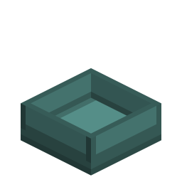</td>
<td width="110" align="center">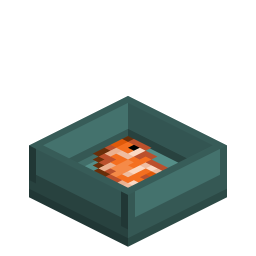</td>
<td width="110" align="center">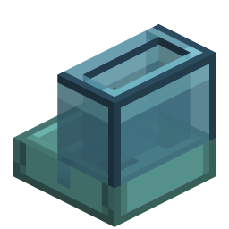</td>
<td width="110" align="center">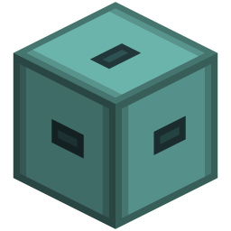</td>
</tr>
<tr>
<td align="center">Axolotl Bowl</td>
<td align="center">…holding fish</td>
<td align="center">Axolotl Feeding Station</td>
<td align="center">…holding fish</td>
</tr>
</table>

Both blocks are waterloggable, because an underwater base is where they belong.

At a feeding station the trip home pays twice over. The axolotl empties its five loot slots into
the station's fifteen, and the experience it soaked up from its kills becomes Bottles o' Enchanting
at eight points each. A hopper underneath drains the loot and the bottles and cannot reach the
fish.

* **Armor.** Iron, gold, diamond and netherite axolotl armor absorbs every point of incoming
  damage, loses durability instead, and adds attack damage. Enchantable, repairable on the anvil
  with a turtle scute.
* **Hurt guardians go home.** Below 20 % health a guardian drops everything and swims back to heal,
  and only takes duty up again above 40 %. A lightly hurt one heads home on its own below 60 %.
* **Playing dead is rationed.** An armored guardian will not flop out of a fight while its armor
  holds; an unarmored one keeps vanilla's play-dead exactly as it is.
* **The station can be dressed.** One deco slot holds a material — coral, prismarine, amethyst,
  froglight — and the block takes on the matching look. Fourteen of them.
* **Two screens.** Hold the modifier key (default Left Ctrl) and right-click your own axolotl for
  its armor and loot slots; right-click a station for food, loot and the style slot.
* **A goggles overlay** shows an axolotl's health, armor, experience and owner, and on the shared
  debug toggle its target, its guard box and the path it is swimming.
* **Buckets lose nothing.** Scooping up your own axolotl carries owner, bowl, fed timer, experience
  and the whole inventory along in the bucket — and gives them back wherever the bucket is emptied,
  including from a dispenser.

Two things are worth knowing before you switch the module on, because they apply to axolotls that
are none of your business: raw tropical fish becomes valid `#minecraft:axolotl_food`, so ordinary
wild axolotls can be tempted and bred with it, and nobody can punch an owned axolotl bare-handed
any more. See [Compatibility and known limits](#compatibility-and-known-limits).

## In detail

### Taming and ownership

Axolotls are not `TamableAnimal`s, so there is no vanilla owner to set. Ownership lives in the
`axolotl_owner` entity attachment and is written by right-clicking a **wild** axolotl with fish:
one chance in three per fish, heart particles on success, smoke on failure. The fish is consumed
either way unless you are in creative.

"Fish" is the `#minecraft:fishes` tag throughout this module — cod, salmon, pufferfish, tropical
fish and the two cooked variants, plus both [Flying Fish](flying_fish.md) items when that module is
on. It is the same tag the cat station uses, so one Create attribute filter feeds both.

An axolotl that is already owned swallows the right-click and **keeps your fish**: guardians eat
from their bowl, not from your hand, and there is no free refuel. The one exception is breeding.
An owned axolotl that is grown, ready and has **no** bowl goes into love mode from the plain fish
item, which vanilla offers only for the bucket. Guardians never breed — the tropical-fish-bucket
interaction is cancelled outright for any axolotl with a bowl. Babies inherit one parent's owner
at random, and no bowl.

Attachments never sync on their own, so a packet mirrors the owner and the bowl position into the
client-side attachment. Everything client-side — the inventory gesture, the glow, the overlay —
reads that mirror.

### Binding a bowl

Sneak and right-click a bowl or station with **both hands empty**. Vanilla skips the block
interaction entirely when you sneak with an item in hand, so the gesture is empty-handed by
construction. Every axolotl of yours inside `association_radius` (64 blocks) is bound, one that was
bound elsewhere is detached from its old bowl first, and the chat tells you how many were taken —
or that the bowl is full, or that it found none of yours nearby.

A bowl holds `max_axolotls_per_station` (8). An owned axolotl with **no** bowl binds itself: on its
own tick it looks for the nearest bowl with room within `auto_associate_radius` (1.5 blocks), so
emptying a bucket next to the station is enough. Whose bowl it is does not matter — any bowl with
room takes any owned axolotl.

The binding is stored on both sides — a block position on the axolotl, a list of UUIDs on the
block — and the **station** reconciles the two every 200 ticks. It only ever prunes on positive
evidence: an axolotl in an unloaded chunk cannot be told apart from one that no longer exists, so
an entry it cannot inspect is left alone. The reverse direction is repaired in the same pass:
an axolotl within `guard_radius + 16` (48 blocks) that still points at this station but is missing
from the list is re-added, or, if the station is full, has its own pointer cleared so both sides
agree.

The plain **bowl has no block-entity ticker at all** and therefore never reconciles anything. Its
list is only ever corrected by the events that touch it directly, and a dangling pointer on the
axolotl side is cleared by the axolotl's own tick when the bowl turns out to be gone.

### Food and the fed timer

A bowl or a station takes `#minecraft:fishes` plus the **tropical fish bucket**, so breeding stock
can be piped in; the empty bucket is handed back when the fish is eaten. The **bowl** takes one
item per right-click into its single slot, and an empty-handed, non-sneaking click takes one back
out. The **station** takes the whole stack in one click (in creative, one item) into a 3 × 3 food
chamber.

An axolotl whose timer has run out swims to its bowl and, within two blocks, eats one fish: the
timer is set to `fed_duration_ticks` (6000 ticks = five minutes), it makes the vanilla eating
sound and gets Regeneration II for 100 ticks. At a station that same moment also triggers a loot
hand-over.

The timer runs down in real time — ten ticks per pass — whatever else the axolotl is doing,
including while it flees or plays dead.

The config comment for `fed_duration_ticks` still says "a single tropical fish". That is historic:
any item in the tag does it, and the station also feeds out of a tropical fish bucket.

### What a guardian does, state by state

Priority runs from the top down; the first state that matches ends the pass.

| State | Entered when | Behaviour |
|---|---|---|
| Playing dead | vanilla rolled it (see below) | combat target erased, nothing else attempted |
| Fleeing | health below 20 % (2.8 HP) | ignores every mob, swims home, heals, resumes only above 40 % |
| Returning | a target was lost or none was reachable, or it drifted more than 8 blocks from the bowl, or health fell below `heal_return_threshold` (60 %) | swims home; hands loot and XP over on arrival |
| Fed | a fish was eaten, timer still running | scans the guard box, engages, idles near the bowl |
| Unfed | the timer hit 0 | swims to the bowl and eats |

**Fleeing** is absolute and hysteretic: 20 % in, 40 % out, so a guardian cannot yo-yo back into the
fight at the boundary. Within four blocks of the bowl it heals and hands its loot over; further
out it keeps re-asserting the way home.

**Returning** is interruptible — a fresh target in the zone pulls the axolotl back out, *unless*
all five loot slots are full, in which case the trip is finished first because a full axolotl could
not pick anything up anyway. It ends within four blocks of the bowl; a trip that has not arrived
after 1200 ticks (60 s) teleports home, and one that cannot even do that gives up in place at 1800
ticks.

**Healing happens at home.** Within four blocks of the bowl, out of combat, a guardian regains 0.2
HP per pass — 1 HP per 50 ticks, the rate of Regeneration I — up to `heal_recovery_target` (full
health by default). That, the Regeneration II burst from eating, and the armor are the whole
recovery story: mobs have no natural regeneration.

**Playing dead** is vanilla's, not ours. `Axolotl.hurt` rolls it before any of our handlers see the
damage — one chance in three, in water, with an attacker, a hit that would not kill it, and a
second roll that either weighs the damage or waves the axolotl through below half health — and
sets `PLAY_DEAD_TICKS` to 200, which parks it for ten seconds with Regeneration I and outranks the
FIGHT activity. A guardian that is playing dead therefore drops its combat target rather than holding a
stale one for ten seconds, and picks a fresh one when it wakes up. For an **armored** guardian the
memory is erased again while its health is above `play_dead_min_health` (4 HP of 14) — and because
armor absorbs everything, that means in practice: no flopping until the armor has broken.

**Dry land ends the shift.** A guardian out of water with less than 1200 ticks of air left drops
its target and heads home. An axolotl carries 6000 ticks of air and loses one per tick out of the
water, so that is four minutes beached — about a minute before vanilla's dry-out damage starts.

### Picking a target

Vanilla's own `AxolotlAttackablesSensor` only ever offers what is in
`#minecraft:axolotl_always_hostiles` — drowned, guardian, elder guardian — plus
`#minecraft:axolotl_hunt_targets` (cod, salmon, tropical fish, pufferfish, squid, glow squid,
tadpole), in water, and within eight blocks (`distanceToSqr <= 64.0`).

A fed guardian gets a second, wider search of its own, which writes the brain's `ATTACK_TARGET`
memory directly. The box is the bowl's block inflated by `guard_radius` (32) horizontally and
`guard_radius_y` (16) vertically; candidates are `Monster`s that are alive, **in water**, and not
blacklisted.

Selection is not "nearest as the crow flies". The candidates are sorted by distance, the closest
eight get a real path computed, and a candidate survives only if

* the path's end node lies within 2 blocks of the mob (no partial paths, no swimming at a wall),
  and
* **every** node of the path stays inside the guard box.

The shortest surviving path wins. If nothing survives, the search goes on a two-pass cooldown
(~20 ticks), because an A\* run per candidate is not cheap.

Two buffers bound the fight so that nothing flickers at the edge:

| Buffer | Value | Meaning |
|---|---|---|
| target | +4 blocks | a target that leaves the zone by more than this is dropped and blacklisted |
| axolotl | +10 blocks | the axolotl itself may swim this far out; beyond it the target is blacklisted and it heads home |

A blacklisted mob is ignored for 1200 ticks (60 s). Every 20 ticks the live path is re-checked
against the zone — a mob that leads the axolotl out through a cave mouth is blacklisted rather than
followed — and expired entries are evicted. A target that beaches itself is let go and blacklisted
too: this is a water specialist, and it does not fight on land.

The blacklist has to be enforced every pass, not just once. Vanilla's own `StartAttacking` knows
nothing about it and re-acquires the same mob the tick after we drop it, which is exactly how an
axolotl ends up pressing against an obstacle forever.

**Fish are exempt from the fed check.** A `Monster` target is dropped the moment `fed_ticks` hits
zero — an unfed guardian disengages mid-fight — but vanilla's fish hunting is left alone so a
hungry guardian can still catch a passing cod and restock its own station. It stays leashed to the
zone either way.

**Retaliation** bypasses the search. A `Monster` that hits a guardian, in water, inside the zone,
becomes the target immediately, and any return trip is cancelled first — otherwise the returning
branch keeps re-asserting the way home while the FIGHT activity pulls the other way, and the
axolotl stands still between the two. A fleeing or play-dead axolotl ignores the trigger. A
blacklisted attacker is ignored as well, *unless* it is within three blocks: a hit from melee range
is proof that it is reachable after all, while a trident thrown from behind a wall is not.

### Getting there

A guardian swims with vanilla's `AmphibiousPathNavigation` and vanilla's FIGHT activity
(`MeleeAttack` on a 20-tick cooldown, chase speed 0.6 in water). What the module adds is
persistence:

* **Follow range +16**, which doubles the pathfinder's search radius from 16 to 32 blocks — the
  attribute is read live on every path request. This is applied to *every* axolotl that joins the
  level server-side, not only to guardians.
* **A doubled node budget for the way home** (`setMaxVisitedNodesMultiplier(2.0)`), reset on
  arrival and on acquiring a target, so it is never dragged into combat.
* **Re-asserting the walk target** every pass while returning. `MoveToTargetSink` erases it when it
  gives up; re-asserting restarts the attempt. It is the brain-mob equivalent of a repath loop.

Stuck detection samples every 40 ticks while the axolotl actually wants to move. There are two ways
to earn a strike, and a homebound trip can earn one either way:

| Symptom | Threshold |
|---|---|
| barely moved | less than 0.75 blocks since the last sample |
| moving but not arriving | homebound, still more than 5 blocks out, and less than 0.5 blocks closer than last sample |

The second one matters more than it looks: a failed return path degrades into vanilla's random
swimming, which is plenty of movement and no progress at all, and a position delta alone never
calls that stuck.

| Strike | Response |
|---|---|
| every | erase the `PATH` memory and stop the navigation, so a fresh path is computed |
| 3 | blacklist the current target and commit to going home |
| ≥ 5 while homebound | teleport into a free water block within 2 blocks horizontally and 1 vertically of the bowl |

The teleport is the guardian's version of the vanilla pet owner-teleport. The bowl sits in water by
design, so a candidate practically always exists; when it does not, the attempt simply repeats on a
later strike.

### Armor

Right-click your own axolotl with a piece of axolotl armor to put it on; a piece already worn goes
back into your inventory. Taking armor *off* is done by dragging it out of the axolotl's inventory
screen — there is no click gesture for it.

| Tier | Durability | Attack bonus | Enchantment value |
|---|---|---|---|
| Iron | 800 | +1.0 | 9 |
| Gold | 400 | +2.0 | 25 |
| Diamond | 1600 | +3.0 | 10 |
| Netherite | 2400 | +4.0 | 15 |

An axolotl's base attack damage is 2.0, so netherite armor triples it. The bonus is an
`ADD_VALUE` modifier on `ATTACK_DAMAGE` and is re-applied on every join, which is what carries it
through a chunk reload or a dimension change.

Armor absorbs **100 %** of incoming damage and takes `max(1, ceil(damage))` durability for it. The
axolotl's own health does not move at all while the armor holds; when it breaks it falls off, the
attack bonus goes with it, and play-dead and the flee threshold take over.

Three enchantments do something:

| Enchantment | Effect |
|---|---|
| Unbreaking | works natively, through vanilla's own durability handling |
| Thorns | reflects `min(1.0, thorns_reflect_fraction × level)` of the absorbed damage back at a living attacker — 33 % per level by default. The level is read **before** the armor may break, so the last hit still reflects |
| Sharpness | adds `0.5 + 0.5 × level` to the axolotl's outgoing damage |

Protection and the rest are legal but pointless: the armor already absorbs everything. The items
sit in `#minecraft:enchantable/armor`, `#minecraft:enchantable/durability` and
`#minecraft:enchantable/sharp_weapon` and report a material enchantment value, which is what an
enchanting table looks at.

### Loot and experience

Drops from a mob a guardian killed are inserted straight into its five loot slots before they ever
become item entities. What does not fit stays on the floor as normal.

Edible drops are routed somewhere else first. Any drop in `#minecraft:fishes` is inserted into the
guardian's bowl or station as **food**, item by item, before the loot pass runs — from wherever the
kill happened, because the insert goes to the block entity, not to the axolotl. A guardian that
catches a cod at the far edge of its zone therefore restocks its own station without swimming home.
Whatever the chamber cannot take falls through into the loot slots, and then to the ground.

Experience needs a detour. Vanilla drops experience only for a victim that was recently hurt by a
*player*:

```java
if (this.level() instanceof ServerLevel serverlevel
    && !this.wasExperienceConsumed()
    && (this.isAlwaysExperienceDropper()
        || this.lastHurtByPlayerTime > 0 && this.shouldDropExperience()
            && this.level().getGameRules().getBoolean(GameRules.RULE_DOMOBLOOT))) {
```

So a kill by an axolotl alone drops none at all. The module credits the owner on every hit a
guardian lands (`victim.setLastHurtByPlayer(owner)`), which makes vanilla drop the experience
normally; it is then intercepted and redirected into the axolotl's buffer up to
`axolotl_xp_capacity` (500), and anything over that spawns as ordinary orbs. The owner has to be
**online and in the same level** at the moment of the hit, or there is no experience at all —
exact parity with the cat module.

At the station the axolotl hands over both. Loot goes into the 15 loot slots, experience into the
station's counter up to `station_xp_capacity` (5000) — what the station cannot take stays on the
axolotl. The station then converts its counter into Bottles o' Enchanting at `xp_per_bottle` (8)
each, for as long as there is room in the loot grid.

### The station as a machine

| Section | Slots | Contents |
|---|---|---|
| Food chamber | 9 | fish the axolotls eat |
| Loot storage | 15 | what they bring back, plus the XP bottles |
| Style slot | 1 | one material item, see below |

Every face accepts **anything**. Fish is routed into the food chamber even when a matching stack
already sits in the loot storage, and fish that no longer fits the chamber overflows into the loot
storage instead of backing the pipe up. Extraction is where the faces differ: the bottom face hands
out loot only, so a hopper underneath keeps collecting drops and bottles but can never drain the
axolotls' meals. Every other face may pull food back out — which is also how the empty bucket left
over from a tropical fish bucket gets collected again.

That empty bucket is kept in the food chamber rather than inserted through the handler, because the
chamber's own filter only admits food. It is skipped when an axolotl looks for its next meal, so
nobody is ever served a bucket. Only a completely full station drops it on top of the block. The
plain bowl has one slot and no room for by-products, so it always drops the bucket above itself.

The comparator reports **occupancy, not fill level**: `floor(axolotls × 15 / max_axolotls_per_station)`,
so with the default of 8 a full station reads 15.

Bowl and station both carry a `filled` blockstate and swap their look as soon as they hold fish;
the station additionally has a facing (with a hitbox per direction) and its skin property, and
renders the fish it holds inside the tank. Breaking either drops the block, its contents, the style
item and clears every binding on it.

**Only the station has an item-handler capability.** The plain bowl has none at all, so hoppers,
funnels and pipes cannot fill it — it is hand-fed, by design.

### Styles

The style slot takes one material item and the block reskins itself. The item stays in the slot and
comes back out when you remove it or break the station.

| | Style | Put in |
|---|---|---|
| 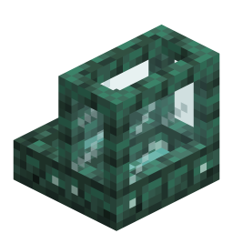 | `prismarin_aquarium` | Prismarine |
| 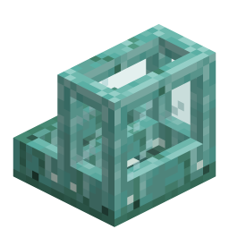 | `ozeanmonument` | Prismarine Bricks |
| 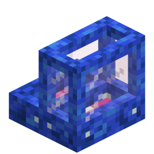 | `korallenriff` | Sea Lantern |
| 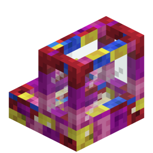 | `korallengarten` | Sea Pickle |
| 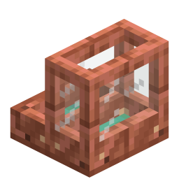 | `kupfer_labor` | Copper Ingot |
| 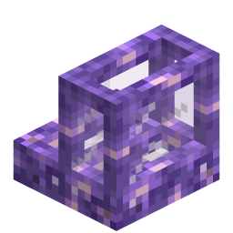 | `amethyst_grotte` | Amethyst Block or Shard |
| 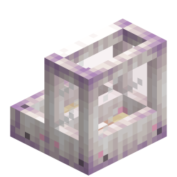 | `froglight_strand` | Any Froglight |
| 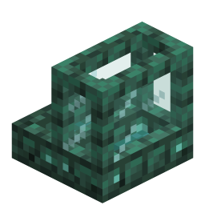 | `wirrwald` | Warped Planks |
| 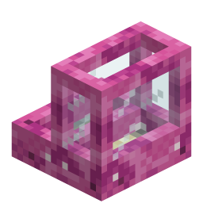 | `lagune` | Sand |
| 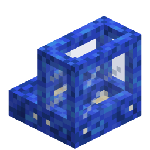 | `koralle_blau` | Tube Coral — block, coral or fan |
| 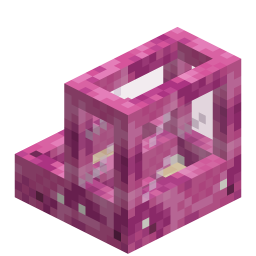 | `koralle_rosa` | Brain Coral — block, coral or fan |
| 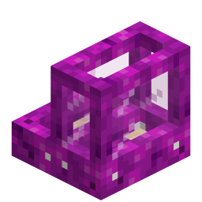 | `koralle_lila` | Bubble Coral — block, coral or fan |
| 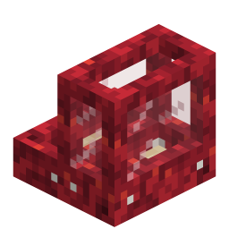 | `koralle_rot` | Fire Coral — block, coral or fan |
| 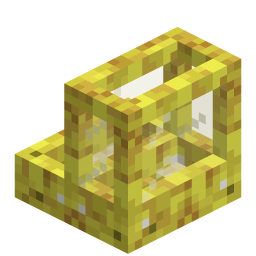 | `koralle_gelb` | Horn Coral — block, coral or fan |

Twenty-seven items map onto those fourteen looks; anything else is refused by the slot. The
identifiers are German on purpose — they are the names the textures were built under, and renaming
them would break existing blockstates.

### The bucket round trip

A water bucket used on an **owned** axolotl does not take vanilla's path. Vanilla keeps only the
variant and the age and discards the rest of the entity, which would quietly destroy owner, bowl,
experience, loot and worn armor. The module replicates the pickup and writes all of that into a
`vpa_guardian` sub-tag of the bucket's `BUCKET_ENTITY_DATA`, then detaches the axolotl from its
bowl and discards it.

The restore is hooked at the tail of `Axolotl.loadFromBucketTag` — the one place every placement
path funnels through. Emptying the bucket by hand, from a dispenser or with a Create deployer all
restore the same state, and the axolotl re-registers with its old bowl if that bowl still exists
and has room. Before that fix the payload was captured on the player's right-click alone, so a
dispenser produced an unowned axolotl that no station would ever adopt.

The new entity gets a fresh UUID, which is why the old one is removed from the bowl's list on
pickup and the new one added on restore.

### Seeing what an axolotl is doing

**The axolotl's inventory** opens on modifier + right-click on one of your own. The default
modifier is Left Ctrl; it is an ordinary rebindable key mapping and may sit on a mouse button. It
is read as a raw held-key state rather than a press event, so it works as a modifier. The screen
has the armor slot, the five loot slots, and bars for experience, the fed timer and the armor's
durability.

**Glow.** Looking at a bowl makes your own axolotls bound to it glow for `glow_duration_seconds`
(30). This is purely client-side — only the player looking sees it, and nothing is sent to the
server.

**The goggles overlay** needs goggles: Create's Engineer's Goggles, or any item in the
`vanillaplusadditions:arm_goggles` tag worn on the head. On top of that it has two independent
triggers:

| Trigger | Shows |
|---|---|
| holding the modifier and looking at one of your axolotls (≤ 20 blocks, clear line of sight) | a panel with health, armor durability, experience and the owner's name |
| holding it while looking at a bowl or station | `Associated Axolotls: n/max` |
| the shared debug toggle (default numpad +, owned by [Debug Overlay](debug_overlay.md)) | outlines on the axolotl and its current target, the guard box at the bowl, and the live navigation path |

The panel needs line of sight and disappears behind a wall; the 3D boxes are xray on purpose — they
are the debug view. Boxes linger for 300 ticks (15 s) after you look away. Stats are re-requested
from the server at most once a second, and the server answers only within 64 blocks.

### Every axolotl, not only the guardians

Some of this is not gated on being a guardian. Server-side, anything that joins the world as an
`Axolotl` gets:

| Change | Applies to |
|---|---|
| Follow range +16 | every axolotl |
| Armor attribute and armor sync restored from its inventory | every axolotl that has armor |
| Petting instead of a punch on an empty-handed left click | every **owned** axolotl, from any player |
| The guard tick (10-tick cycle) | every **owned** axolotl; without a bowl it only looks for one |

## Items, blocks and recipes

| | Item | Details |
|---|---|---|
|  | **Axolotl Bowl** | One fish slot. Association and glow work exactly as at a station; no loot storage, no XP, no GUI, no item handler, no ticker. |
|  | **Axolotl Feeding Station** | 9 food + 15 loot + 1 style slot, comparator output, item handler on every face, skins, reconciliation ticker. |
| 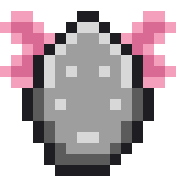 | **Iron Axolotl Armor** | 800 durability, +1.0 attack. |
| 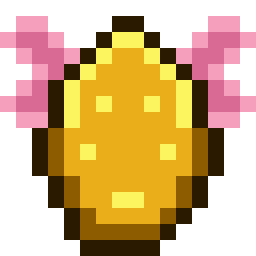 | **Golden Axolotl Armor** | 400 durability, +2.0 attack. |
| 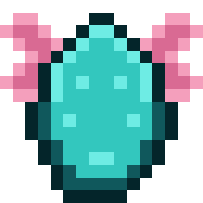 | **Diamond Axolotl Armor** | 1600 durability, +3.0 attack. |
| 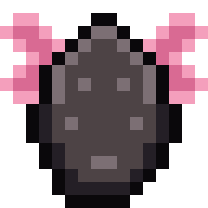 | **Netherite Axolotl Armor** | 2400 durability, +4.0 attack, survives lava as an item. |

```
Axolotl Bowl        Axolotl Feeding Station    Axolotl Armor (all four tiers)
  P . P               G G G                      X . .
  P P P               G C G                      X X X
                      P P P                      S . S

P = Prismarine      G = Glass Pane             X = iron ingot / gold ingot /
                    C = Cauldron                     diamond / netherite ingot
                    P = Prismarine             S = Turtle Scute
```

All six recipes are registered **in code**, per the project convention — a reload listener added in
`AddReloadListenerEvent` merges them into the `RecipeManager` on every datapack reload, gated on
the module being enabled. There are no recipe JSONs, and block drops come from a `getDrops`
override rather than a loot table. The anvil repair with a turtle scute lives in
`isValidRepairItem` and is not a recipe either.

<!-- vpa:config:start -->
## Configuration

Section `[modules.axolotl_guardian]` in `config/vanillaplusadditions-common.toml` (or `config/vpa_axolotl_guardian-common.toml` if you run the standalone jar).

Every module also has the universal `enabled` and `debug_logging` keys — see the [Configuration Guide](../guides/configuration.md).

| Key | Type | Default | Range | Effect |
|---|---|---|---|---|
| `association_radius` | double | `64.0` | 1.0 ~ 128.0 | Radius (blocks) in which owned axolotls are associated when shift-clicking a bowl. |
| `auto_associate_radius` | double | `1.5` | 0.5 ~ 4.0 | Radius (blocks) within which an axolotl without a bowl is automatically associated with a nearby bowl. |
| `axolotl_xp_capacity` | int | `500` | 0 ~ 10000 | Maximum XP points a single axolotl can hold before XP drops normally. |
| `fed_duration_ticks` | int | `6000` | 20 ~ 144000 | How many ticks a single tropical fish keeps an axolotl in the 'fed' (guarding) state (20 ticks = 1 second). |
| `glow_duration_seconds` | int | `30` | 1 ~ 300 | How many seconds your own associated axolotls glow (client-side only) when looking at their bowl. The getter multiplies by 20, so the code works in ticks (default 600). |
| `guard_radius` | double | `32.0` | 2.0 ~ 128.0 | Horizontal radius (blocks, XZ) around the associated bowl in which a fed axolotl scans for hostile mobs in water. |
| `guard_radius_y` | double | `16.0` | 2.0 ~ 128.0 | Vertical radius (blocks, Y) around the associated bowl - axolotls ignore mobs further away vertically. |
| `heal_recovery_target` | double | `1.0` | 0.0 ~ 1.0 | While at/near its home block (distance squared <= 16), a guardian axolotl keeps regenerating until its health reaches this fraction of max HP. |
| `heal_return_threshold` | double | `0.60` | 0.0 ~ 1.0 | A fed, out-of-combat guardian whose health drops below this fraction of max HP proactively swims back to its bowl/station to heal. |
| `max_axolotls_per_station` | int | `8` | 1 ~ 64 | Maximum number of axolotls that can be associated with a single bowl or station. Also the divisor of the feeding station's comparator output. |
| `play_dead_min_health` | int | `4` | 1 ~ 14 | An armored guardian axolotl may only play dead once its health drops to this absolute HP value or below (axolotl max health is 14). Unarmored axolotls keep vanilla play-dead untouched. |
| `station_xp_capacity` | int | `5000` | 0 ~ 100000 | Maximum XP points a feeding station can hold before overflow stays on axolotls. |
| `thorns_reflect_fraction` | double | `0.33` | 0.0 ~ 1.0 | Base fraction of absorbed damage reflected back to the attacker, scaled by the armor's Thorns level. |
| `xp_per_bottle` | int | `8` | 1 ~ 64 | XP points consumed per Bottle o' Enchanting produced at the station. |
<!-- vpa:config:end -->

## Compatibility and known limits

| Limit | Effect |
|---|---|
| Raw tropical fish becomes axolotl food | A datapack tag adds `minecraft:tropical_fish` to vanilla's `#minecraft:axolotl_food`, which no Java code in this module reads. It is a deliberate side effect: ordinary wild axolotls can now be tempted and bred with the raw fish, and Create's attribute filters recognise it. |
| You cannot punch an owned axolotl | An empty-handed left-click on **any** owned axolotl is cancelled and turned into petting: a sound and five hearts. Ownership of the *puncher* is not checked. Hit it with something in hand if you really mean it. |
| Anyone can bucket your axolotl | The guardian-preserving pickup fires for any player holding a water bucket, not only the owner. The state survives the trip, but so does the axolotl's absence from your base. |
| A dead guardian takes everything with it | Fed timer, loot, experience and worn armor are entity attachments and are not dropped on death. Only the bowl's bookkeeping is cleaned up. |
| Loot beyond five slots is lost | Drops that do not fit stay on the ground where the mob died; the axolotl does not come back for them. |
| Guardians never fight on land | Targets must be in water, and so must the axolotl. A mob that beaches itself is dropped and blacklisted for 60 seconds. |
| The plain bowl never self-repairs | Only the station has a ticker, so only the station prunes and reclaims its list. A bowl whose list has drifted stays drifted until an axolotl clears its own pointer. |
| Offline owner, no experience | Experience only flows if the owner is a player object present in the same level at the moment of the hit. Loot collection is unaffected. |
| Sable contraptions | With [Sable](https://modrinth.com/mod/sable) installed, bowls and stations are registered as Sable-aware variants and associated axolotls are teleported into the sublevel when a ship assembles, with their bowl position rewritten to the ship-local one. Without Sable a bowl assembled onto a contraption simply leaves its axolotls behind in the old level. |
| Repairs are invisible without JEI | The anvil repair lives in `isValidRepairItem`, and JEI's built-in anvil list is hardcoded vanilla. The bundled JEI plugin adds the turtle-scute repair and the enchantment listing back. Without JEI both still work, they are just undiscoverable. |
| Standalone jar needs `vpa_debug_overlay` | Declared as a required module dependency, because the goggles handler compiles against `GogglesUtil` and `DebugOverlayState` and a module jar ships only its own package. |
| Goggles overlay can be unreachable standalone | The overlay accepts Create's goggles or the `vanillaplusadditions:arm_goggles` tag — and that tag's JSON ships with the `arm_target_overlay` module, not with this one. Standalone, without Create and without that module, neither branch can be satisfied. |
| Sharpness at a table needs the bundle | `enchantable/armor` and `enchantable/durability` ship with the standalone jar; `enchantable/sharp_weapon` ships only in the combined jar. Standalone, Sharpness has to come from an anvil and a book. |
| One stale entry per damaged mob that never dies | The map that redirects experience is filled on every hit a guardian lands and emptied when the experience event fires. A mob that is damaged and then despawns — or dies with no player credited, so vanilla never fires the event — leaves one `int → int` entry behind. Server thread only, small, but never pruned. |
| Whole module disabled | `AxolotlGuardianClientSetup` is an FML-scanned `@EventBusSubscriber` and registers the armor layer, the block-entity renderer and both menu screens without an `isModuleEnabled()` check, dereferencing holders while it does. The same shape exists in `cat_guardian` and `item_vault_viewer`, so it is house style rather than a slip here. <!-- TODO: read off the source; no test in this repository starts the client with the module off. --> |

## Under the hood

**No goals, no AI mixins.** Axolotls are brain mobs with an empty goal selector, so the guard AI
drives the vanilla brain through memories: `ATTACK_TARGET` for combat, `WALK_TARGET` for the way
home, `PATH` erased to force a repath. Vanilla's FIGHT activity does the chasing and the melee
natively, and vanilla's own swimming means the cat module's entire amphibious layer has no
counterpart here. The only mixin in the module is the bucket restore.

**Where the state lives.** Seven entity attachments carry everything per axolotl: the owner UUID
(empty string = wild), the bowl position (`Long.MIN_VALUE` = no bowl, and that is also the
definition of *guardian*), the fed timer, a six-slot inventory (1 armor + 5 loot), the returning
and fleeing flags and the XP buffer. The station keeps its three inventories, its XP counter and
the UUID list in block-entity NBT. Everything else — return age, search cooldowns, blacklists, the
stuck samples, the last synced target — is a server-side map keyed by UUID, dropped on death and
on bucket pickup.

**Ticking.** `EntityTickEvent.Post`, server side, every tenth tick, and only for owned axolotls.
That is why every duration in this module is a multiple of ten ticks. The station's own ticker runs
every 200 ticks; the path sync and the blacklist eviction run on the axolotl's 20-tick boundary.

**Why healing is manual.** The first version applied `MobEffectInstance(REGENERATION, 60, 0)` every
ten ticks and never healed a single point: vanilla runs a regeneration tick only when
`duration % 50 == 0` and checks that *before* decrementing, so a constantly refreshed effect only
ever saw durations 60…51 and the 50 mark was overwritten one tick too early. The replacement is a
plain `heal(10.0f / 50.0f)` per pass — the same rate, without the trap. The Regeneration II from
eating is a real effect, because nothing refreshes it.

**The mixin.** `AxolotlBucketRestoreMixin` injects at TAIL of `Axolotl.loadFromBucketTag` and hands
the bucket's full `BUCKET_ENTITY_DATA` tag to the module. It is registered in the common mixin
list, not the client one — the restore is server-side work.

**Networking.** Attachments do not sync, so ownership is mirrored explicitly. Two packets go up
(open inventory, request stats) and five come down (owner + bowl, armor, stats, current target,
navigation path). Target changes are edge-detected in the tick, because a brain mob has no goal
`start()`/`stop()` hook to hang the sync on. `PlayerEvent.StartTracking` re-sends owner, armor,
experience and the live target, so the overlay is correct the moment a player comes into range.

**The glow** borrows `vpa_core`'s shared-flag invoker. `Entity#setGlowingTag` is a no-op on the
client — it writes `setSharedFlag(6, isCurrentlyGlowing())`, and that method reads back exactly the
flag it is setting — so the bit the renderer checks has to be flipped directly.

**Sable indirection.** `AxolotlGuardianModule` never names a Sable type. Putting
`new SableAxolotlBowlBlock(...)` into a registration lambda would make the bytecode verifier load
the Sable subclass while *linking* the module class, which crashes without Sable no matter what
`ModList.isLoaded` says. The `SableAxolotlBlocks` factory exists solely to keep those signatures
out — do not simplify it away.

**Classes.**

| Class | Role |
|---|---|
| `modules/axolotl_guardian/AxolotlGuardianModule` | registration, recipes, the whole guard AI, interaction, combat, loot and XP |
| `.../block/AbstractAxolotlBowlBlock`, `AxolotlBowlBlock`, `AxolotlFeedingStationBlock` | association gesture, waterlogging, drops, shapes, comparator |
| `.../block/AxolotlStationSkin` | the 14 looks and the 27 items that select them |
| `.../blockentity/…` | fish handling, association bookkeeping, station inventories and XP |
| `.../item/AxolotlArmorItem` | four tiers, enchantment values, the scute repair |
| `.../client/…` | armor layer, station renderer, both screens, keybind, glow, goggles overlay |
| `.../sable/…` | every Sable reference in the module |
| `.../compat/jei/AxolotlGuardianJeiPlugin` | the repair and enchantment listings |
| `mixin/axolotl_guardian/AxolotlBucketRestoreMixin` | the bucket restore |
| `standalone/axolotl_guardian/AxolotlGuardianStandalone` | `@Mod("vpa_axolotl_guardian")` |

**Testing.** This repository has no unit tests, and the real verification is playing it. The one
part with a written-down check is the association reconciliation: the CHANGELOG records a throwaway
server run of the same script against the release build and against the fix — a list that came out
as `[A]` before and `[A, D, B]` after — done on the cat module, whose fix this one shares.
Everything else on this page is read off the source.

## See also

* [Cat Guardian](cat_guardian.md) — the same idea on land, and where most of this came from
* [Flying Fish](flying_fish.md) — its fish are in `#minecraft:fishes`, so bowls and stations take them
* [Battle Dogs](battle_dogs.md) — the same armor system on wolves
* [Debug Overlay](debug_overlay.md) — owns the numpad + toggle the 3D boxes hang on, and is a hard dependency of the standalone jar
* [Free Anvil Repair](free_anvil_repair.md) — makes the scute repair cost no levels
* [Configuration Guide](../guides/configuration.md) — where the config file lives
* [All modules](../../README.md#-modules)
