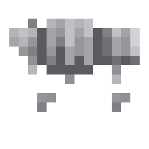
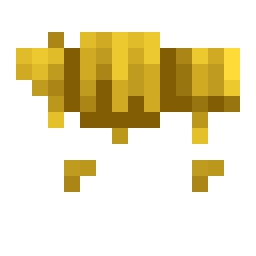

# Battle Dogs

> **TL;DR** — Your own tamed wolves can wear iron, gold, diamond or netherite armour that soaks up
> every point of incoming damage until it breaks, makes them hit harder, and finally gives a biting
> wolf a visible head snap instead of vanilla's motionless attack.

<!-- vpa:meta:start -->
|  |  |
|---|---|
| **Module ID** | `battle_dogs` |
| **Side** | Client + Server |
| **Requires** | — |
| **Works with** | [JEI](https://modrinth.com/mod/jei), [Quark](https://modrinth.com/mod/quark) <sub>tested 4.1-482</sub> |
| **Download** | [`vpa_battle_dogs.jar`](https://github.com/GeraldHofbauerWeb/vanillaplusadditions/releases/latest/download/vpa_battle_dogs.jar) · also needs `vpa_core` |
| **Config section** | `[modules.battle_dogs]` |
| **Since** | `v1.0.0-beta` |
<!-- vpa:meta:end -->

## What it does

Four tiers of wolf body armour, on top of vanilla's single one. Right-click your own tamed, grown
wolf with a piece to put it on; shear it off again with anything that works as shears.

<table>
<tr>
<td width="90" align="center"></td>
<td width="90" align="center"></td>
<td width="90" align="center"></td>
<td width="90" align="center"></td>
</tr>
<tr>
<td align="center">Iron</td>
<td align="center">Golden</td>
<td align="center">Diamond</td>
<td align="center">Netherite</td>
</tr>
</table>

While the armour holds, the wolf takes **no damage at all** — every hit is paid for in durability
instead, and its health bar does not move. Each tier also adds a flat bonus to the wolf's attack
damage, from +1 on iron to +4 on netherite, which on an ordinary wolf means the difference between
4 and 8 damage a bite.

The third part has nothing to do with the armour: a biting wolf now **moves**. Vanilla wolves deal
their damage without so much as twitching; here the head snaps down and the whole animal lunges
forward at whatever it is biting.

## Why it exists

### Vanilla's wolf armour is hardcoded to one item

`AnimalArmorItem` and `WolfArmorLayer` look thoroughly generic — the layer even re-checks the body
type — but everything on the wolf's side goes through one method:

```java
public boolean hasArmor() {
    return this.getBodyArmorItem().is(Items.WOLF_ARMOR);
}
```

Five separate vanilla behaviours hang off that single `is()`, and all five are therefore shut to any
other canine armour:

| Vanilla behaviour | Gate |
|---|---|
| The render layer draws anything | `if (livingEntity.hasArmor())`, the first line of `WolfArmorLayer.render` |
| Damage absorption in `actuallyHurt` | `canArmorAbsorb` → `hasArmor()` |
| The armour-damage hurt sound, the crack sound and the scute particles | the same `canArmorAbsorb` |
| Shears take the armour off | `mobInteract` → `this.hasArmor()` |
| Scute repair on a sitting wolf | `mobInteract` → `this.hasArmor()` |

Equipping is gated one step earlier still, on the item itself (`itemstack.is(Items.WOLF_ARMOR)`), so
a right-click with anything else falls through to vanilla's sit/stand toggle. This module therefore
brings its own equip gesture, its own absorption, its own attack bonus and — despite what the README
used to say — **its own render layer**. There is no vanilla path to borrow.

### A wolf cannot animate its own bite

`LivingEntity.updateSwingTime()` is what turns a swing into the `attackAnim` ramp every attack
animation reads:

```java
protected void updateSwingTime() {
    int i = this.getCurrentSwingDuration();
    if (this.swinging) {
        this.swingTime++;
        ...
    }
    this.attackAnim = (float)this.swingTime / (float)i;
}
```

It is called from exactly three places in the whole game: `Player`, `RemotePlayer` and
`Monster.aiStep`. A wolf is a `TamableAnimal`, so none of them applies — its `swingTime` never
advances and `attackAnim` is pinned at 0 forever. That is also why vanilla ships no wolf attack
animation in the first place: `WolfModel` never reads `attackAnim`, because the value it would read
is never wound up.

## In detail

### The four tiers

| Tier | Durability | Attack bonus | Wolf's attack damage | Notes |
|---|---|---|---|---|
| Iron | 200 | +1.0 | 5.0 | |
| Golden | 100 | +2.0 | 6.0 | The odd one out on purpose: second-best bite, worst durability |
| Diamond | 400 | +3.0 | 7.0 | |
| Netherite | 600 | +4.0 | 8.0 | The only one that survives lava and fire **as a dropped item** |

A vanilla wolf's `ATTACK_DAMAGE` is 4.0, tamed or not, so netherite doubles it. The bonus is a flat
`ADD_VALUE` attribute modifier under the id `vanillaplusadditions:wolf_armor_bonus`, added and
removed by `LivingEquipmentChangeEvent` on the `BODY` slot — it therefore also disappears the moment
the armour breaks.

All four use vanilla's `ArmorMaterials.ARMADILLO` with `BodyType.CANINE` and `hasOverlay = false` —
`AnimalArmorItem`'s third constructor argument, the one that gives vanilla's own wolf armour its
`_overlay.png` dye layer. The material settles three things at once: the anvil repair ingredient is
the armadillo scute, the enchantment value is the same for every tier, and the armour carries the
material's 11 armour points in the body slot. Those armour points are visible in the tooltip and
completely moot in play — the absorption below zeroes the damage after vanilla has already applied
them.

### Putting it on and taking it off

Both halves run on `PlayerInteractEvent.EntityInteract` and both require the wolf to be **tame and
owned by you**.

| | Equipping | Removing |
|---|---|---|
| Item in hand | a `WolfArmorItem` | anything that can perform `ItemAbilities.SHEARS_REMOVE_ARMOR` |
| Body slot | must be empty | must hold one of ours |
| Puppies | refused (`!wolf.isBaby()`) | allowed — removal does not check |
| Cost | one item, unless you are in creative | 1 durability on the shears |
| Result | — | the armour is **dropped on the ground**, not put back in your inventory |
| Sound | `ARMOR_EQUIP_WOLF` | `ARMOR_UNEQUIP_WOLF` |

Both branches cancel the interaction with a sided success, so the right-click never reaches vanilla's
sit/stand toggle. Both branches also test for *our* item class, so vanilla wolf armour keeps its own
behaviour untouched — the two kinds coexist on the same wolf population, one piece at a time.

### Damage absorption

`LivingDamageEvent.Pre` fires inside `LivingEntity.actuallyHurt`, after armour and magic reduction
and before the health is subtracted. The handler sets the remaining damage to zero and charges the
armour `max(1, ceil(absorbed))` durability for it.


**Terrain costs nothing.** A cactus, a sweet berry bush or a stalagmite deals damage on a timer for
as long as the animal stands in it, so an unlucky walk through a hedge wore the armour down faster
than any fight did (Gerry, 2026-09-26). Since `v1.0.0-beta.98` every damage type in
`#vanillaplusadditions:pet_armor_no_wear` is still absorbed in full — nothing reaches the animal —
but costs **no durability at all**:

| | |
|---|---|
| Free at every tier | `cactus`, `sweet_berry_bush`, `stalagmite`, `falling_stalactite`, `freeze`, `in_wall`, `cramming`, `fly_into_wall` |
| Free on **netherite only** | `hot_floor`, `campfire` — in the second tag `#vanillaplusadditions:pet_armor_no_wear_heatproof` |
| Deliberately not | fire, fall, drowning, starvation — the armour still wears from the animal's own mistakes |
| Turning it off | a datapack with `"replace": true` and an empty list; there is no config flag, the tag *is* the switch |

Standing on a magma block is not free at every tier on purpose: netherite shrugs it off because the
material does not burn up in vanilla either, while iron, gold and diamond pay for it. The tier
question is asked through the `util/PetArmor` interface — an interface rather than a fourth tag,
because a tag nothing fills is silently empty and the rule just never fires, which is exactly how the
End backtanks broke (see [`end_oxygen`](end_oxygen.md)). A missing implementation is a compile error.

The rule lives in `util/MobArmorDamage.wearArmor`, shared by all three pet armours so the rounding
and the floor of 1 cannot drift apart between them.

It asks two questions only: is the victim a `Wolf`, and does its body slot hold a `WolfArmorItem`.
Not whether the wolf is tame, not whose it is. A wild wolf handed a piece with `/item` is just as
invulnerable as yours until the armour breaks.

Three details separate this from vanilla's absorption, all of them consequences of vanilla's path
being closed (see above):

* **Nothing is exempt.** Vanilla skips the absorption for anything tagged
  `#minecraft:bypasses_wolf_armor` — which is `#bypasses_invulnerability` plus `cramming`, `drown`,
  `dry_out`, `freeze`, `in_wall`, `indirect_magic`, `magic`, `outside_border`, `starve`, `thorns`
  and `wither`. This handler checks no tag at all, so an armoured wolf also stops drowning,
  freezing, suffocating, starving and withering.
* **The armour cracks silently.** `WOLF_ARMOR_CRACK` and the scute particles live in
  `Wolf.actuallyHurt`, behind `canArmorAbsorb`. The durability bar is the only warning you get.
* **The wolf yelps normally.** `getHurtSound` picks `WOLF_ARMOR_DAMAGE` from the same
  `canArmorAbsorb`, so an armoured wolf here sounds like an unarmoured one being hurt.

### Enchantments

| Enchantment | Effect |
|---|---|
| Unbreaking | works natively, through vanilla's own `hurtAndBreak` |
| Thorns | reflects `absorbed × min(1.0, thorns_reflect_fraction × level)` back at a living attacker as thorns damage — 33 % per level by default |
| Sharpness | adds `0.5 + 0.5 × level` to the wolf's outgoing damage |

Beyond those three, everything else the same tags allow is legal and pointless. Protection sits in
`#minecraft:enchantable/armor` next to Thorns, so the book goes on — but its reduction runs first, in
`getDamageAfterMagicAbsorb`, and the absorption described above then zeroes whatever is left of the
damage anyway. Mending is the one that stings: legal through the `durability` tag it shares with
Unbreaking, but `ExperienceOrb.repairPlayerItems` only scans the *player's* own equipment slots, so a
piece worn by the wolf is never mended.

Thorns is read off the stack **before** the durability is charged, so a piece that breaks on the same
hit still reflects. It is server-side only and is skipped when the damage source's attacker is not a
living, still-alive entity, or is the wolf itself. Sharpness is read on the outgoing side, only while
the wolf wears one of ours; a wolf as the *victim* is skipped there, so the two damage handlers can
never both fire on one event.

**The enchanting table will not take these items.** `AnimalArmorItem` closes the door itself:

```java
@Override
public boolean isEnchantable(ItemStack stack) {
    return false;
}
```

`ItemStack.isEnchantable()` asks the item first, and `EnchantmentMenu` only offers a slot for
`itemstack.isEnchantable()`. An anvil and an enchanted book are the way in; the three
`#minecraft:enchantable/{armor,durability,sharp_weapon}` tags this mod puts these items in are what
make those books legal on them in the first place — and they are also the ceiling. `AnvilMenu` checks
every book against `ItemStack.supportsEnchantment`, which ends at the enchantment's own
`supported_items`, with a bypass only for a player in creative. Anything asking for a tag the mod
does not put these items in — Respiration and Aqua Affinity (`head_armor`), Feather Falling and Depth
Strider (`foot_armor`), Looting (`sword`), Curse of Binding (`equippable`) — therefore cannot go on
these items in survival at all.

### The bite

Three pieces, and a packet to aim them.

**The swing timer** (`WolfSwingTimeMixin`) injects at HEAD of `Wolf.aiStep` and does by hand exactly
what `Monster.aiStep` does for a hostile mob — the logic is inlined rather than shadowed, because
`@Shadow` resolves only against the target class and `updateSwingTime` is declared on `LivingEntity`.
It runs on **both** sides: the client needs the ramp to draw, the server keeps `swinging` from
staying latched. A swing lasts `getCurrentSwingDuration()` ticks, six by default, shortened by Haste
and lengthened by Mining Fatigue.

**The head snap** (`WolfBiteAnimationMixin`) injects at TAIL of `WolfModel.setupAnim` and adds to two
parts that are assigned fresh every frame, so it cannot accumulate:

| Part | Added at full swing |
|---|---|
| `head.xRot` | `sin(swing·π) × 0.9 rad × strength` — about 50° at strength 1.0 |
| `upperBody.xRot` | `sin(swing·π) × 0.12 rad × strength` — a small shoulder lean so the head does not move alone |

**The lunge** (`WolfBiteLunge`) shoves the whole wolf on the render pose instead, 0.32 blocks forward
and 0.10 blocks down at full swing, multiplied by the same sine curve, the same `strength`, and by
the wolf's own `generic.scale` — so a 3.25-scale mount lunges like a mount. It exists because the
head snap does not survive the modpack: Entity Model Features re-applies the Fresh Animations
`wolf.jem` part rotations *after* `setupAnim` returns, and overwrites it. The lunge sits outside the
model, where EMF has nothing to say. It is deliberately a translation and not a rotation — a rotation
there would land in world space, before `setupRotations` applies the body yaw, and would tip the
wrong way on half the compass.

**The direction** comes from the server, one packet per landed bite, carrying the yaw from the wolf
to what it bit. The two obvious client-side sources both fail: `Mob.getTarget()` is server-side AI
state and is always null on the client, and the head yaw — the fallback — is wrong in the one case
that matters, because `tickRidden` overwrites head and body rotation from the *rider's* look every
tick while a player is aboard. A reported yaw stays usable for 500 ms; after that the animation falls
back to the head yaw on its own.

The snap and the lunge honour `bite_animation.only_when_ridden` and `bite_animation.strength`, and
both stop at `bite_animation.enabled = false` — as does the packet. The swing timer honours none of
the three: it asks only whether the module itself is active — see *Compatibility and known limits*.

## Items, blocks and recipes

| | Item | Details |
|---|---|---|
|  | **Iron Wolf Armor** | 200 durability, +1.0 attack. |
|  | **Golden Wolf Armor** | 100 durability, +2.0 attack. |
|  | **Diamond Wolf Armor** | 400 durability, +3.0 attack. |
|  | **Netherite Wolf Armor** | 600 durability, +4.0 attack, survives lava as an item. |

All four share one recipe shape, category *equipment*:

```
 S . .        S = Armadillo Scute
 X X X        X = Iron Ingot / Gold Ingot / Diamond / Netherite Ingot
 X . X
```

Per the project convention the recipes are registered in code, not as datapack JSON: a reload
listener added on `AddReloadListenerEvent` merges all four into the `RecipeManager` on every datapack
reload, gated on the module being enabled. See the [Custom Crafting Recipes
module](custom_crafting_recipes.md) for the reasoning.

**Repairs.** An anvil takes armadillo scutes, through `ArmorItem.isValidRepairItem` and the armadillo
material's repair ingredient. Vanilla's other repair — right-clicking a *sitting* armoured wolf with
a scute for 12.5 % of its durability — is gated on `hasArmor()` and does not work on these.

<!-- vpa:config:start -->
## Configuration

Section `[modules.battle_dogs]` in `config/vanillaplusadditions-common.toml` (or `config/vpa_battle_dogs-common.toml` if you run the standalone jar).

Every module also has the universal `enabled` and `debug_logging` keys — see the [Configuration Guide](../guides/configuration.md).

| Key | Type | Default | Range | Effect |
|---|---|---|---|---|
| `bite_animation.enabled` | boolean | `true` | — | Snap the wolf's head down when it lands a bite. Also gates the lunge and the server-side bite-direction packet; it does NOT gate the swing-timer mixin. |
| `bite_animation.only_when_ridden` | boolean | `false` | — | Restrict the animation to a wolf that is being ridden (off by default, because a dog that only bites visibly while carrying someone looks stranger than one that always does). |
| `bite_animation.strength` | double | `1.0` | 0.0 ~ 2.0 | Scales how far the head swings and how far the lunge travels; 1.0 is about 50 degrees of head pitch (BITE_PITCH = 0.9 rad). |
| `thorns_reflect_fraction` | double | `0.33` | 0.0 ~ 1.0 | Base fraction of absorbed damage reflected back to the attacker, scaled by the armor's Thorns level (0.0 = none, 1.0 = full). Total reflect is capped at 1.0 (min(1.0, fraction * thornsLevel)). |
<!-- vpa:config:end -->

## Compatibility and known limits

| Limit | Effect |
|---|---|
| **Standalone jar has no bite animation** | `vpa_battle_dogs` is declared in `build.gradle` without a `mixins:` list, so neither `WolfSwingTimeMixin` nor `WolfBiteAnimationMixin` ships in it. `attackAnim` then stays pinned at 0 and both the head snap and the lunge (which read it) are dead, although the three `bite_animation` keys still appear in the config. Read off the packaging tasks; no jar was built to confirm. |
| **Standalone jar cannot be enchanted** | The `enchantable/*` tag files are not in its `dataGlobs` either, so an anvil has nothing to say the books are legal on these items. Textures and models are unaffected — `vpa_core` ships all of `assets/vanillaplusadditions/**`. |
| Absorption ignores ownership | The handler checks only "is a wolf" and "wears our armour". Any wolf given a piece by command is unkillable until it breaks. |
| Absorption ignores `#minecraft:bypasses_wolf_armor` | Drowning, freezing, suffocation, starvation, wither and magic are absorbed too, where vanilla wolf armour lets them through. |
| Curse of Binding | Vanilla's shear branch refuses to remove a piece carrying `PREVENT_ARMOR_CHANGE` unless the player is creative. This module's branch makes no such check. Getting to that divergence takes some doing, though: Binding wants `#minecraft:enchantable/equippable`, which the mod does not add these items to, so only a creative-mode anvil or a command produces such a stack in the first place. |
| Enchanting table | Refuses the items outright (`AnimalArmorItem.isEnchantable` is `false`). Anvil and book only. |
| Swing timer runs even with the animation off | `WolfSwingTimeMixin` checks only whether the module is active, not `bite_animation.enabled`. With the animation off, a wolf's `swingTime`/`attackAnim` are still maintained every tick on both sides — and `LivingEntity.tick` snaps the body-rotation target to `getYRot()` whenever `attackAnim > 0`, which vanilla never reaches for a wolf. |
| Fresh Animations / Entity Model Features | Overwrite the head snap after `setupAnim` returns. The lunge still shows. |
| Clients without the bite channel | Get no packet (the channel is `optional()` and each send is checked per connection), so the lunge falls back to the wolf's head yaw. Tracking is approximated by `clientTrackingRange × 16` rather than read from `ChunkMap`, so a player just outside real tracking range loses one packet. |
| Module disabled | The items are never registered at all — the `DeferredRegister` is attached inside `onInitialize`, which only runs for an enabled module. Existing stacks and equipped pieces become unknown items. The permanent attack modifier is only ever removed by the equipment-change handler, which is itself gated on the module, so a wolf that was wearing armour keeps its bonus. |
| `BiteDirections` never evicts | Entries expire logically after 500 ms but are never removed; the static map keeps one entry per wolf entity id that ever bit near you, for the lifetime of the client session. Called out as deliberate in its javadoc — a stale entry is simply never read again. |
| Debug latches | Both mixins announce themselves once per JVM, not once per wolf, and only with `debug_logging = true`. |
| [Wolf Mount](wolf_mount.md) | Composes cleanly, in one direction. `wolf_mount` never imports a class from here — it tests `AnimalArmorItem` with `BodyType.CANINE` and colours its armour HUD by item id — so it works with this module absent. Its rider immunity cancels on `LivingIncomingDamageEvent`, which fires well before the `LivingDamageEvent.Pre` all three handlers here use, so on that path the absorption is simply never reached. |
| [Quark](https://modrinth.com/mod/quark)'s Foxhound | Supported, through a layer of our own — see [Quark's Foxhound](#quarks-foxhound). A damaged set shows no cracks there; the vanilla crack textures are laid out for a different model. |
| [JEI](https://modrinth.com/mod/jei) | Optional. `BattleDogsJeiPlugin` is loaded by JEI's own annotation scan (there is no `jei` entry in `neoforge.mods.toml`) and adds the armadillo-scute anvil repairs and the possible enchantments to the recipe viewer. Without JEI both still work, they are just undiscoverable — vanilla anvil repair is code-only and JEI's anvil list is hardcoded vanilla. |

### Quark's Foxhound

A foxhound wearing one of these sets used to show nothing at all — the inventory slot quite plainly
held a piece of armour and the dog stayed bare. Two independent gates were closed at once:

* **Quark's own armour layer never fired.** It is gated on `Wolf.hasArmor()`, which is
  `getBodyArmorItem().is(Items.WOLF_ARMOR)` — the concrete vanilla item, not the type. Our items are
  `AnimalArmorItem`s with `BodyType.CANINE`, which is what the rest of that layer goes on to check,
  but it never gets that far.
* **Our own layer was not there to help.** `BattleDogsClientSetup` adds `BattleDogsArmorLayer` to
  `EntityType.WOLF`'s renderer. A Foxhound extends `Wolf` but has a renderer and a model of its own
  (`FoxhoundModel extends AgeableListModel`, not `WolfModel`), so it never sees that layer.

So the module adds a second layer, on Quark's renderer, behind a `ModList.isLoaded("quark")` gate
that lives in its own Quark-free class — resolving a static member links the class that holds it,
and the verifier would then load the Quark types named in its signatures. That is the
`NoClassDefFoundError`-at-construction trap this project has hit before.

The geometry is Quark's (`ModelHandler.foxhound_armor`), the colour is ours. It has to be a separate
set of textures: Quark's armour model uses a 64×64 UV layout that has nothing in common with the
64×32 vanilla wolf armour, so our wolf sheets would smear across it.

**The four Foxhound textures are generated, not drawn.** `scripts/gen_foxhound_armor_textures.py`
recolours Quark's own `foxhound_armor.png` with each tier's palette. That works because both sides
use exactly eleven opaque colours — Quark's eleven reddish ones (eight plate, three leather strap)
and each of our tiers' eleven shades of one metal. The mapping is by **luminance rank**: darkest to
darkest, next-darkest to next-darkest. Shading survives pixel for pixel and only the hue moves. The
script refuses to guess if either side stops having eleven colours.

The leather strap is recoloured along with everything else, on purpose: our wolf armour is one metal
throughout, so a brown strap the wolf version does not have would be the odd one out.

Results are committed, so neither the build nor CI needs the Quark jar.

**Permission.** Those four textures are derived from Quark's own `foxhound_armor.png`, so they are
not ours to redistribute by default. Vazkii was asked directly and granted it — Discord DM,
2026-09-24: *"yeah no problem"*. The question named exactly what was done (recoloured per tier, same
pixels and shading, only the hue remapped) so the permission covers what actually ships.

## Under the hood

| File | Role |
|---|---|
| `modules/battle_dogs/BattleDogsModule.java` | Items, equip gesture, all three damage handlers, recipes, the packet |
| `modules/battle_dogs/item/WolfArmorItem.java` | The four tiers, the texture, the shared tooltip |
| `modules/battle_dogs/client/BattleDogsArmorLayer.java` | Draws the armour and the crack overlay |
| `modules/battle_dogs/client/BattleDogsClientSetup.java` | Adds the layer to the wolf renderer |
| `modules/battle_dogs/client/WolfBiteLunge.java` | The render-pose lunge |
| `modules/battle_dogs/network/WolfBiteDirectionPacket.java`, `BiteDirections.java` | Server → client bite yaw and its 500 ms store |
| `mixin/battle_dogs/WolfSwingTimeMixin.java` | The swing timer, both sides |
| `mixin/battle_dogs/WolfBiteAnimationMixin.java` | The head snap, client only |
| `modules/battle_dogs/compat/jei/BattleDogsJeiPlugin.java` | JEI repairs and enchantments |
| `util/MobArmorEnchantments.java`, `util/MobArmorTooltip.java` | Shared with the cat and axolotl armours |

**Events.**

| Event | Bus | Purpose |
|---|---|---|
| `PlayerInteractEvent.EntityInteract` | game | Equip and shear |
| `LivingDamageEvent.Pre` | game | **Three** separate handlers: the bite-direction packet (fires for any wolf, armoured or not), the absorption plus Thorns, and the Sharpness bonus |
| `LivingEquipmentChangeEvent` | game | The attack-damage modifier on the `BODY` slot |
| `AddReloadListenerEvent` | game | The four recipes |
| `RegisterPayloadHandlersEvent` | mod | The bite channel, registered `optional()` on registrar `"1"` |
| `EntityRenderersEvent.AddLayers` | mod, client | Adds `BattleDogsArmorLayer` |
| `RenderLivingEvent.Pre` / `.Post` | game, client | The lunge push and pop |

Every game-bus handler is gated on `isModuleEnabled()` per event, so switching the module off at
runtime stops the behaviour — but the items are registered at startup and stay.

**The render layer.** `BattleDogsArmorLayer` bakes `ModelLayers.WOLF_ARMOR` into a second
`WolfModel` and draws the item's own `getTexture()`,
`vanillaplusadditions:textures/entity/wolf/wolf_armor_<tier>.png`. The crackiness overlays on top are
vanilla's own textures, selected by `Crackiness.WOLF_ARMOR.byDamage(stack)`, which is damage-based
and works on any item. `BattleDogsClientSetup` is a plain `@EventBusSubscriber(Dist.CLIENT, MOD)`
with no module gate, so the layer is added even when the module is off — inert, because no
`WolfArmorItem` instance can then exist and the layer's `instanceof` check returns immediately.

**The packet, and why it is sent by hand.** `optional()` only covers the handshake.
`NetworkRegistry.checkPacket` re-checks per connection on every send and throws
`UnsupportedOperationException` when the channel was never negotiated there — and since the send sits
inside `Wolf.aiStep`, that is a ticking-entity crash that takes the server with it.
`PacketDistributor.sendToPlayersTrackingEntity` sends to every tracker unconditionally, so one player
on an older build was enough to crash-loop games2 on 2026-09-18 (fixed in `v1.0.0-beta.81`; the bug
had been in since `beta.76`). Every send is now guarded by `player.connection.hasChannel(...)`, the
same check `checkPacket` would otherwise fail on.

**The bite-direction handler is separate from the Sharpness handler on purpose.** The Sharpness one
bails out on a wolf without our armour; the animation belongs to every wolf, armoured or not.

**Mixin notes.** `WolfSwingTimeMixin` targets `Wolf.aiStep` rather than `LivingEntity.aiStep` because
Mixin needs the target method declared in the target class, and `Wolf` happens to declare its own for
the wet-shake. It is listed in the `"mixins"` block of `vanillaplusadditions.mixins.json`;
`WolfBiteAnimationMixin` targets a client-only class and is listed in `"client"`.

**Localisation.** The four item names exist in all six lang files. The two tooltip lines are shared
with the cat and axolotl armours under `tooltip.vanillaplusadditions.mob_armor.attack` and
`.absorb`, so editing them affects three modules.

## See also

* [Cat Guardian](cat_guardian.md) — the same armour mechanic on cats
* [Axolotl Guardian](axolotl_guardian.md) — and on axolotls
* [Wolf Mount](wolf_mount.md) — rides a big armoured wolf; its armour HUD is the natural companion
* [Custom Crafting Recipes](custom_crafting_recipes.md) — why recipes are built in code here
* [Configuration Guide](../guides/configuration.md) — where the config file lives
* [All modules](../../README.md#-modules)
