# Cat Guardian

> **TL;DR** — Hook a tamed cat up to a fish bowl or a feeding station and it goes to work: it
> patrols a box around that block, kills what walks into it, carries the loot and the experience
> back, and can be sent out in its own armor.

<!-- vpa:meta:start -->
|  |  |
|---|---|
| **Module ID** | `cat_guardian` |
| **Side** | Client + Server |
| **Requires** | — |
| **Works with** | [Sable](https://modrinth.com/mod/sable) <sub>tested 2.0.5</sub>, [Create](https://modrinth.com/mod/create) <sub>tested 6.0.10</sub>, [JEI](https://modrinth.com/mod/jei) |
| **Download** | [`vpa_cat_guardian.jar`](https://github.com/GeraldHofbauerWeb/vanillaplusadditions/releases/latest/download/vpa_cat_guardian.jar) · also needs `vpa_core`, `vpa_debug_overlay`, `vpa_flying_fish` |
| **Config section** | `[modules.cat_guardian]` |
| **Since** | `v1.0.0-beta` |
<!-- vpa:meta:end -->

## What it does

A vanilla tamed cat sits on chests, scares creepers by existing and trots after you. This module
gives it a post to hold.

Place a **Cat Bowl** or a **Cat Feeding Station**, sneak and right-click it with both hands empty,
and every tamed cat of yours within 64 blocks is bound to that block. Then put fish in. A cat that
has eaten guards a box of 32 blocks horizontally and 16 vertically around its bowl for the next
five minutes: it walks down whatever hostile mob enters, kills it, takes the drops straight out of
the kill and carries them home.

<table>
<tr>
<td width="110" align="center">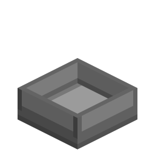</td>
<td width="110" align="center">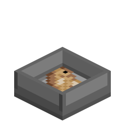</td>
<td width="110" align="center">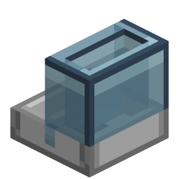</td>
<td width="110" align="center">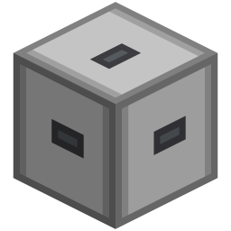</td>
</tr>
<tr>
<td align="center">Cat Bowl</td>
<td align="center">…holding fish</td>
<td align="center">Cat Feeding Station</td>
<td align="center">…holding fish</td>
</tr>
</table>

At a feeding station the trip home pays twice over. The cat empties its five loot slots into the
station's fifteen, and the experience it soaked up from its kills is turned into Bottles o'
Enchanting at eight points each. A hopper underneath drains the loot and the bottles and cannot
reach the fish.

* **Armor.** Iron, gold, diamond and netherite cat armor absorbs every point of incoming damage,
  loses durability instead, and adds attack damage. Enchantable, repairable on the anvil with an
  armadillo scute or the tier's own ingot.
* **Hurt cats go home.** Below 20 % health a guardian abandons everything, runs to its bowl, sits
  there and heals, and only takes duty up again above 40 %.
* **The station can be dressed.** A single style slot holds a material — wool, planks, deepslate,
  andesite — and the block takes on the matching look. 27 of them.
* **Two screens.** Hold the modifier key (default Left Ctrl) and right-click your own cat for its
  armor and loot slots; right-click a station for food, loot and the style slot.
* **A goggles overlay** shows a cat's health, armor, experience and owner, and on the shared debug
  toggle its target, its guard box and the path it is walking.

One module-wide side effect is worth knowing before you switch it on: while `cat_guardian` is
enabled, **no** tamed cat follows or teleports to its owner any more — guardian or not. See
[Compatibility and known limits](#compatibility-and-known-limits).

## In detail

### Binding a cat to a bowl

Sneak and right-click a bowl or station with **both hands empty**. Vanilla skips the block
interaction entirely when you sneak with an item in hand, so the gesture is empty-handed by
construction. Every tamed cat of yours inside `association_radius` (64 blocks) is bound, a cat that
was bound elsewhere is detached from its old bowl first, and the chat tells you how many were
taken — or that the bowl is full, or that it found none of yours nearby.

A bowl holds `max_cats_per_station` cats (8). A cat that has *no* bowl binds itself: on its own
tick it looks for the nearest bowl with room within `auto_associate_radius` (1.5 blocks), so
walking a new cat up to the station is enough.

The binding is stored on both sides — a block position on the cat, a list of UUIDs on the block —
and the station reconciles the two every 200 ticks. It only ever prunes on positive evidence: a cat
in an unloaded chunk cannot be told apart from a cat that no longer exists, so an entry it cannot
inspect is left alone, and a cat it *can* see that still points at this station but is missing from
the list is re-added.

### Food and the fed timer

Only items in `#minecraft:fishes` count. Right-clicking the **bowl** with fish inserts one at a
time into its single slot; an empty-handed, non-sneaking click takes one back out. The **station**
takes the whole stack in one click (in creative, one item), into a 3 × 3 food chamber.

A cat whose timer has run out walks to its bowl and, within two blocks, eats one fish: the timer is
set to `fed_duration_ticks` (6000 ticks = five minutes), it makes the vanilla eating sound and gets
Regeneration II for five seconds. At a station that same moment also triggers a loot hand-over. The
walk only starts while the bowl actually holds fish — at an empty bowl the cat stays where it is.

The timer runs down in real time — ten ticks per pass — whatever else the cat is doing, including
while it flees or walks home.

**Hand-feeding.** Any player can hand any tamed *guardian* cat a fish: the timer resets, the cat is
healed to full, it purrs, seven heart particles appear and one item is consumed unless the feeder
is in creative. Ownership is not checked. A tamed cat with **no** bowl is left to vanilla, which is
why ordinary pet cats still breed normally — guardians do not.

Beside the fish-tag items, hand-feeding also accepts raw and cooked **Flying Fish** by name (they
are in the tag anyway when the [Flying Fish](flying_fish.md) module is on).

### The four states

| State | Entered when | Behaviour |
|---|---|---|
| Unfed | the fed timer hits 0 | walks to the bowl and eats — only while the bowl holds fish; at an empty bowl it stays put |
| Fed | a fish was eaten | scans the guard box, engages, sits at the bowl when there is nothing to do |
| Returning | a target was lost, or nothing reachable was found | walks home; hands loot and XP over on arrival |
| Fleeing | health below 20 % | drops every target, runs home, sits and heals |

Priority runs from the bottom up: fleeing beats returning, returning beats normal duty.

**Fleeing** is absolute. The cat ignores all mobs, keeps the navigation budget doubled for the way
home, and once within four blocks of the bowl it heals — force-sitting until it is back above 40 %.
The 20 / 40 hysteresis is what keeps it from yo-yoing back into the fight at the boundary.

**Returning** is interruptible: a fresh target in the zone pulls the cat back out, *unless* all
five loot slots are full — then the trip is finished first, because a full cat could not pick
anything up anyway. It ends within four blocks of the bowl, or after 1200 accumulated ticks so a
failed path can never strand the cat.

**Passive healing only happens at home.** A resting guardian with no target, within four blocks of
its bowl, regains 0.2 HP per pass — one heart every five seconds, the rate of Regeneration I.
Together with the full heal from a hand-fed fish and the Regeneration II burst a cat gets from
eating at its bowl, that is how a guardian recovers: mobs have no natural regeneration, and armored
cats never take damage to heal in the first place.

### Picking a target

The scan box is the bowl's block inflated by `guard_radius` (32) horizontally and `guard_radius_y`
(16) vertically. Candidates are `Monster`s that are alive, not blacklisted and not fully submerged.

Selection is not "nearest as the crow flies". The candidates are sorted by distance, the closest
eight get a real path computed, and a candidate survives only if

* the path's end node lies within 2 blocks of the mob (no partial paths, no running at a wall), and
* **every** node of the path stays inside the guard box.

The shortest surviving path wins. If nothing survives, the cat goes home instead. A failed search
puts the scan on a 20-tick cooldown, because an A\* run per candidate is not cheap.

Two different buffers bound the fight, so nothing flickers at the edge:

| Buffer | Value | Meaning |
|---|---|---|
| target | +4 blocks | a target that leaves the zone by more than this is dropped |
| cat | +10 blocks | the cat itself may step this far out; beyond it the target is blacklisted and the cat heads home |

A blacklisted mob is ignored for 60 seconds. Every 20 ticks the live path is re-checked against the
zone — a mob that leads the cat out through a cave mouth is blacklisted rather than followed. A
target that dives under water is simply let go, without a blacklist, and re-engaged when it
surfaces.

Retaliation bypasses the search cooldown — but only for an armored cat. A `Monster` that hits the
cat inside the zone triggers an immediate re-target, but the handler that does it (`onCatHurt`)
returns early for a cat that wears no cat armor. An unarmored guardian gets no instant reaction at
all — it has to wait for the ordinary scan to find its attacker again, because a guardian has no
retaliation goal of its own either: vanilla cats never register a `HurtByTargetGoal`, and
`suppressFollowingBehaviors` strips any that another mod adds. A fleeing cat ignores the trigger
either way.

Guardians are land animals here. They may cross shallow water (the water pathfinding malus is
cleared for them, the border malus lowered to 2), but vanilla's float goal keeps them at the
surface and they never dive. With less than 60 ticks of air left — three seconds — the cat drops
its target and heads home, and it cannot acquire a new one while drowning.

### Getting there

Path-finding around a base is the part that fails silently, so several things help it along:

* **Step height +0.9** (0.6 → 1.5). The attribute is what both the walk-node evaluator and the
  movement code read, so the cat actually climbs the 1.5-block ledges the pathfinder already
  considered walkable.
* **Follow range +16**, which doubles the pathfinder's search radius (16 → 32 blocks) — the
  attribute is read live on every path request. The visited-node budget itself is fixed when the
  navigation is built and is only raised by the doubled multiplier on the way home.
* **Fences are walkable** for guardians. Otherwise the pathfinder rejects those nodes outright and
  hides shorter routes through a fenced base. Pet cats keep avoiding them, so a penned cat stays in.
* **Ledge hop.** A moving guardian that bumps into something hops 0.5 upward with 0.28 forward
  carry, following the live path where there is one, otherwise a path it recomputes toward its goal
  every ten ticks, and only as a last resort the straight line to the target or bowl. As long as it
  has a direction to hop along, it refuses to hop without a solid block to clear, without headroom
  above take-off and landing, and one block higher at a water edge, so it does not leap over banks
  it could walk around. Only when even that straight line is under 0.6 blocks — the cat is
  practically on top of its goal — does it fall through and hop with whatever horizontal velocity
  is left, unchecked.
* **Pathless nudge.** When navigation produces no route at all, the cat is pushed 0.18 toward the
  bowl so it can work its way out of a narrow spot.

Stuck detection samples the position every 40 ticks while the cat wants to move. Less than 0.75
blocks of progress is a strike, and the strikes escalate:

| Strike | Response |
|---|---|
| every | force a repath |
| ≥ 2 | active hop toward the goal — frees a cat parked on a chest or a slab, where nothing collides and the route silently fails |
| 3 | blacklist the current target and commit to going home |
| ≥ 5 while heading home | teleport to a standable block next to the bowl (sturdy floor, two collision-free blocks, no fluid — the module's own variant of the vanilla pet teleport) |

A cat that has *arrived* is deliberately excluded — a fleeing cat sitting still while it heals used
to be read as stuck and got bounced and teleported every few seconds.

### Combat

Vanilla registers a cat's leap goal at priority 8 and its attack goal at 9 — below the
bed-lying goal at 5, which means a vanilla cat would rather lie on a bed than fight. The module
re-registers the leap at 3 and its own melee goal at 4, so combat wins while idle behaviour still
works when there is no target.

Reach is `width × 2 + target width + 1.5`, about 3.3 blocks against a zombie. Line of sight is
skipped for targets in water, where a ray is always blocked but the cat can still reach.

**Creepers are the exception.** Cats already frighten creepers in vanilla; here that gets a
consequence. Damage to a creeper is forced past its remaining health, so it dies before the fuse
ignites — no explosion, loot and experience drop as usual:

```java
if (victim instanceof Creeper) {
    event.setNewDamage(Math.max(event.getNewDamage(), victim.getHealth() + 1000.0f));
}
```

To keep that from being a free ranged kill, the reach against a creeper alone is cut to one block.
The cat has to walk right up to it.

### Armor

Right-click your own cat with a piece of cat armor to put it on; a piece already worn goes back
into your inventory. Taking armor *off* is done by dragging it out of the cat's inventory screen —
there is no click gesture for it, because sneak-right-click is left to Carry On and a plain
right-click is vanilla's sit/stand toggle.

| Tier | Durability | Attack bonus | Enchantment value | Repairs with |
|---|---|---|---|---|
| Iron | 200 | +1.0 | 9 | armadillo scute or iron ingot |
| Gold | 100 | +2.0 | 25 | armadillo scute or gold ingot |
| Diamond | 400 | +3.0 | 10 | armadillo scute or diamond |
| Netherite | 600 | +4.0 | 15 | armadillo scute or netherite ingot (fire-resistant as an item) |

Armor absorbs **100 %** of incoming damage and takes `max(1, ceil(damage))` durability for it. The
cat's own health does not move at all while the armor holds; when it breaks it falls off and the
attack bonus goes with it. Unarmored cats take damage normally — which is what the flee threshold
and the healing at the bowl are for.

**Terrain costs nothing.** A cactus, a sweet berry bush or a stalagmite deals damage on a timer for
as long as the animal stands in it, so grazing a hedge wore the armor down faster than any fight did
(Gerry, 2026-09-26). Since `v1.0.0-beta.98` every damage type in
`#vanillaplusadditions:pet_armor_no_wear` is still absorbed in full but costs **no durability**:
`cactus`, `sweet_berry_bush`, `stalagmite`, `falling_stalactite`, `freeze`, `in_wall`, `cramming`,
`fly_into_wall`. The heat hazards `hot_floor` and `campfire` sit in a second tag,
`#vanillaplusadditions:pet_armor_no_wear_heatproof`, and are free on the **netherite tier only** —
asked through the `util/PetArmor` interface. Fire, fall, drowning and starvation are deliberately
left out. There is no config flag — the tag is the switch, and a datapack with `"replace": true` and an
empty list turns it off. Shared with the wolf and the other pet armor through
`util/MobArmorDamage.wearArmor`, so the rounding cannot drift between them.

Three enchantments do something:

| Enchantment | Effect |
|---|---|
| Unbreaking | works natively, through vanilla's own durability handling |
| Thorns | reflects `min(1.0, thorns_reflect_fraction × level)` of the absorbed damage back at a living attacker as thorns damage — 33 % per level by default |
| Sharpness | adds `0.5 + 0.5 × level` to the cat's outgoing damage |

Protection and the rest are legal but pointless: the armor already absorbs everything. The items
sit in `#minecraft:enchantable/armor`, `#minecraft:enchantable/durability` and
`#minecraft:enchantable/sharp_weapon`, and report a material enchantment value, which is what an
enchanting table looks at.

### Loot and experience

Drops from a mob a guardian killed are inserted straight into the cat's five loot slots before they
ever become item entities. What does not fit stays on the floor as normal.

Experience needs a detour. Vanilla only drops experience for a victim that was recently hurt by a
*player*, so a kill by a cat alone drops none at all. The module credits the owner on every hit a
guardian lands:

```java
if (cat.getOwner() instanceof Player owner) {
    victim.setLastHurtByPlayer(owner);
}
```

With the experience now dropping, it is intercepted and redirected into the cat's own buffer up to
`cat_xp_capacity` (500); anything over that spawns as ordinary orbs.

At the station the cat hands over both. Loot goes into the 15 loot slots, experience into the
station's counter up to `station_xp_capacity` (5000) — what the station cannot take stays on the
cat. The station then converts its counter into Bottles o' Enchanting at `xp_per_bottle` (8) each,
for as long as there is room in the loot grid.

### The station as a machine

| Section | Slots | Contents |
|---|---|---|
| Food chamber | 9 | fish the cats eat |
| Loot storage | 15 | what the cats bring back, plus the XP bottles |
| Style slot | 1 | one material item, see below |

Every face accepts **anything**. Fish is routed into the food chamber even when a matching stack
already sits in the loot storage, and fish that no longer fits the chamber overflows into the loot
storage instead of backing the pipe up. Extraction is where the faces differ: the bottom face hands
out loot only, so a hopper underneath keeps collecting drops and bottles but can never drain the
cats' meals. Every other face may pull fish back out.

The comparator reports **occupancy, not fill level**: `floor(cats × 15 / max_cats_per_station)`, so
with the default of 8 a full station reads 15 and each cat is worth just under two steps of
signal strength.

Bowl and station both carry a `filled` blockstate and swap their texture as soon as they hold fish;
the station additionally has a facing and its skin property. Breaking either drops the block, its
contents, the style item and clears every binding on it.

### Styles

The style slot takes one material item and the block reskins itself. The item stays in the slot and
comes back out when you remove it or break the station.

| | Style | Put in |
|---|---|---|
| 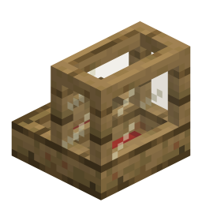 | `gemuetliches_holz` | Oak or spruce planks |
| 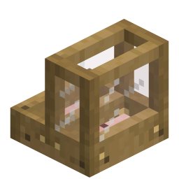 | `kirschholz_cafe` | Cherry planks |
| 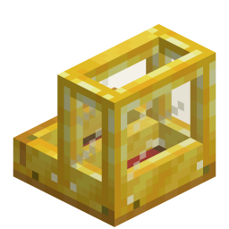 | `edle_dunkeleiche` | Block of Gold |
| 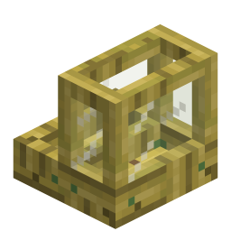 | `bambus_lounge` | Bamboo or bamboo planks |
| 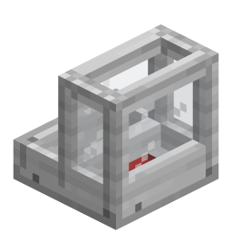 | `stein_bistro` | Stone or smooth stone |
| 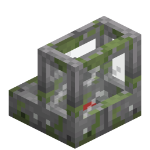 | `steinmetz` | Stone bricks |
| 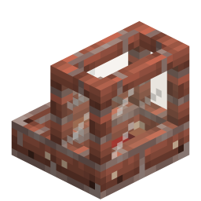 | `dorf` | Bricks |
| 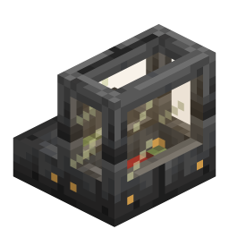 | `hoehle` | Deepslate, cobbled, polished or deepslate bricks |
| 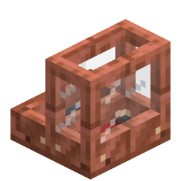 | `deepslate_modern` | Copper ingot |
| 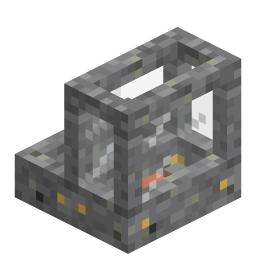 | `create_andesit` | Andesite or polished andesite |
| 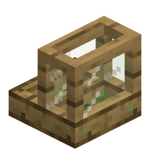 | `wiesengarten` | Grass block |
| 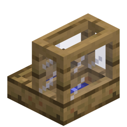 | `wolle_*` | The matching wool — all 16 colours |

Two of those mappings are historical rather than logical: a Block of Gold gives the dark-oak look
and a copper ingot the modern deepslate one. The identifiers are German on purpose — they are the
names the textures were built under and renaming them would break existing blockstates.

### Seeing what a cat is doing

**The cat's inventory** opens on modifier + right-click on one of your own cats. Default modifier is
Left Ctrl; it is a normal rebindable key mapping and may sit on a mouse button. It is read as a raw
held-key state, not as a press event, so it works as a modifier. The screen has the armor slot, the
five loot slots, bars for the fed timer, experience and armor durability, and the cat's health as
text. Without the modifier a right-click stays vanilla sit/stand.

**Glow.** Looking at a bowl makes your own cats bound to it glow for `glow_duration_seconds` (30).
This is purely client-side — only the player looking sees it, and nothing is sent to the server.

**The goggles overlay** needs goggles: Create's Engineer's Goggles, or any item in the
`vanillaplusadditions:arm_goggles` tag. On top of that it has two independent triggers — a
hold-to-peek popup and the shared 3D-box toggle:

| Trigger | Shows |
|---|---|
| holding the cat modifier and looking at a cat (≤ 20 blocks, clear line of sight) | a panel with health, armor durability, experience and the owner's name |
| holding it while looking at a bowl or station | `Associated Cats: n/max` |
| the shared debug toggle (default numpad +, owned by [Debug Overlay](debug_overlay.md)) | outlines on the cat and its current target, the guard-radius box at the bowl, and the cat's live navigation path |

The panel requires line of sight and disappears behind a wall; the 3D boxes are xray on purpose —
they are the debug view. Boxes linger for 15 seconds after you look away. Stats are re-requested
from the server at most once a second.

### Every cat, not only the guardians

Some of the changes are not gated on a cat being a guardian. Anything that joins the world as a
`Cat` gets, server-side:

| Change | Applies to |
|---|---|
| Follow range +16, step height +0.9 | every cat |
| The guard target goal, and vanilla's attack goal replaced by the wider-reach guardian one | every cat |
| Follow-owner and panic goals stripped every tick | every cat |
| Sit-on-chest and lie-on-bed goals stripped (and restored when the bowl is gone) | guardians on duty |
| Fence walking, water maluses | guardians on duty |

## Items, blocks and recipes

| | Item | Details |
|---|---|---|
|  | **Cat Bowl** | One fish slot, holds up to a stack. Association and glow work exactly as at a station; it has no loot storage, no XP and no GUI. |
|  | **Cat Feeding Station** | 9 food + 15 loot + 1 style slot, comparator output, item handler on every face. |
| 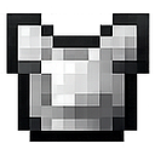 | **Iron Cat Armor** | 200 durability, +1.0 attack. |
| 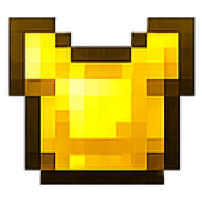 | **Golden Cat Armor** | 100 durability, +2.0 attack. |
| 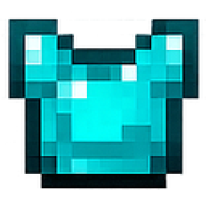 | **Diamond Cat Armor** | 400 durability, +3.0 attack. |
| 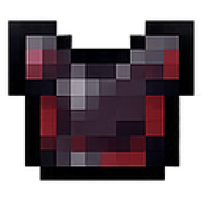 | **Netherite Cat Armor** | 600 durability, +4.0 attack, survives lava as an item. |

All six recipes are registered **in code**, per the project convention — a reload listener added in
`AddReloadListenerEvent` merges them into the `RecipeManager` on every datapack reload, gated on the
module being enabled. There are no recipe JSONs to copy.

```
Cat Bowl             Cat Feeding Station    Cat Armor (all four tiers)
  S . S                G G G                  X . .
  S S S                G C G                  X X X
                       S S S                  U . U

S = Smooth Stone     G = Glass Pane         X = iron ingot / gold ingot /
                     C = Cauldron                diamond / netherite ingot
                     S = Smooth Stone       U = Armadillo Scute
```

<!-- vpa:config:start -->
## Configuration

Section `[modules.cat_guardian]` in `config/vanillaplusadditions-common.toml` (or `config/vpa_cat_guardian-common.toml` if you run the standalone jar).

Every module also has the universal `enabled` and `debug_logging` keys — see the [Configuration Guide](../guides/configuration.md).

| Key | Type | Default | Range | Effect |
|---|---|---|---|---|
| `association_radius` | double | `64.0` | 1.0 ~ 128.0 | Radius (blocks) in which tamed cats are associated when shift-clicking a bowl. |
| `auto_associate_radius` | double | `1.5` | 0.5 ~ 4.0 | Radius (blocks) within which a cat without a bowl is automatically associated with a nearby bowl. |
| `cat_xp_capacity` | int | `500` | 0 ~ 10000 | Maximum XP points a single cat can hold before XP drops normally. |
| `fed_duration_ticks` | int | `6000` | 20 ~ 144000 | How many ticks a single fish feeding keeps a cat in the 'fed' (guarding) state (20 ticks = 1 second). |
| `glow_duration_seconds` | int | `30` | 1 ~ 300 | How many seconds the (client-side) glow lasts on associated cats when looking at their bowl. Consumed as ticks via getGlowDurationTicks() = value * 20. |
| `guard_radius` | double | `32.0` | 2.0 ~ 128.0 | Horizontal radius (blocks, XZ) around the associated bowl in which a fed cat scans for and attacks hostile mobs. |
| `guard_radius_y` | double | `16.0` | 2.0 ~ 128.0 | Vertical radius (blocks, Y) around the associated bowl - cats ignore mobs further away vertically. |
| `max_cats_per_station` | int | `8` | 1 ~ 64 | Maximum number of cats that can be associated with a single bowl or station. Also the divisor of the feeding station's comparator output. |
| `station_xp_capacity` | int | `5000` | 0 ~ 100000 | Maximum XP points a feeding station can hold before overflow stays on cats. |
| `thorns_reflect_fraction` | double | `0.33` | 0.0 ~ 1.0 | Base fraction of absorbed damage reflected back to the attacker, scaled by the armor's Thorns level (0.0 = none, 1.0 = full). |
| `xp_per_bottle` | int | `8` | 1 ~ 64 | XP points consumed per Bottle o' Enchanting produced at the station. |
<!-- vpa:config:end -->

## Compatibility and known limits

| Limit | Effect |
|---|---|
| No tamed cat follows you any more | While the module is enabled, the follow-owner goal is stripped from every cat every tick and two mixins additionally force `FollowOwnerGoal#canUse` and `TamableAnimal#shouldTryTeleportToOwner` to false for cats. The panic goal goes with it, so cats no longer bolt when hurt or set on fire. Disable the module to get vanilla pets back. |
| Cats no longer block chests | `ChestBlock#isCatSittingOnChest` returns false for everyone while the module is active. A convenience, but it is a global behaviour change. |
| Every cat is modified, not just guardians | Strays included — see the table above. Only the fence walking, the water maluses and the goal suppression are duty-gated. |
| You cannot punch a cat | An empty-handed left-click on **any** cat is cancelled and turned into petting: a purr and five hearts. Hit it with something in hand if you really mean it. |
| A dead guardian takes everything with it | Fed timer, loot, experience and worn armor are entity attachments and are not dropped on death. Only the bowl's bookkeeping is cleaned up. |
| Loot beyond five slots is lost | Drops that do not fit the cat's loot slots stay on the ground where the mob died; the cat does not come back for them. |
| Guardians do not swim after anything | They cross shallow water at the surface only. Submerged mobs are filtered out of the search and dropped as targets; low air aborts the fight. |
| Requires `flying_fish` in practice | The fish check falls through to `FlyingFishModule`'s item holders for any item that is not already in `#minecraft:fishes`. With `cat_guardian` on and `flying_fish` off those holders are never bound, and right-clicking a cat with a non-fish item is expected to throw. The standalone jar declares `vpa_flying_fish` as a module dependency for exactly this reason. <!-- TODO: code-structure risk read off the source; not reproduced in game. --> |
| Goggles overlay can be unreachable standalone | The overlay accepts Create's goggles or the `vanillaplusadditions:arm_goggles` tag — and that tag's JSON ships with the `arm_target_overlay` module, not with this one. Standalone, without Create and without that module, neither branch can be satisfied. |
| Sharpness at a table needs the bundle | The `enchantable/sharp_weapon` tag file ships only in the combined jar. In the standalone jar Sharpness has to come from an anvil and a book. |
| Anvil repairs barely show up in JEI | The anvil repair lives in `isValidRepairItem`, and JEI's built-in anvil list is hardcoded vanilla. The bundled JEI plugin adds the armadillo-scute repair back; the repair with the tier's own ingot or gem is not registered and stays invisible even with JEI. Without JEI both still work, they are just undiscoverable. |
| Sable contraptions | With [Sable](https://modrinth.com/mod/sable) installed, bowls and stations are registered as Sable-aware variants and associated cats are teleported into the sublevel when a ship assembles. Without Sable a bowl on a moving contraption simply loses its cats, which then re-associate the usual way. |
| `association_radius` fallback | `CatGuardianConfig#getAssociationRadius` falls back to 8.0 while the static accessor falls back to 64.0. Only reachable before the config spec is loaded, but the two disagree. |

## Under the hood

**Where the state lives.** Six entity attachments carry everything per cat: the bowl position
(`Long.MIN_VALUE` means "no bowl", and that is also the definition of *guardian*), the fed timer, a
six-slot inventory (1 armor + 5 loot), the returning and fleeing flags, and the XP buffer. The
station keeps its inventories, its XP counter and the UUID list in block-entity NBT.

**Ticking.** `EntityTickEvent.Pre` strips the follow-owner goal before the goal selector runs that
tick — doing it in `Post` left a one-tick window in which the teleport could still fire.
`EntityTickEvent.Post` runs the ledge assist and stuck detection every tick and the main `tickCat`
pass every tenth, which is why every duration in this module is a multiple of ten ticks.

**Why healing is manual.** The first version applied `MobEffectInstance(REGENERATION, 60, 0)` every
ten ticks and never healed a single point: vanilla runs a regeneration tick only when
`duration % 50 == 0` and checks that *before* decrementing, so a constantly refreshed effect only
ever saw durations 60…51 and the 50 mark was overwritten one tick too early. The replacement is a
plain `heal(10.0f / 50.0f)` per pass — the same rate, without the trap.

**Mixins** (three, all active only while the module is enabled):

| Mixin | Target | Effect |
|---|---|---|
| `CatGuardianFollowMixin` | `FollowOwnerGoal#canUse` / `#canContinueToUse` | false for any cat |
| `CatGuardianTeleportMixin` | `TamableAnimal#shouldTryTeleportToOwner` | false for tame cats; the only legitimate cat teleport left is Sable assembly |
| `ChestBlockCatMixin` | `ChestBlock#isCatSittingOnChest` | false |

The client-side glow additionally borrows `vpa_core`'s shared-flag invoker. `Entity#setGlowingTag`
is a no-op on the client — it writes `setSharedFlag(6, isCurrentlyGlowing())`, and that method reads
back exactly the flag it is setting — so the bit the renderer checks has to be flipped directly.

**Networking.** Entity attachments do not sync, so `isGuardianCat` is server truth only. Two packets
go up (open inventory, request stats) and four come down (armor, stats, current target, navigation
path). `PlayerEvent.StartTracking` re-sends armor, XP and the live target so the overlay is correct
the moment a player comes into range, and the client-side overlay falls back to "any tame cat of
mine" because it cannot see the bowl attachment.

**Blocks.** Recipes and block drops are both in code — `getDrops` is overridden on the shared bowl
block, container contents are dropped in each subclass's `onRemove`. Datapack JSONs for recipes and
loot tables do not load reliably in this mod; see the project convention.

**Sable indirection.** `CatGuardianModule` never names a Sable type. Putting
`new SableCatBowlBlock(...)` into a registration lambda would make the bytecode verifier load the
Sable subclass while *linking* the module class, which crashes without Sable no matter what
`ModList.isLoaded` says. The `SableCatBlocks` factory exists solely to keep those signatures out —
do not simplify it away.

**Kittens.** `BabyEntitySpawnEvent` tames a kitten to one randomly chosen tamed parent's owner and
force-sits it, because otherwise the follow goal yanks it across the map toward an owner who may be
thousands of blocks away.

The client classes (`CatGuardianClientSetup`, `CatGuardianClientEvents`,
`CatGuardianGogglesClientHandler`) are `@EventBusSubscriber`s that FML registers regardless of
module state, and the setup class resolves its menu and block-entity holders without an
`isModuleEnabled()` check. The same shape exists in `axolotl_guardian` and `item_vault_viewer`, so
it is house style rather than a slip here.
<!-- TODO: not verified in game — no test in this repository starts the client with the module off. -->

## See also

* [Flying Fish](flying_fish.md) — the extra fish guardian cats accept, and a hard dependency of this module
* [Axolotl Guardian](axolotl_guardian.md) — the same idea underwater
* [Battle Dogs](battle_dogs.md) — the same armor system on wolves
* [Debug Overlay](debug_overlay.md) — owns the numpad + toggle the 3D boxes hang on
* [Free Anvil Repair](free_anvil_repair.md) — makes the scute repair cost no levels
* [Configuration Guide](../guides/configuration.md) — where the config file lives
* [All modules](../../README.md#-modules)
