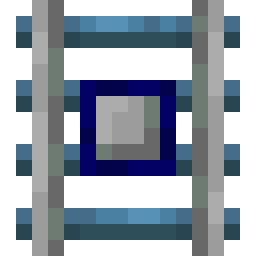
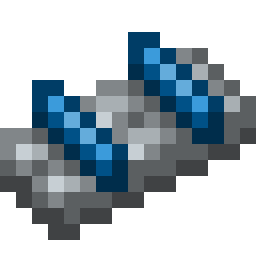
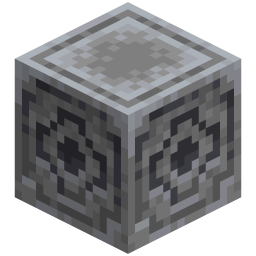

# Debug Overlay

> **TL;DR** — Put on a pair of Engineer's Goggles, press numpad +, and every debug view in the mod
> appears at once: chunk-loader borders, Chunk Anchor areas and the guardian pets' outline boxes all
> hang on that one key.

<!-- vpa:meta:start -->
|  |  |
|---|---|
| **Module ID** | `debug_overlay` |
| **Side** | Client only |
| **Requires** | — |
| **Works with** | [Create](https://modrinth.com/mod/create) <sub>tested 6.0.10</sub>, [Create Aeronautics](https://modrinth.com/mod/create-aeronautics) |
| **Download** | [`vpa_debug_overlay.jar`](https://github.com/GeraldHofbauerWeb/vanillaplusadditions/releases/latest/download/vpa_debug_overlay.jar) · also needs `vpa_core` |
| **Config section** | `[modules.debug_overlay]` |
| **Since** | `v1.0.0-beta.16` |
<!-- vpa:meta:end -->

## What it does

This module has nothing of its own to show. It is the switch, and the scaffolding the other modules
hang their debug views on: one shared toggle, one goggles check, one set of render helpers, so every
overlay in the mod appears and disappears together instead of each one inventing its own key.

Two things must be true before anything is drawn:

1. the overlay is **toggled on** — numpad&nbsp;+ by default, rebindable in the vanilla Controls
   screen under the category *Vanilla+ Additions*;
2. you are **wearing goggles** — Create's Engineer's Goggles, or anything in the
   `vanillaplusadditions:arm_goggles` item tag worn on your head.

Pressing the key prints `Debug overlay: ON` or `Debug overlay: OFF` on the action bar, with or
without goggles, so you can arm it first and it comes up the moment you put them on.

What then shows up depends on which modules are installed:

| | Overlay | From |
|---|---|---|
|  | Every nearby chunk holding a Chunk Loader Rail, outlined — blue while idle, red while it is actually force-loading | [Minecart Chunk Loading](minecart_chunk_loading.md) |
|  | The same for Chunk Loader Tracks — blue while idle, red while a carriage the client can see is holding them loaded: within the load radius (2 chunks by default), and for 15&nbsp;s by default (`active_timeout_seconds`) after it has passed. The state is computed client-side, so it approximates the server's forced set rather than reading it. The carriage itself gets no box | [Train Chunk Loading](train_chunk_loading.md) |
|  | A Chunk Anchor's whole forced area as one box — green while powered, grey while it is not | [Chunk Anchor](stationary_chunk_loader.md) |
| — | A guardian cat's or axolotl's outline, its current target, the guard box at its bowl and its live navigation path | [Cat Guardian](cat_guardian.md), [Axolotl Guardian](axolotl_guardian.md) |

The toggle lives in the client process and nowhere else. It is not written to disk and not sent to
the server, so it is off again after every restart, and switching it on in single-player has no
effect on anybody else on a server.

## In detail

### The gate

Every one of the three dispatch handlers asks the same question first:

```java
private static boolean active(Minecraft mc) {
    return DebugOverlayState.isEnabled()
            && mc.player != null
            && mc.level != null
            && GogglesUtil.isWearingGoggles(mc.player);
}
```

All three conditions are checked once per event, in the framework, which is why a registered
renderer never has to test the toggle or the goggles itself — the interface's javadoc says so
explicitly, and none of the three in-repo renderers does.

**The keybind is consumed before that gate**, not after it. The `consumeClick` loop sits at the top
of `onClientTick` and `active()` is only asked afterwards, so numpad&nbsp;+ flips the state and
prints its action-bar line even with a bare head — and, as [the section on the `enabled`
switch](#the-enabled-switch-does-not-switch-it-off) shows, even when the module is switched off in
the config.

### What counts as goggles

```java
if (CREATE_LOADED && GogglesItem.isWearingGoggles(player)) {
    return true;
}
return player.getItemBySlot(EquipmentSlot.HEAD).is(ARM_GOGGLES_TAG);
```

Two paths, in that order. The first is Create's own predicate, behind a static
`ModList.get().isLoaded("create")` flag that is read once — that path also accepts goggles sitting
in a Curios slot, because Create registers that predicate itself. The second is a plain tag check
against the **vanilla head slot**; Curios is not consulted there.

The tag ships two entries, both optional:

```json
{ "values": [
  { "id": "create:goggles", "required": false },
  { "id": "aeronautics:aviators_goggles", "required": false }
] }
```

`"required": false` means a missing mod drops the entry instead of breaking the tag. In a pack with
neither Create nor Create: Aeronautics the tag therefore resolves to the empty set, the first path
is skipped and the second can never match — the overlay can be toggled on, says so on the action
bar, and still draws nothing. That holds in the all-in-one bundle too, not only in the standalone
jars.

### Who plugs in, and who only shares the key

The `debug_overlay` module drives three renderers and shares its state with three more handlers that
it knows nothing about. The difference matters when you are reading the code, and it matters when
one of those modules is switched off.

| Module | Coupling | Consequence |
|---|---|---|
| `minecart_chunk_loading` | registers a `DebugOverlayRenderer` in `onClientSetup()` | driven by this module's dispatcher, fully covered by `active()` |
| `stationary_chunk_loader` | same | same |
| `train_chunk_loading` | same | same |
| `cat_guardian` | own `@EventBusSubscriber` handler, reads `DebugOverlayState.isEnabled()` and `GogglesUtil` | the 3D boxes follow this toggle; the stats popup hangs on the module's own hold-to-peek key |
| `axolotl_guardian` | same | same |
| `mob_cart_loader` | own handler, reads **only** `GogglesUtil` | its goggles panel is not on this toggle at all — goggles plus looking at a loader is enough, overlay on or off |

`arm_target_overlay` and `item_vault_viewer` are goggles overlays as well, and neither goes through
`GogglesUtil` — but not in the same way. `arm_target_overlay` keeps its own copy of the dual check,
Create's predicate and then the `arm_goggles` tag. `item_vault_viewer` calls Create's
`GogglesItem.isWearingGoggles` directly and has no tag fallback at all — it requires Create anyway —
so a tagged Aeronautics aviator's goggles opens this overlay but not the vault viewer. Only the six
modules above touch this module.

### The `enabled` switch does not switch it off

Both handler classes are annotated `@EventBusSubscriber(value = Dist.CLIENT, …)`, which NeoForge
scans per jar without ever asking VPA's `ModuleManager`, and nothing anywhere in
`modules/debug_overlay/` calls `isModuleEnabled()`. So with `debug_overlay.enabled = false`:

* the keybind is still registered and still appears in the Controls screen,
* numpad&nbsp;+ still flips the state and still prints the action-bar message,
* every renderer that made it into the registry still draws.

What the switch does reach is the other end. `ModuleManager.clientSetup()` iterates only the enabled
modules, so a disabled `minecart_chunk_loading`, `stationary_chunk_loader` or `train_chunk_loading`
never reaches its `onClientSetup()` and never registers its renderer. In other words: to lose the
chunk borders, switch off the chunk-loader module — switching off `debug_overlay` leaves you with a
live toggle and nothing plugged into it.

<!-- vpa:config:start -->
## Configuration

Section `[modules.debug_overlay]` in `config/vanillaplusadditions-common.toml` (or `config/vpa_debug_overlay-common.toml` if you run the standalone jar).

Every module also has the universal `enabled` and `debug_logging` keys — see the [Configuration Guide](../guides/configuration.md).

This module has no settings of its own.
<!-- vpa:config:end -->

## Compatibility and known limits

| Limit | Effect |
|---|---|
| Neither Create nor Create: Aeronautics | Both tag entries are `required: false`, so the tag is empty and no item can satisfy the goggles check. The toggle works, the message prints, nothing is ever drawn. Applies to the bundle as well. |
| Standalone `vpa_debug_overlay` without `vpa_arm_target_overlay` | `arm_goggles.json` is assigned to the **arm_target_overlay** jar in `build.gradle`, and `vpa_core` carries no module's own data files — beyond the framework classes it ships `assets/vanillaplusadditions/**`, `logo.png` and the third-party compat tags under `data/sable/**`. In a standalone install without that jar the tag has no content at all, so Create's own goggles are the only way in. Read off the build script, not reproduced. |
| Curios | Only through Create's predicate. The tag fallback reads `EquipmentSlot.HEAD` and nothing else, so a tagged non-Create goggles item in a Curios slot does not count. |
| `enabled = false` | Does not remove the keybind, the toggle or the message — see above. |
| Not an x-ray view | All three registered renderers draw with the depth-tested render types, so their boxes are hidden behind terrain. The see-through outlines around a guardian cat come from that module's own private render type, not from this one. |
| Toggle not persisted | A plain static boolean, never saved and never synced. Off after every client restart, and per client — one player's overlay is invisible to everyone else. |
| Dedicated server | Client-only. `onInitialize()` has an empty body and every class that does anything sits behind `Dist.CLIENT`, so the module is inert on a server. |

## Under the hood

| Event | Bus | Purpose |
|---|---|---|
| `RegisterKeyMappingsEvent` | mod, client | Registers the single `TOGGLE` mapping |
| `ClientTickEvent.Post` | game, client | Consumes the keybind, then dispatches `clientTick` to every registered renderer |
| `RenderLevelStageEvent` | game, client | Returns unless the stage is `AFTER_TRANSLUCENT_BLOCKS`, then dispatches `renderWorld` |
| `RenderGuiEvent.Post` | game, client | Dispatches `renderHud` |

No mixins, no commands, no network payloads, no items, blocks or entities — the module's mixin
config carries no `debug_overlay` entry, and its standalone descriptor declares neither data files
nor mixins.

### The world-render pass

`onRenderLevelStage` filters on `AFTER_TRANSLUCENT_BLOCKS` and then returns early when the gate
fails or the registry is empty — in that order. With the toggle off that costs one boolean; with it
on, the goggles check runs before the list is even looked at, and with Create loaded a bare head
runs both of its branches — so a pack with nothing plugged in still pays for that check every
frame. Otherwise it pushes a pose translated by `-cameraPos`:

```java
pose.pushPose();
pose.translate(-cam.x, -cam.y, -cam.z);
for (DebugOverlayRenderer renderer : DebugOverlayRegistry.renderers()) {
    renderer.renderWorld(event, pose, buffers, cam, partialTick);
}
pose.popPose();
```

That is the whole contract for a renderer: feed it raw world coordinates and they land in the right
place. `partialTick` comes from `event.getPartialTick().getGameTimeDeltaPartialTick(true)`. After
the loop the framework flushes all four of its render types explicitly, whether or not anything
wrote to them.

### The four render types

| Constant | Name | Mode | Depth test |
|---|---|---|---|
| `XRAY_LINES` | `vpa_debug_lines` | `LINES` | `NO_DEPTH_TEST` — draws through terrain |
| `XRAY_QUADS` | `vpa_debug_quads` | `QUADS` | `NO_DEPTH_TEST` |
| `DEPTH_LINES` | `vpa_debug_lines_depth` | `LINES` | `LEQUAL_DEPTH_TEST` — occluded by terrain |
| `DEPTH_QUADS` | `vpa_debug_quads_depth` | `QUADS` | `LEQUAL_DEPTH_TEST` |

All four use a 1536-byte buffer, `TRANSLUCENT_TRANSPARENCY`, `VIEW_OFFSET_Z_LAYERING`, `COLOR_WRITE`
and `NO_CULL`; the two see-through ones additionally render into `ITEM_ENTITY_TARGET`. The `NO_CULL`
is what lets `sideQuad` emit its four vertices in whatever winding is convenient.

### The two drawing helpers

`renderChunkBorder` draws one chunk as a bright 12-edge outline (`LevelRenderer.renderLineBox`) plus
four faint translucent side walls, over a caller-chosen Y band. `renderBox` does the same for an
arbitrary axis-aligned rectangle — that is how a Chunk Anchor's whole radius becomes one box rather
than a grid of them.

The interesting part is `renderChunkBorder`'s four-flag overload. Translucent walls between two
adjacent chunks stack, and a region of eight or ten loader chunks turns into an opaque fog. So the
callers precompute every chunk's state and suppress a wall whose neighbour is in the same state:

```java
boolean north = !sameState(loadedState, cp.x, cp.z - 1, loaded);
```

The bright outline is always drawn, so the chunk grid survives; only the fills collapse to the outer
boundary of each same-state region.

### The plug-in interface

`DebugOverlayRenderer` has three methods and all three are `default`, so a renderer implements only
what it needs — the three in this repo implement `clientTick` and `renderWorld` and leave `renderHud`
alone. `DebugOverlayRegistry.register()` is called from a module's `onClientSetup()`; there is no
unregister.

### Classes

| Class | Role |
|---|---|
| `modules/debug_overlay/DebugOverlayModule` | Module descriptor; `onInitialize()` is empty by design |
| `modules/debug_overlay/client/DebugOverlayKeybinds` | The single `KeyMapping`, default `GLFW_KEY_KP_ADD` |
| `modules/debug_overlay/client/DebugOverlayState` | The static toggle |
| `modules/debug_overlay/client/GogglesUtil` | The goggles check, and the only Create reference |
| `modules/debug_overlay/client/DebugOverlayRegistry` | The renderer list |
| `modules/debug_overlay/client/DebugOverlayRenderer` | The plug-in interface |
| `modules/debug_overlay/client/DebugOverlayClientEvents` | Keybind handling, the gate, the three dispatchers |
| `modules/debug_overlay/client/DebugRenderUtil` | The four render types and the two drawing helpers |
| `standalone/debug_overlay/DebugOverlayStandalone` | `@Mod("vpa_debug_overlay")` entry point |

### Loose ends in the code

None of these break anything; they are things a reader will trip over.

| Thing | State |
|---|---|
| `DebugOverlayState.setEnabled(boolean)` | Never called anywhere in `src/main/java` — dead API surface next to `toggle()`. |
| `XRAY_LINES` / `XRAY_QUADS` | No renderer in this repository writes to them; they are only ever flushed. `arm_target_overlay`, `block_glow`, `cat_guardian` and `axolotl_guardian` each define their own private see-through line type instead of reusing these. |
| `renderHud` | Dispatched on every `RenderGuiEvent.Post` while the overlay is active, but no class in the repository implements it. |
| `DebugRenderUtil`'s class javadoc | Still claims "Both render types are depth-test-free" — there are four now, and two of them are depth-tested. |
| `DebugOverlayRegistry.renderers()` | Returns the internal mutable `ArrayList`, no copy and no unmodifiable wrapper. `register()` de-dupes with `List.contains`, i.e. by identity for these classes, so two instances of the same renderer class would both be added and both drawn. |

### Standalone jar

`vpa_debug_overlay` carries the module package, the standalone entry point and nothing else — no
data files, no mixins, no assets (those live in `vpa_core`). Its generated `neoforge.mods.toml`
declares `vpa_core`, `neoforge` and `minecraft` as required plus the all-in-one bundle as
incompatible, and **no Create dependency at all**, not even an optional one; the bundle's own
`neoforge.mods.toml` does declare Create as `optional` and names this module in the comment above it.

Five module jars declare `vpa_debug_overlay` as a required dependency: `vpa_axolotl_guardian`,
`vpa_cat_guardian`, `vpa_minecart_chunk_loading`, `vpa_stationary_chunk_loader` and
`vpa_train_chunk_loading`.

### History

Introduced in `v1.0.0-beta.16` together with the minecart chunk loader, generalising a cat-only
debug keybind that already used numpad&nbsp;+ — which is why that default was kept. The
`isLoaded("create")` gate in `GogglesUtil` came later, with the release that made the library mods
genuinely optional.

## See also

* [Minecart Chunk Loading](minecart_chunk_loading.md), [Train Chunk Loading](train_chunk_loading.md),
  [Chunk Anchor](stationary_chunk_loader.md) — the three modules that register a renderer here
* [Cat Guardian](cat_guardian.md), [Axolotl Guardian](axolotl_guardian.md) — their boxes share this
  toggle, their popups do not
* [Mob Cart Loader](mob_cart_loader.md) — uses the goggles check without the toggle
* [Arm Target Overlay](arm_target_overlay.md) — ships the `arm_goggles` tag the fallback reads
* [Configuration Guide](../guides/configuration.md) — where the config file lives
* [All modules](../../README.md#-modules)
