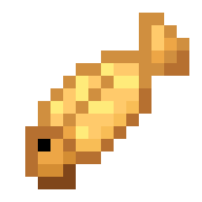
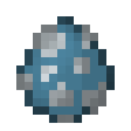

# Flying Fish

> **TL;DR** — Adds flying fish that leap out of warm oceans, plus Flying Fish Boots that let you
> sprint across the water surface, hop out of the water and glide back down.

<!-- vpa:meta:start -->
|  |  |
|---|---|
| **Module ID** | `flying_fish` |
| **Side** | Client + Server |
| **Requires** | — |
| **Works with** | — |
| **Download** | [`vpa_flying_fish.jar`](https://github.com/GeraldHofbauerWeb/vanillaplusadditions/releases/latest/download/vpa_flying_fish.jar) · also needs `vpa_core` |
| **Config section** | `[modules.flying_fish]` |
| **Since** | `v0.15.0` |
<!-- vpa:meta:end -->

## What it does

Warm oceans get a fish that will not stay in the water. A flying fish swimming in the topmost water
layer throws itself into the air every couple of seconds, turns on its side as it goes and sails a
short way before dropping back in.

Catch one in a bucket, put the bucket on a crafting grid together with a pair of diamond boots, and
you get **Flying Fish Boots**. Wear them, sprint into water and you skim the surface instead of
wallowing in it; roughly every 0.7 seconds the boots throw you into a hop, and for the next 16 ticks
you sink at a fraction of the normal rate — a short flat glide before you touch down and the next hop
starts.

<table>
<tr>
<td width="90" align="center"></td>
<td width="90" align="center"></td>
<td width="90" align="center"></td>
<td width="90" align="center"></td>
<td width="90" align="center"></td>
</tr>
<tr>
<td align="center">Flying Fish</td>
<td align="center">Cooked</td>
<td align="center">Bucket</td>
<td align="center">Boots</td>
<td align="center">Spawn Egg</td>
</tr>
</table>

Raw Flying Fish also counts as **cat food** — it tames, heals and breeds cats just like cod does.
Both the raw and the cooked item sit in `#minecraft:fishes`, so anything that takes fish takes them,
including this mod's cat and axolotl bowls and feeding stations.

Spawns are common in warm oceans, where cod does not spawn at all, and deliberately rare in lukewarm
oceans, so they do not crowd cod out of the shared water-ambient mob cap.

## In detail

### The fish

`FlyingFishEntity` extends `Cod`, so it swims, schools and sounds like a cod. Two things are added,
both in `aiStep` and both hardcoded — the config tunes only the boots.

**The leap**, checked once per tick before the inherited AI runs. It needs all four of:

| Condition | Value |
|---|---|
| Own leap cooldown expired | `16 + random(24)` ticks after the last leap, so 16–39 |
| No attack target | `getTarget() == null` |
| Random roll | 12 % per tick (`LEAP_CHANCE = 0.12F`) |
| At the surface | water in the fish's own block, **no** water in the block above |

The roll costs about 8 further ticks on average, so a fish that holds the surface undisturbed leaps
roughly every 36 ticks — one hop every 1.8 seconds.

The launch takes the fish's current swim direction — or, if it is all but stationary
(`horizontalDistanceSqr <= 1.0E-4`), its facing jittered by ±25° — and sets

* horizontal `0.45 + random·0.22` blocks/tick (0.45–0.67),
* upward `0.56 + random·0.16` blocks/tick (0.56–0.72).

**The air glide**, applied after the inherited AI whenever the fish is neither in water nor on the
ground: downward speed is clamped to 0.08 blocks/tick and horizontal motion is multiplied by 1.01
each tick. That is what turns the hop into a soaring arc instead of a plop.

The entity also gets `generic.movement_speed` 1.1. `AbstractFish.createAttributes()` sets only
`MAX_HEALTH` 3, so a plain cod runs on the attribute's own default of 0.7. Hitbox 0.5 × 0.3,
`MobCategory.WATER_AMBIENT`, client tracking range 4.

### The boots

Two separate effects, evaluated server-side in `PlayerTickEvent.Post`.

**The skim boost** runs on every tick where you are sprinting, *not* sneaking, and touching water. It
adds `boots_horizontal_boost` (0.08) along your horizontal look vector and then clamps the total
horizontal speed to a hardcoded 0.95 blocks/tick. Sneaking is the off switch: hold shift and both the
boost and the leap stop immediately.

"Touching water" is generous on purpose — `isInWaterOrBubble()`, or water in the block at your feet
minus 0.1, 0.6 or 1.0 blocks. Shallow water counts, so does running along the top of a one-block
channel, and so does being fully submerged.

**The leap** needs the same sprint-and-water condition, an expired cooldown, a leap mode other than
`REALISTIC`, and — in `DEFAULT` — both halves of a surface check: **no** water 0.6 blocks above you
**and** water at your feet minus 0.1, 0.6 or 1.0. You have to be at the surface rather than under
it, and the `isInWaterOrBubble()` half of "touching water" does not qualify on its own — a hitbox
that merely overlaps an adjacent water block still earns the boost, but not the leap. It then sets

| | Value |
|---|---|
| Horizontal | 60 % of your current motion **plus** 0.55 along your horizontal look |
| Vertical | at least `boots_vertical_boost` (0.42) — exactly a vanilla jump, since `generic.jump_strength` defaults to 0.42 |
| Fall distance | reset to 0 |
| Cooldown | `leap_cooldown_ticks` (14), halved in `ARCADE` |
| Glide grace | 16 ticks |

The vertical value is a floor (`Math.max`), not an assignment, so a leap never slows an upward motion
you already had. The boost is applied earlier in the same tick than the leap, so the 60 % carried
into the launch already contains that tick's 0.08.

**The glide** applies during those 16 grace ticks, but only while you are out of water: downward
speed is capped at `max_glide_fall_speed` (0.08 blocks/tick, 1.6 blocks/s — one tick's worth of
gravity, which also defaults to 0.08) and fall distance is zeroed every tick. A hop that ends on land
inside the grace therefore does no fall damage; once the grace runs out, ordinary falling resumes
from wherever you happen to be.

The 16 grace ticks outlast the 14-tick cooldown, so while you keep skimming the next leap always
refreshes the grace before it expires: the glide only ever lapses once you stop, and raising
`leap_cooldown_ticks` past 16 is what makes the hops feel disconnected.

### The three leap modes

| `leap_mode` | Leap triggers when | Cooldown | Glide |
|---|---|---|---|
| `DEFAULT` | sprinting, touching water, and at the surface | 14 ticks | yes |
| `ARCADE` | sprinting and touching water at all, submerged included | 7 ticks (`max(1, 14/2)`) | yes |
| `REALISTIC` | never | — | **no** |

`REALISTIC` losing the glide is not a separate decision: the grace counter is only ever set inside
the launch, so a mode that never launches leaves the horizontal skim boost and nothing else.

### Where they spawn

Two `neoforge:add_spawns` biome modifiers, both `minCount` 2 / `maxCount` 5, placed with
`SpawnPlacementTypes.IN_WATER` on `MOTION_BLOCKING_NO_LEAVES` using vanilla's own
`WaterAnimal::checkSurfaceWaterAnimalSpawnRules`.

| Biome | Flying fish weight | Cod there | Share of the water-ambient roll |
|---|---|---|---|
| `warm_ocean` | 28 | none | 28 of 68 ≈ 41 % |
| `lukewarm_ocean` | 8 | weight 15 | 8 of 53 ≈ 15 % |
| `deep_lukewarm_ocean` | 8 | weight 8 | 8 of 46 ≈ 17 % |

The split is deliberate. Warm ocean carries no cod at all, so a heavy weight there costs nothing;
lukewarm ocean is cod's home and the whole `WATER_AMBIENT` category shares one mob cap, so a heavy
weight there would quietly replace the cod.

## Items, blocks and recipes

| | Item | Details |
|---|---|---|
|  | **Flying Fish** | Food: 2 hunger, 0.4 saturation modifier. In `#minecraft:fishes` and in `#minecraft:cat_food`. |
|  | **Cooked Flying Fish** | Food: 5 hunger, 0.6 saturation modifier. In `#minecraft:fishes`, deliberately **not** in `#minecraft:cat_food`. |
|  | **Bucket of Flying Fish** | `MobBucketItem`, stacks to 1, empties with the vanilla fish-bucket sound. Crafting it away returns an empty Bucket (`craftRemainder`). |
|  | **Flying Fish Boots** | `ArmorMaterials.DIAMOND`, boots slot: 3 armour, 2.0 toughness, enchantment value 10, 429 durability (13 × 33) — statistically identical to diamond boots. Rarity uncommon. Three tooltip lines. Depth Strider and Frost Walker are refused. |
|  | **Flying Fish Spawn Egg** | Colours `#4F8AA6` / `#E8F2F7`. |

**Boots recipe** — shapeless, category *equipment*:

```
Diamond Boots + Bucket of Flying Fish  →  Flying Fish Boots  (+ the empty Bucket back)
```

Per the project convention it is registered in code, not as a datapack JSON: a reload listener added
in `AddReloadListenerEvent` merges it into the `RecipeManager` on every datapack reload.

**Drops** — killing a flying fish yields one raw Flying Fish, or one **Cooked** Flying Fish if the
fish was on fire when it died. The handler adds nothing if something else already dropped a flying
fish, and it respects the `doMobLoot` gamerule. Vanilla's cod table does two further things that
this fallback does not. It smelts the drop for a burning fish *or* for a killer whose weapon carries
a `#minecraft:smelts_loot` enchantment — so a Fire Aspect sword that kills a flying fish underwater,
where the fire goes out at once, still gives you the raw item. And it carries a second pool with a
5 % chance of Bone Meal, which a flying fish therefore never drops.

**There is no cooking recipe.** Raw Flying Fish cannot be smelted, smoked or grilled on a campfire —
nothing in this repository defines one. Smelting, smoking and campfire recipes existed once and were
dropped in `v1.0.0-beta.15` because they sat in the pre-1.21 plural `recipes/` folder and never
loaded; they were not re-implemented in code. Outside creative and commands, a fish that dies on fire
is the only source of the cooked item.

<!-- vpa:config:start -->
## Configuration

Section `[modules.flying_fish]` in `config/vanillaplusadditions-common.toml` (or `config/vpa_flying_fish-common.toml` if you run the standalone jar).

Every module also has the universal `enabled` and `debug_logging` keys — see the [Configuration Guide](../guides/configuration.md).

| Key | Type | Default | Range | Effect |
|---|---|---|---|---|
| `boots_horizontal_boost` | double | `0.08` | 0.0 ~ 1.0 | Horizontal speed boost applied while sprinting over or through water with Flying Fish Boots. Added to the delta movement each tick along the horizontal look vector, then clamped to the hardcoded MAX_SURFACE_SPEED of 0.95. |
| `boots_vertical_boost` | double | `0.42` | 0.0 ~ 2.0 | Vertical launch strength applied when the boots trigger a flying-fish leap (used as a floor via Math.max on the current upward motion). |
| `leap_cooldown_ticks` | int | `14` | 1 ~ 200 | Cooldown between automatic flying-fish leaps from the water surface. ARCADE uses half of it (minimum 1). |
| `leap_mode` | enum | `LeapMode.DEFAULT` | DEFAULT \| ARCADE \| REALISTIC (LeapMode.java) | Auto-hop behaviour of the Flying Fish Boots: DEFAULT = automatic leaps when sprinting near the water surface (governed by leap_cooldown_ticks), ARCADE = leaps trigger any time the player touches water while sprinting, with the cooldown halved, REALISTIC = no automatic leaps at all, so only the horizontal water-skim boost remains (and with it no glide, because the glide grace is only set on a leap). |
| `max_glide_fall_speed` | double | `0.08` | 0.01 ~ 1.0 | Maximum downward speed while gliding after a water leap; lower values glide longer. Applies only during the 16-tick glide grace after a leap and only while out of water. |
<!-- vpa:config:end -->

## Compatibility and known limits

| Limit | Effect |
|---|---|
| Fishing rod | Flying fish cannot be caught. Both items are in `#minecraft:fishes`, but vanilla's `gameplay/fishing/fish` table lists cod, salmon, tropical fish and pufferfish by literal id and contains no tag entry. |
| Entity loot table never loads | The file ships at `data/vanillaplusadditions/loot_tables/entities/flying_fish.json`, plural, while 1.21 reads the singular `loot_table/`. The entity therefore resolves to the empty table, which makes the `LivingDropsEvent` fallback the only drop path: drops follow `doMobLoot` and the table's `random_sequence` never applies. |
| It *is* a cod | `FlyingFishEntity extends Cod extends AbstractSchoolingFish`. It schools, uses cod sounds and cod bucket handling, and any mod testing `instanceof Cod` or `instanceof AbstractSchoolingFish` will match it. |
| Standalone jar, enchantments | `vpa_flying_fish` ships only `enchantable/foot_armor.json`; `enchantable/armor.json` and `enchantable/durability.json` travel with the bundle and with `vpa_cat_guardian`. Run the boots standalone and Feather Falling and Soul Speed still work, but Protection, Thorns, Unbreaking and Mending have no supported-items entry for them. The `fishes` and `cat_food` tags do ship standalone, so the cat-food coupling survives. |
| Module disabled, datapack not | The two biome-modifier JSONs ship unconditionally, while the item and entity registers are only handed to the mod bus for an enabled module. Turning the module off leaves spawn entries pointing at an unregistered entity id. Read off the source: not verified at runtime, no test in this repository covers the disabled-module start. |
| Spectators | Skipped on purpose: the forced velocity sync that carries the boost jerks the spectator camera. Passengers are skipped too. |
| Logged-out player mid-cooldown | The two timer maps are keyed by player UUID and cleared either by counting down or on the first tick without the boots. There is no logout handler, so a player who quits wearing the boots mid-cooldown leaves one `Integer` behind. Bounded and server-thread only. |
| Recipe injection | The reload listener copies every recipe into a new map, adds its own and calls `RecipeManager.replaceRecipes` — a full replace, once per datapack reload. Several modules stack this same pattern. |

## Under the hood

No mixins, no commands, no keybinds, no network payloads. All of the boots movement is
server-authoritative: the handler returns immediately on the client. The skim boost and the leap
set `hasImpulse` and `hurtMarked`, so the server pushes the new velocity to the client itself. The
glide clamp sets neither flag: it changes the velocity server-side without forcing that sync, and
resets `fallDistance`.

| Event | Bus | Purpose |
|---|---|---|
| `EntityAttributeCreationEvent` | mod | `AbstractFish.createAttributes()` plus `MOVEMENT_SPEED` 1.1 |
| `RegisterSpawnPlacementsEvent` | mod | `IN_WATER` / `MOTION_BLOCKING_NO_LEAVES` / `checkSurfaceWaterAnimalSpawnRules`, `Operation.REPLACE` |
| `EntityRenderersEvent.RegisterRenderers` | mod, client | Added only when `FMLEnvironment.dist == Dist.CLIENT`, and the handler itself returns unless `FlyingFishModule.isContentRegistered()` |
| `LivingDropsEvent` | game | The fallback fish drop |
| `AddReloadListenerEvent` | game | Adds `vanillaplusadditions_flying_fish_recipes` |
| `PlayerTickEvent.Post` | game | Every boots effect: timers, skim boost, leap, glide |

The three game-bus handlers are each gated on `isModuleEnabled()`, so the module can be switched off
at runtime and the boots simply stop working.

**Rendering.** `FlyingFishRenderer` is 46 lines and adds no new model: it bakes vanilla's
`ModelLayers.COD` into a `CodModel` and only swaps the texture for
`vanillaplusadditions:textures/entity/fish/flying_fish.png`. `setupRotations` adds a sine wiggle
(`4.3° · sin(0.6·bob)` about Y) and, when the fish is out of water, a 90° roll about Z plus a small
translate — that is the sideways soar you see in the air.

**Classes.**

| Class | Role |
|---|---|
| `modules/flying_fish/FlyingFishModule` | Registration, spawns, drops, the recipe listener, all boots movement |
| `modules/flying_fish/entity/FlyingFishEntity` | `aiStep` leap and air glide, `getBucketItemStack` |
| `modules/flying_fish/item/FlyingFishBootsItem` | Diamond boots plus the enchantment block and the three tooltip lines |
| `modules/flying_fish/config/FlyingFishConfig`, `LeapMode` | The five config values |
| `modules/flying_fish/client/FlyingFishRenderer`, `FlyingFishClientHooks` | Client-only rendering |
| `standalone/flying_fish/FlyingFishStandalone` | `@Mod("vpa_flying_fish")` entry point for the standalone jar |

**Enchantment block.** `FlyingFishBootsItem` refuses Depth Strider and Frost Walker twice over — at
the enchanting table through `isPrimaryItemFor`, and for anvils and books through `isBookEnchantable`,
which inspects the book's `STORED_ENCHANTMENTS` component. The `desc_3` tooltip line says so in game.

**Cross-module coupling.** This module imports nothing from another module. The dependency runs the
other way: `cat_guardian` imports `FlyingFishModule` to accept raw and cooked flying fish as
guardian-cat food, and the standalone `vpa_cat_guardian` jar therefore lists `vpa_flying_fish` as a
module dependency. The cat and axolotl bowls and feeding stations need no such import — they test
`#minecraft:fishes` and pick both items up through the tag.

## See also

* [Cat Guardian](cat_guardian.md) — feeds on flying fish, and depends on this module
* [Axolotl Guardian](axolotl_guardian.md) — its bowls and stations take them via `#minecraft:fishes`
* [Configuration Guide](../guides/configuration.md) — where the config file lives
* [All modules](../../README.md#-modules)
