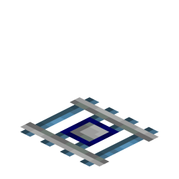
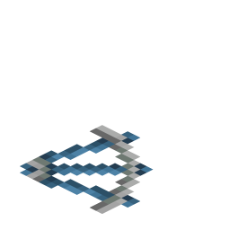
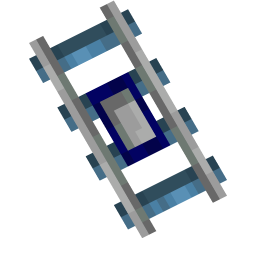

# Minecart Chunk Loading

> **TL;DR** — A craftable rail that keeps the chunks around a travelling minecart loaded, so
> long-distance cart lines keep running instead of stalling at the edge of the loaded world.

<!-- vpa:meta:start -->
|  |  |
|---|---|
| **Module ID** | `minecart_chunk_loading` |
| **Side** | Client + Server |
| **Requires** | — |
| **Works with** | [Create](https://modrinth.com/mod/create) <sub>tested 6.0.10</sub>, [Create Aeronautics](https://modrinth.com/mod/create-aeronautics) |
| **Download** | [`vpa_minecart_chunk_loading.jar`](https://github.com/GeraldHofbauerWeb/vanillaplusadditions/releases/latest/download/vpa_minecart_chunk_loading.jar) · also needs `vpa_core`, `vpa_debug_overlay` |
| **Config section** | `[modules.minecart_chunk_loading]` |
| **Since** | `v1.0.0-beta.16` |
<!-- vpa:meta:end -->

## What it does

Adds a **Chunk Loader Rail**. It rides like an ordinary rail — straights, curves, ascending pieces,
waterlogging, and vanilla track connects and curves into it — but while a minecart is on one, a
square of chunks around that rail is force-loaded and kept ticking. Fifteen seconds after the last
cart left, the square is released again.

<table>
<tr>
<td width="110" align="center"></td>
<td width="110" align="center"></td>
<td width="110" align="center"></td>
<td width="110" align="center"></td>
<td width="110" align="center"></td>
</tr>
<tr>
<td align="center">Item</td>
<td align="center">Straight</td>
<td align="center">Curve</td>
<td align="center">Ascending N/E</td>
<td align="center">Ascending S/W</td>
</tr>
</table>

Place one every 32 blocks along a line and a cart carries its own loaded window with it: it keeps
rolling with nobody watching, and it arrives instead of standing halfway there waiting to be found.
Leave a cart parked on a loader rail and that chunk stays loaded for as long as it stands there.

The chunks are forced with *ticking* tickets, so they do not merely exist — blocks, block entities
and entities in them run as if a player were nearby.

## Why it exists

A minecart moves itself. Everything that reads the rail under it and advances it sits in
`AbstractMinecart.tick`:

```java
if (this.level().getBlockState(new BlockPos(i, j - 1, k)).is(BlockTags.RAILS)) {
    j--;
}
BlockPos blockpos = new BlockPos(i, j, k);
BlockState blockstate = this.level().getBlockState(blockpos);
this.onRails = BaseRailBlock.isRail(blockstate);
if (canUseRail() && this.onRails) {
    this.moveAlongTrack(blockpos, blockstate);
```

And `ServerLevel` only calls that tick for an entity whose chunk is in entity-ticking range:

```java
this.entityTickList.forEach(entity -> {
    ...
    if (this.chunkSource.chunkMap.getDistanceManager().inEntityTickingRange(entity.chunkPosition().toLong())) {
        ...
        this.guardEntityTick(this::tickNonPassenger, entity);
    }
});
```

So a cart that rolls out of the loaded region does not slow down or get simulated — it stops dead,
mid-track, and stays there until a player comes close enough to pull its chunk back into
entity-ticking range. On a line longer than one simulation distance, an unattended cart never
reaches the far end.

## In detail

### The loop: mark, reconcile, release

Three steps, all server-side.

**Mark.** On `EntityTickEvent.Post`, every `AbstractMinecart` in a `ServerLevel` is checked against
the block it is standing on. `railAt` accepts a Chunk Loader Rail at the cart's own block position
**or one block below it** — the same `j--` offset vanilla applies in the code quoted above, because a
cart rides slightly above the rail it is on. If it finds one, the rail is stamped with the current game time.

**Reconcile.** Every 10 game ticks (`RECONCILE_INTERVAL`, `now % 10 != 0` returns early), each level
walks its active set. A rail that has just become active forces its square; a rail whose last stamp
is older than `active_timeout_seconds × 20` ticks unforces its square and is dropped.

**Release.** Nothing else *in the loop* releases chunks. Breaking a loader rail, picking the cart up
or derailing it all end the same way: the stamp stops being refreshed and the square falls away after
the timeout. Two paths release chunks outside the loop: the players-online pause below — `releaseAll`
unforces a level's chunks at once and does not wait for any timeout — and, on world load, the
`LoadingValidationCallback` under *Across a restart*, which drops every ticket the controller owns.

The square is Chebyshev — a `(2R+1) × (2R+1)` block of chunks centred on the rail's own chunk:

| `chunk_load_radius` | Forced chunks | Reach beyond the rail's own chunk |
|---|---|---|
| `0` | 1 | none — the rail's chunk only |
| `1` | 9 (3×3) | 16 blocks |
| `2` (default) | 25 (5×5) | 32 blocks |
| `4` | 81 (9×9) | 64 blocks |
| `8` (maximum) | 289 (17×17) | 128 blocks |

Each rail owns its tickets under its own block position, so two rails whose squares overlap do not
interfere: a shared chunk is released only when the last rail holding it lets go.

### How far apart to place them

This is the rule that decides whether a line works, and it follows from the mark step: **the forcing
follows the cart, and the cart only ticks inside a loaded chunk.** A loader rail sitting in an
already-unloaded chunk is never visited, never stamped, and never loads anything. The window has to
roll forward before the cart falls off its trailing edge.

So place a loader rail **at most `chunk_load_radius × 16` blocks apart** along the line — 32 blocks
with the default radius of 2. The config calls this the "rolling-load LOOKAHEAD"; the Train Chunk
Loading ponder scene states the same rule of thumb in game for the track version.

Spacing them tighter costs nothing but rails. Spacing them wider is the one way to build a line that
silently does not work.

### A parked cart is a permanent chunk loader

There is no movement or velocity check anywhere in this module. `markActive` fires for any minecart
sitting on a loader rail, every tick. The forced chunk keeps the cart ticking, the ticking cart keeps
refreshing the stamp, and the persisted rail set survives a restart — so a cart left standing on a
loader rail is a chunk loader that never switches off.

That makes the rail useful for a second thing entirely: park a cart on one beside a farm and the farm
keeps running. The only thing that interrupts it is the players-online gate below.

### Pausing while nobody is online

`ServerTickEvent.Post` evaluates one flag server-wide:

```java
boolean shouldLoad = !getConfig().isOnlyWhilePlayersOnline() || playersOnline;
```

Only the two transitions do any work:

| Transition | What happens |
|---|---|
| off → on (server start with `only_while_players_online = false`, or the first player joining — in single player normally once per game session) | `resume(level, radius)` on every level: re-forces every rail in the persisted set and stamps each one active *now* |
| on → off (the last player leaving) | `releaseAll(level)` on every level: unforces everything and clears the in-memory active set, but **keeps** the persisted set |

With the default `only_while_players_online = true` an empty server forces nothing at all — carts
freeze where they are and pick up again on the next join, which is normally what you want from a
chunk loader on a survival server. Set it to `false` and the loop keeps running through the night.

### Across a restart

NeoForge persists forced chunks itself and would reinstate this module's tickets on world load. The
module throws them away on purpose — its `LoadingValidationCallback` removes every ticket the
controller owns — and rebuilds the state from its own record instead:

| | |
|---|---|
| Record | `ChunkLoaderData`, a `SavedData` named `vanillaplusadditions_chunk_loader` |
| Contents | NBT long array `active_rails` — the `BlockPos.asLong()` of every rail that is currently forcing |
| Written | when a rail starts forcing (`add`) and when its timeout expires (`remove`) |
| Read | by `resume`, on the off → on transition |

That is why a rail is *not* removed from the record by `releaseAll`: pausing is not the same as
giving up. Only an expired timeout takes a rail out of the set.

The rebuild is self-healing. `resume` stamps every recorded rail as active at the current game time,
so a rail whose cart vanished while the server was down holds its chunks for one
`active_timeout_seconds` window, finds no cart to refresh it, expires and drops itself from the
record. Nothing accumulates. It only happens on the off → on transition, though, and in single
player that transition may not fire again for a second world in the same game session — see
*Second world in the same game session* below.

### Seeing what is loaded

The module ships a chunk-border renderer for the shared [debug overlay](debug_overlay.md). Toggle the
overlay (default **numpad +**, `key.vanillaplusadditions.debug_overlay.toggle`) and wear goggles, and
every nearby chunk that contains a loader rail is outlined:

| Colour | Meaning |
|---|---|
| Blue | a chunk containing a loader rail, not currently being force-loaded |
| Red | within the load radius of a rail that has a minecart on it — currently forced |

The band is drawn `overlay.chunk_border_vertical_span` blocks (24 by default) above and below a
representative rail Y inside that chunk, depth-tested so terrain occludes it, and walls shared
between two chunks of the same colour are culled so the translucent fills do not stack into fog.

Two things to know about it. It is a **client-side approximation**: it re-derives "loaded" from the
minecarts the client can actually see and from the client's own config values, and the config is
registered as `COMMON` and is not synced — on a server with a different `chunk_load_radius` or
`active_timeout_seconds` the borders will disagree with reality. And the rail scan is brute force:
every 10 client ticks it walks the non-empty sections of `(2·scan_radius+1)²` chunks, which is 289
chunks at the default `overlay.chunk_border_scan_radius` of 8.

## Items, blocks and recipes

| | Block | Details |
|---|---|---|
|  | **Chunk Loader Rail** | `vanillaplusadditions:chunk_loader_rail`. Strength 0.7, no collision, `METAL` sound — identical to a vanilla rail, except that it is cyan on maps (`MapColor.COLOR_CYAN`) where a vanilla rail is blank. Carries `RAIL_SHAPE` and `WATERLOGGED`; the blockstate maps all ten rail shapes, so curves and ascending pieces work. |

**Recipe** — shaped, category *misc*, 8 rails per craft:

```
 R R R        R = Powered Rail
 R E R        E = Ender Pearl
 R R R
```

Per the project convention it is registered in code, not as a datapack JSON: a reload listener added
in `AddReloadListenerEvent` merges it into the `RecipeManager` on every datapack reload. See the
[Custom Crafting Recipes module](custom_crafting_recipes.md) for the reasoning.

**Drops.** `getDrops` is overridden to return exactly one Chunk Loader Rail, unconditionally. No loot
table is consulted at all, so Silk Touch, Fortune and every loot condition are irrelevant here.

**Tags.** The module adds the block to `minecraft:rails` (a `replace: false` tag with that one value),
and that single entry does more than it looks:

* `BaseRailBlock.isRail` is `state.is(BlockTags.RAILS) && state.getBlock() instanceof BaseRailBlock` —
  without the tag a minecart would not ride the block at all.
* Vanilla rails connect and curve into it, because `RailState` uses the same test.
* Vanilla's `mineable/pickaxe` lists `#minecraft:rails` rather than the four rail blocks, so a pickaxe
  mines the loader rail at full speed without the module adding a tool tag of its own.
* Vanilla's `prevent_mob_spawning_inside` lists `#minecraft:rails` too, so nothing spawns inside the
  rail's own block.

<!-- vpa:config:start -->
## Configuration

Section `[modules.minecart_chunk_loading]` in `config/vanillaplusadditions-common.toml` (or `config/vpa_minecart_chunk_loading-common.toml` if you run the standalone jar).

Every module also has the universal `enabled` and `debug_logging` keys — see the [Configuration Guide](../guides/configuration.md).

| Key | Type | Default | Range | Effect |
|---|---|---|---|---|
| `active_timeout_seconds` | int | `15` | 1 ~ 300 | How long a loader rail stays active (keeps chunks loaded) after the last minecart passed over it, in seconds; multiplied by 20 into ticks at MinecartChunkLoadingModule.java:154. MinecartChunkLoadingConfig.java:29-32. |
| `chunk_load_radius` | int | `2` | 0 ~ 8 | Chebyshev chunk radius force-loaded around an active loader rail (0 = only the rail's own chunk, 1 = 3x3, 2 = 5x5); this is the rolling-load lookahead. MinecartChunkLoadingConfig.java:22-27. |
| `only_while_players_online` | boolean | `true` | — | Only force-load chunks while at least one player is online; false keeps loading with nobody online (e.g. perpetual loops). Evaluated every server tick at MinecartChunkLoadingModule.java:168-181. MinecartChunkLoadingConfig.java:34-39. |
| `overlay.chunk_border_scan_radius` | int | `8` | 1 ~ 16 | Debug overlay: how many chunks around the player are scanned for loader rails to draw permanent chunk borders for. In a sub-section pushed as "overlay" (MinecartChunkLoadingConfig.java:41-45); the renderer clamps the value to 1..16 again at ChunkLoaderBorderRenderer.java:133. |
| `overlay.chunk_border_vertical_span` | int | `24` | 4 ~ 256 | Debug overlay: vertical extent in blocks above/below the rail of the rendered chunk border band (drawn as centerY-span .. centerY+span, ChunkLoaderBorderRenderer.java:77,103-110). MinecartChunkLoadingConfig.java:47-50. |
<!-- vpa:config:end -->

## Compatibility and known limits

| Limit | Effect |
|---|---|
| A loader rail in an already-unloaded chunk | Never activates — the cart that would stamp it is not ticking either. This is the spacing rule above, and it is the usual reason a line "does not work". |
| Only `AbstractMinecart` counts | Anything that is not a minecart subclass is ignored. Create trains have their own [Train Chunk Loading](train_chunk_loading.md); a loader with no vehicle at all is [Stationary Chunk Loader](stationary_chunk_loader.md). |
| Second world in the same game session (single player) | `forcingEnabled` is a module-instance field that no handler resets when the integrated server stops — it is written only in `ServerTickEvent.Post`. If the shutdown does not include one server tick with zero players, the flag is still `true` when the next world starts, so the off → on transition does not fire: `resume` is skipped, the persisted set is not re-forced, and a cart parked in an unloaded chunk stays unloaded until a player comes near or the game is restarted. A dedicated server is unaffected — fresh JVM per start. Read off the source; not reproduced. |
| Module disabled while chunks are forced | The reconcile and the players-online handler are both gated on `isModuleEnabled()`, and nothing else releases a ticket. Chunks already forced stay forced until the world is reloaded, where the validation callback drops them. Read off the source; not reproduced. |
| Module disabled at startup (bundle) | In the all-in-one jar `ModuleManager` initializes only the enabled modules, so `onInitialize` never runs, `vanillaplusadditions:chunk_loader_rail` is not registered and rails already placed in the world become unknown blocks. Do not use `enabled = false` to switch a built network off — `only_while_players_online` or taking the carts off the rails are the safe ways. In the **standalone** jar `StandaloneModuleBootstrap` initializes the module regardless of `enabled`, so the rail stays registered there and only the handlers (and the recipe) go quiet. |
| Overlay without Create or Create: Aeronautics | Unreachable. The overlay renders only while the player wears goggles, and the accepted items are Create's Engineer's Goggles (helmet or a Curios slot) or an item in `vanillaplusadditions:arm_goggles`, which lists `create:goggles` and `aeronautics:aviators_goggles`. The chunk loading itself is completely unaffected. |
| Overlay colours on a server | Client-side approximation from visible carts and the client's own unsynced `COMMON` config. Treat red as "this is roughly what the server should be doing". |
| Structure blocks and block-state rotation | `ChunkLoaderRailBlock` overrides neither `rotate` nor `mirror`, and `BaseRailBlock` does not either, so both fall through to `BlockBehaviour`'s identity default, where vanilla's `RailBlock` overrides both. A rotated or mirrored copy keeps its original rail shape and has to be re-laid. |
| Redstone next to a T-junction | Vanilla's `RailBlock` overrides the four-argument `updateState` to re-run `updateDir` when a signal-source neighbour changes at a three-way junction — the quirk that flips which way a rail curves. This block extends `BaseRailBlock` directly and inherits the empty implementation, so that flip does not happen here. |
| `only_while_players_online = false` | Chunks stay forced with nobody online, including under a parked cart. That is the intended setting for perpetual loops, and it is also the setting that keeps a server working when it should be idle. |
| Shared bookkeeping | `ChunkLoaderManager` and `ChunkLoaderData` are shared with [Train Chunk Loading](train_chunk_loading.md) — each module supplies its own SavedData name and its own ticket controller, but a change in those two classes affects both. [Stationary Chunk Loader](stationary_chunk_loader.md) does *not* share them: it carries a parallel copy of the same pattern in `StationaryChunkLoaderManager` and `ChunkAnchorData`, which has to be kept in step by hand. |
| Standalone jar | `vpa_minecart_chunk_loading` requires `vpa_core` **and** `vpa_debug_overlay`, and declares the all-in-one `vanillaplusadditions` bundle as incompatible. |
| Testing | This repository has no unit tests; nothing here is covered by an automated test. |

## Under the hood

| Event | Bus | Purpose |
|---|---|---|
| `RegisterTicketControllersEvent` | mod | Registers `vanillaplusadditions:minecart_chunk_loading` with its `LoadingValidationCallback`, and hands the controller to the shared `ChunkLoaderManager` |
| `EntityTickEvent.Post` | game | Marks the loader rail under a ticking minecart as active |
| `LevelTickEvent.Post` | game | Reconciles force and release every 10 ticks per `ServerLevel`, gated on the module *and* the players-online flag |
| `ServerTickEvent.Post` | game | The players-online gate itself: `resume` / `releaseAll` on a transition |
| `LevelEvent.Unload` | game | Drops in-memory tracking for that level. The one handler that does **not** re-check `isModuleEnabled()` — tickets vanish with the level anyway |
| `AddReloadListenerEvent` | game | Adds the recipe reload listener |

The client-side chunk borders hang off no event of their own: `onClientSetup` registers a
`ChunkLoaderBorderRenderer` with `DebugOverlayRegistry`, and the shared `DebugOverlayClientEvents`
drives it from `ClientTickEvent.Post` and `RenderLevelStageEvent` at stage
`AFTER_TRANSLUCENT_BLOCKS`. In the bundle `ModuleManager.clientSetup()` walks only the enabled
modules, so a disabled module registers no renderer. The standalone jar does not go through
`ModuleManager`'s lifecycle: `StandaloneModuleBootstrap` calls `clientSetup()` straight from
`FMLClientSetupEvent`, and `AbstractModule.clientSetup()` carries no enabled check — so there the
renderer is registered even with `enabled = false`. Only the drawing, though; the server-side
handlers still check `isModuleEnabled()` and force nothing — and that check itself resolves through
`ModuleManager.resolveModuleEnabled` in either jar.

**Classes.**

| Class | Role |
|---|---|
| `modules/minecart_chunk_loading/MinecartChunkLoadingModule` | Registration, the six event handlers, the recipe, the static accessors |
| `modules/minecart_chunk_loading/block/ChunkLoaderRailBlock` | `BaseRailBlock` with `isStraight = false`, its own `MapCodec`, and the `getDrops` override |
| `modules/minecart_chunk_loading/config/MinecartChunkLoadingConfig` | The five config values, two of them in the pushed `overlay` sub-section |
| `modules/minecart_chunk_loading/client/ChunkLoaderBorderRenderer` | The blue/red chunk borders |
| `util/chunkload/ChunkLoaderManager` | The active/forced bookkeeping — **shared** |
| `util/chunkload/ChunkLoaderData` | The persistent rail set — **shared** |
| `standalone/minecart_chunk_loading/MinecartChunkLoadingStandalone` | `@Mod("vpa_minecart_chunk_loading")` entry point |

**Why `BaseRailBlock` and not `RailBlock`.** Extending `RailBlock` would inherit its `MapCodec`,
which is typed to `RailBlock`; the block needs its own so that `codec()` returns the right type.
The cost is the two overrides `RailBlock` carries and this block does not — `rotate`/`mirror` and
the redstone `updateState` quirk, both listed above.

**Recipe injection.** The listener copies the whole recipe map into a `LinkedHashMap`, adds
`vanillaplusadditions:chunk_loader_rail` and calls `RecipeManager.replaceRecipes` — a full replace,
once per datapack reload, on the game thread after `barrier.wait(...)`. Several modules stack this
same pattern; because every one of them runs on the game executor after the barrier, the copies
happen one after another and the additions accumulate instead of clobbering each other. This module
is the template `pathfinder_quills` and `tipped_arrows` cite.

**No mixins, no commands, no network packets, no block entity, no JEI plugin.** The only lang key is
`block.vanillaplusadditions.chunk_loader_rail`; the `BlockItem` inherits it.

**Standalone packaging.** The module jar carries `modules/minecart_chunk_loading/**`,
`standalone/minecart_chunk_loading/**` and `data/minecraft/tags/block/rails.json`. The block and item
models, the blockstate and the textures live in `vpa_core.jar`, which ships
`assets/vanillaplusadditions/**` wholesale, and so do the two shared `util/chunkload` classes. In the
bundle all of it is in one jar.

**A rough edge.** Each of the four numeric defaults is written out three times: in `defineInRange`,
in the config getter's own null fallback, and again in the static accessor the client renderer calls
(`2`, `15`, `8`, `24` for a null `instance`). Change one and the other two quietly disagree.
`instance` is also a plain static field assigned in the constructor, so the last constructed module
instance wins.

## See also

* [Train Chunk Loading](train_chunk_loading.md) — the same idea for Create trains, on the same shared bookkeeping
* [Stationary Chunk Loader](stationary_chunk_loader.md) — a redstone-gated anchor block, for when there is no vehicle to follow
* [Debug Overlay](debug_overlay.md) — the toggle, the goggles gate and the other overlays it drives
* [Custom Crafting Recipes](custom_crafting_recipes.md) — why recipes are built in code here
* [Configuration Guide](../guides/configuration.md) — where the config file lives
* [All modules](../../README.md#-modules)
