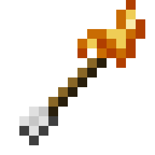

# Mo' Arrows

> **TL;DR** — An arrow crafted from an arrow and a fire charge: it flies burning, sets alight whatever it hits, and starts a real fire where it lands — the part even a Flame-enchanted bow has never done.

<!-- vpa:meta:start -->
|  |  |
|---|---|
| **Module ID** | `mo_arrows` |
| **Side** | Client + Server |
| **Requires** | — |
| **Works with** | — |
| **Download** | [`vpa_mo_arrows.jar`](https://github.com/GeraldHofbauerWeb/vanillaplusadditions/releases/latest/download/vpa_mo_arrows.jar) · also needs `vpa_core` |
| **Config section** | `[modules.mo_arrows]` |
| **Since** | `v1.0.0-beta.87` |
<!-- vpa:meta:end -->

## What it does



Adds one arrow so far, and the module is named for the ones that may follow.

| Item | ID | Notes |
|---|---|---|
| **Fire Arrow** | `vanillaplusadditions:fire_arrow` | Flies burning, ignites what it hits, and starts a fire where it lands |

```
Arrow + Fire Charge   (shapeless)   →   1x Fire Arrow
```

A Flame-enchanted bow already sets mobs alight. What it has never done is start a fire on the
ground — and that is the half this arrow adds. Everything else it does is vanilla's own behaviour
for a burning arrow, not a re-implementation:

* it sets what it hits alight for five seconds, Endermen excepted;
* it lights TNT, campfires and candles;
* water puts it out, and an extinguished Fire Arrow lays no fire — it is an ordinary arrow again
  until it is shot anew.

It works from a bow, a crossbow and a dispenser, and it can be picked up and shot again.

## Why it is built this way

The arrow entity is vanilla's `Arrow`. `FireArrowItem` only overrides the two factories `ArrowItem`
already has — `createArrow` for bows and crossbows, `asProjectile` for dispensers — and lights the
result for a hundred seconds, which is exactly what the Flame enchantment does. No arrow stays
airborne for anything like that long, so it is guaranteed to arrive burning.

The fire it lays hangs off `ProjectileImpactEvent` rather than an overridden `onHitBlock`, because
overriding that method would mean registering an entity type, writing a renderer and sending a spawn
packet — for one line of behaviour that cannot desync anyway. The handler recognises our arrow by the
stack it would drop:

```java
arrow.getPickupItemStackOrigin().is(FIRE_ARROW.get())
```

and then does precisely what a fire charge does, block for block:
`BaseFireBlock.canBePlacedAt` → sound → `setBlockAndUpdate(BaseFireBlock.getState(...))` →
`GameEvent.BLOCK_PLACE`, on the face the arrow struck. The event is never cancelled, so the arrow
still sticks where it landed.

**The texture is vanilla's arrow, set alight.** `scripts/gen_fire_arrow_texture.py` takes
`arrow.png` from a client jar and does three things; the result is committed, so the build never
needs a client jar. Every colour is sampled from `campfire_fire.png`.

1. **The head is recoloured** — a plain colour table, no positional mask needed, because the head's
   four greys (`#FFFFFF`, `#D8D8D8`, `#969696`, `#444444`) occur *only* there: the fletching has its
   own greys and the shaft is brown. They map in the same brightness order onto `#F9EBAB`,
   `#EFCD56`, `#C96C03`, `#B13F00`.
2. **The shaft behind the head glows** — three wood pixels turn orange and ember.
3. **Seven flame pixels are added** — a tongue over the edge and a trail running back along the
   shaft, in cells vanilla leaves empty.

Twenty-four pixels differ from vanilla in total. The fletching and the rear two-thirds of the shaft
stay byte-identical. The script verifies the source before writing — the head palette must be
present, no unknown colours may appear, and every flame cell must be empty — and aborts rather than
produce a silently wrong texture if a future Minecraft version redraws the arrow.

An earlier attempt reused vanilla's two-layer tipped-arrow model instead, and looked broken in game:
those layers are not cut the way their names suggest — `tipped_arrow_base.png` is *only* the shaft
and fletching, while `tipped_arrow_head.png` carries the head plus the scattered potion drips.

**The tag is load-bearing.** Bows accept ammunition by the `minecraft:arrows` item tag, so
`data/minecraft/tags/item/arrows.json` adds the Fire Arrow to it with `replace: false`. Without that
file the item exists but no bow will fire it.

## Compatibility and known limits

| Limit | Effect |
|---|---|
| **It really does start fires** | A Fire Arrow is an arson tool in the hands of anyone who can craft one. `light_fires = false` takes that half away and leaves the rest: the arrow still burns, still ignites what it hits, still lights TNT and campfires. |
| Infinity | Does not apply: vanilla's Infinity only refunds plain `minecraft:arrow`, so Fire Arrows are always consumed. |
| Skeletons | Unaffected. Mobs shoot vanilla arrows; nothing here changes what they fire. |
| Extinguished in flight | Arrow flies through water, loses its fire, and lands as an ordinary arrow — the handler re-checks `isOnFire()` before laying anything. |
| Module disabled | The recipe stops being injected and the event handler returns immediately. Items already crafted stay in the world and still fly, but lay no fire. |

## Under the hood

| File | Part |
|---|---|
| `modules/mo_arrows/MoArrowsModule.java` | item registration, recipe, the fire-laying event handler |
| `modules/mo_arrows/item/FireArrowItem.java` | lights the arrow for both bow and dispenser |
| `scripts/gen_fire_arrow_texture.py` | derives the texture from vanilla's `arrow.png` |
| `assets/vanillaplusadditions/textures/item/fire_arrow.png` | the committed result, 14 pixels off vanilla |
| `data/minecraft/tags/item/arrows.json` | makes it usable as ammunition |

**Recipe in code, not JSON.** Like every recipe in this mod, it is injected through
`AddReloadListenerEvent` and re-applied on every server resource reload — datapack recipe files do
not load reliably here; see [Custom Crafting Recipes](custom_crafting_recipes.md) for the reasoning.

**Testing.** This repository has no unit tests. Check in game: craft one, shoot a grass block and a
mob, then shoot through water and confirm the wet arrow lays nothing.

## See also

* [Custom Crafting Recipes](custom_crafting_recipes.md) — why recipes are built in code here
* [Tipped Arrows](tipped_arrows.md) — the other module that touches arrows

<!-- vpa:config:start -->
## Configuration

Section `[modules.mo_arrows]` in `config/vanillaplusadditions-common.toml` (or `config/vpa_mo_arrows-common.toml` if you run the standalone jar).

Every module also has the universal `enabled` and `debug_logging` keys — see the [Configuration Guide](../guides/configuration.md).

| Key | Type | Default | Range | Effect |
|---|---|---|---|---|
| `light_fires` | boolean | `true` | — | Lets a Fire Arrow start a fire where it lands, exactly as a thrown fire charge would. With it off the arrow still burns in flight, still sets what it hits alight for five seconds and still lights TNT, campfires and candles — it simply leaves the ground alone. Only the block half is switchable; igniting on hit is vanilla's own behaviour for a burning arrow and cannot be separated from the arrow being lit. |
<!-- vpa:config:end -->

## See also

* [Configuration Guide](../guides/configuration.md)
* [All modules](../../README.md#modules)
