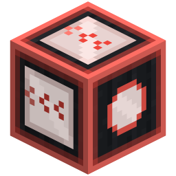
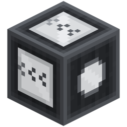

# Mob Cart Loader

> **TL;DR** — Two glass blocks that take a mob out of a pen and put it into a parked minecart (or
> the seat of a standing Create train) and back out again, holding it visibly inside until the way
> out is clear.

<!-- vpa:meta:start -->
|  |  |
|---|---|
| **Module ID** | `mob_cart_loader` |
| **Side** | Client + Server |
| **Requires** | — |
| **Works with** | [Create](https://modrinth.com/mod/create) <sub>tested 6.0.10</sub>, [Create Aeronautics](https://modrinth.com/mod/create-aeronautics) |
| **Download** | bundle only — no standalone jar |
| **Config section** | `[modules.mob_cart_loader]` |
| **Since** | `v1.0.0-beta.53` |
<!-- vpa:meta:end -->

## What it does

Two directional machine blocks that move mobs between a pen and the rail without anyone standing
there with a lead:

* **Mob Loader** — boards a mob from the pen on its input side into a parked, empty rideable
  minecart on its output side.
* **Mob Unloader** — the same the other way round: it pulls the mob riding a parked minecart at its
  input side and sets it down in the pen behind it.

<table>
<tr>
<td width="110" align="center"></td>
<td width="110" align="center"></td>
<td width="110" align="center"></td>
<td width="110" align="center"></td>
</tr>
<tr>
<td align="center">Mob Loader</td>
<td align="center">powered = off</td>
<td align="center">Mob Unloader</td>
<td align="center">powered = off</td>
</tr>
</table>

What they do not do is shove the mob across. The block **takes the mob out of the world** and keeps
it inside itself as entity NBT. From that moment the mob is nowhere: it cannot wander off, cannot
despawn, cannot drown or burn, and stops counting against the mob cap. It comes out again only once
the output side is unobstructed — so a solid block in front of the output, an extended piston head
for instance, turns the machine into a buffer that holds its one mob until redstone lets it go.
Breaking the block puts the mob back into the world rather than losing it.

While a mob is inside it spins as a live model behind the glass, the same idea as a spawner's
mini-mob, so one glance tells you what is inside. A comparator reads the same state: `0`
empty, `1` a hostile mob, `2` a friendly or neutral one, which lets redstone branch on *what* is
being shipped.

Both blocks are **active without redstone**; a signal switches them off and the model goes grey.

With **Create** installed, the loader's output face — or the unloader's input face — may point at a
**track** instead of a rail, and the same blocks serve **carriage seats**. The block does not have
to stand in the track bed: it scans a few blocks along its facing direction, so it can sit beside
the carriage body. Only standing trains are served, so a train passing through is never touched.

With Create's **Engineer's Goggles** on (or Create: Aeronautics' aviator's goggles), looking at
either block draws a small panel beside the crosshair with the stored mob's name; sneaking adds its
health.

## In detail

### Input, output and which way it faces

`FACING` stores the **input** direction, observer-style: it points at you when you place the block.
The output is always the opposite face. Which physical side is the pen and which is the rail
therefore depends on the block:

| | Input face (`FACING`) | Output face (opposite) |
|---|---|---|
| **Mob Loader** | the pen | the rail, or a Create track |
| **Mob Unloader** | the rail, or a Create track | the pen |

Sneak-placing flips the block by 180°, so both orientations are reachable without walking round.
The property is the full six-way `minecraft:facing` — up and down included, with the blockstate
rotating the model by `x`/`y` — and `rotate`/`mirror` are implemented.

The two end faces carry the **same texture** (`mob_loader_in.png` and `mob_loader_out.png` are
byte-identical, as are the unloader's), so the orientation cue sits on the other four: each shows a
pair of chevrons, given its own UV rotation per face (west 0°, east 180°, up 90°, down 270°) so
that they all run the same way — from the input face towards the output face.

### One mob at a time: capture, buffer, release

Per scan, each block does exactly one of two things:

| State | Mob Loader | Mob Unloader |
|---|---|---|
| Empty | Takes the nearest mob out of the pen, stores it, ends the scan | Takes the first mob passenger out of the parked cart, stores it, ends the scan |
| Holding a mob | Releases it into a parked empty cart (or a carriage seat) once the output side is clear | Releases it into the pen once the output side is clear |

Capture and release never happen in the same scan, so a mob needs at least two of them — ten ticks
at the default interval — to travel from the pen into the cart. A block that already holds a mob
ignores the pen entirely; there is exactly one slot.

"Unobstructed" means the output block's collision shape is empty: air and rails qualify, a slab or
an extended piston head does not. Create tracks are exempt from that test by name — they do have a
collision shape, but they are a target rather than a gate.

### What it will and will not pick up

| | Mob Loader | Mob Unloader |
|---|---|---|
| Where it looks for the mob | The input block plus the block above it, a 1 × 2 × 1 box; every mob whose hitbox overlaps it counts, nearest to the box centre wins | The passenger list of the cart at the input side |
| What counts | `Mob`, alive, not already riding something | The first `Mob` among the passengers |
| Which cart | A plain rideable `Minecart`, empty and parked | Any `AbstractMinecart`, parked, carrying a mob |
| Where the cart may be | A 1.8-block box around the output position | The same box around the input position |

**Players are never touched.** `Player` is not a `Mob`, so neither the pen scan nor the passenger
scan can ever see one, whether it stands in the pen or rides the cart.

**Parked** means the squared horizontal velocity is below `1.0E-4` — a speed under 0.01 blocks per
tick. A rolling cart is ignored until it comes to rest.

**Chest, hopper, furnace and TNT minecarts** are not `Minecart` but siblings of it, so the loader
never boards a mob into one. The unloader, which accepts any `AbstractMinecart`, does look at them,
and finds no mob passenger — those carts are not ridden.

### The scan rhythm

`serverTick` returns unless `level.getGameTime() % check_interval_ticks == 0`. The phase is
**global, not per block**: every loader and unloader in the world scans on the same tick, five
ticks apart by default and at most 40. The value is clamped with `Math.max(1, …)` on top of the
config range. There is no client ticker at all — `getTicker` returns `null` on the client side.

### Redstone and the comparator

The redstone control is **inverse**: `POWERED = true` means inactive. `getStateForPlacement` seeds
the property from `hasNeighborSignal`, `neighborChanged` keeps it in sync, and the powered
blockstate variants swap to the `_inactive` models — the same geometry with the drained `_off`
textures. A powered block neither captures nor releases; a mob already inside stays inside.

The comparator output is always available (`hasAnalogOutputSignal` returns true) and reads:

| Output | Meaning |
|---|---|
| `0` | Nothing stored |
| `1` | A stored mob of `MobCategory.MONSTER` |
| `2` | Anything else — animals, villagers, iron golems, tamed wolves |

The category belongs to the entity *type*, not to the individual: a tamed wolf still reads `2`, a
zombified piglin still reads `1`. The comparator is refreshed from exactly one place in the code,
the display setter, which runs when the contents actually change — and at no other time.

### The mob while it is inside

Capture writes the mob with `saveAsPassenger`: the full tag including `id` and `UUID`, health,
equipment, custom name, taming and its own passengers. Identity is preserved, so the mob that comes
out is the same entity that went in, not a copy of it. The tag lives in the block entity under
`StoredMob` and is written only in `saveAdditional` — never in the update tag — so it persists
across a restart and never travels to a client.

Release puts the mob at the centre of the output block. Water-breathers are treated separately:
anything that is a `WaterAnimal` or an `Axolotl`, or whose `canBreatheUnderwater()` is true, is
re-aimed at a water block at the output position or one of its six direct neighbours. If there is
no water in reach it is released dry anyway.

Breaking the block releases the stored mob at the block's own position, so a buffered mob is never
lost. A change of `POWERED` is not a removal and does not trigger that path.

### Create trains

A carriage is not ridden like a minecart: it is a `CarriageContraptionEntity` whose passengers
occupy **Create seat blocks**, addressed by index inside the contraption. The module translates
between those indices and world positions so the block entities can go on thinking in terms of "the
thing in front of my output face".

| Step | Rule |
|---|---|
| Finding the track | From the output block (loader) or input block (unloader), up to `track_search_distance` positions along that direction — the default 3 means that block plus two more. The scan stops at the first block with a collision shape, so it never reaches through a wall. |
| Which trains count | Only carriages of a train that is registered in Create's global railway, is not derailed, and whose speed is under `1.0E-3` in absolute value. A train rolling through is invisible to the block. |
| Which seat | The free seat (loading) or occupied seat (unloading) nearest to the **track block's centre**, within `seat_search_radius` (default 4 blocks). The same radius inflates the box used to collect candidate carriages. |
| Unloading | The mob is dismounted with `stopRiding()` *before* it is stored, so Create clears its seat mapping and syncs that to the clients. |

Create's own `SeatBlock` restriction is deliberately **not** applied. Create refuses to seat hostile
mobs while its `seatHostileMobs` option is off; these blocks are explicit machinery, so hostile mobs
can be shipped by train — and the comparator still says what is aboard.

The two paths do not fall through symmetrically:

* The **loader** only looks for a track when no parked, empty, rideable minecart was found. Because
  "parked and empty" is part of the query, a cart that is moving or already occupied leaves the
  search empty and the loader carries on to the track scan.
* The **unloader** stops as soon as it finds *any* minecart at its input, parked or not, laden or
  not, and never reaches the track path in that scan.

### The mini-mob and the goggles panel

The block entity renderer draws a cached, non-ticking entity of the stored type at the centre of the
block, spinning at 3° per tick — one turn every 120 ticks, six seconds. It is scaled by
`0.5 / max(1, max(width, height))`, so anything up to a block wide renders at half size and larger
mobs shrink to fit. Its shadow is switched off and the render box is generous
(`inflate(1.0)`, plus 1.5 upwards) so the model is never culled at the edge of the screen.

The goggles panel appears when you wear Create's Engineer's Goggles — helmet slot or a Curios slot —
or any head item in `#vanillaplusadditions:arm_goggles`, whose two optional entries are
`create:goggles` and `aeronautics:aviators_goggles`. It draws below and right of the crosshair:

| Row | Content |
|---|---|
| Always | The mob's spawn egg as an icon plus its name, or "Empty" when nothing is stored |
| While sneaking | A heart plus the rounded `health/maxHealth` of the stored mob |

The health values are the ones captured at storage time and do not change while the mob sits
inside — nothing in there ticks. Mobs without a spawn egg (the ender dragon, the wither, an iron golem) get
the name without an icon.

## Items, blocks and recipes

| | Block | Details |
|---|---|---|
|  | **Mob Loader** | Green map colour, metal sounds, hardness 1.5 / blast resistance 3.0, no tool required. Translucent model, `noOcclusion`. |
|  | **Mob Unloader** | The same, in red. |

Both recipes are shaped, category *misc*, and the middle row reads in flow order — intake, saddle,
cart for the loader; cart, saddle, ejector for the unloader:

```
 G G G        G = Glass
 H S M        H = Hopper   S = Saddle   M = Minecart      →  Mob Loader
 G G G
```

```
 G G G        G = Glass
 M S D        M = Minecart   S = Saddle   D = Dropper     →  Mob Unloader
 G G G
```

Being shaped recipes, the middle row is fixed: a mirrored arrangement does not craft. Per the
project convention both are registered in code rather than as datapack JSON — see the
[Custom Crafting Recipes module](custom_crafting_recipes.md) for the reasoning — and the same
applies to the drop: `getDrops` returns one of the block itself, with no loot table.

<!-- vpa:config:start -->
## Configuration

Section `[modules.mob_cart_loader]` in `config/vanillaplusadditions-common.toml`.

Every module also has the universal `enabled` and `debug_logging` keys — see the [Configuration Guide](../guides/configuration.md).

| Key | Type | Default | Range | Effect |
|---|---|---|---|---|
| `check_interval_ticks` | int | `5` | 1 ~ 40 | How often (in ticks) each loader/unloader block scans the adjacent rail and pen; lower = more responsive, higher = cheaper. The check is global-phase (serverLevel.getGameTime() % interval), not per block, and the value is additionally clamped with Math.max(1, ...). |
| `create_trains.enabled` | boolean | `true` | — | Also load/unload mobs into the seats of Create train carriages (inert without Create; minecart handling is unaffected either way). Checked inside findTrackTarget, so turning it off makes the blocks minecart-only. |
| `create_trains.seat_search_radius` | double | `4.0` | 1.0 ~ 16.0 | How far (in blocks) a carriage seat may be from the found track block to still count; measured from the track block's centre, and the nearest matching seat wins. The same radius also inflates the AABB used to collect candidate carriages. |
| `create_trains.track_search_distance` | int | `3` | 1 ~ 8 | How many positions along the relevant direction the block scans for a Create track, starting at the block directly in front of the output (loader) / input (unloader) face - so 3 means that neighbour plus two more. The scan stops at the first block with a non-empty collision shape, so it never reaches through a wall. |
<!-- vpa:config:end -->

## Compatibility and known limits

| Limit | Effect |
|---|---|
| No Create installed | The `create:tracks` tag does not exist, so the track test is always false and the track lookup returns before any Create type is resolved. The blocks work on plain minecarts exactly as before. |
| `create_trains.enabled = false` | Same result on purpose: the track lookup returns immediately, and the blocks are minecart-only. Minecart handling is untouched either way. |
| Moving carts and moving trains | Ignored, by design. Nothing happens until the cart or the train has come to rest. |
| A cart at the unloader's input that carries no mob | Blocks that scan entirely. Any minecart at the input — including a chest or furnace cart, which is never ridden — makes the unloader return before it would look for a Create track. |
| A cart at the loader's output that is moving or occupied | Does *not* block the track path. The "parked and empty" test is part of the query, so the loader treats it as "no cart" and goes on to scan for a Create track in that direction. With a track in line, the mob boards the train instead of waiting for the cart. |
| Hostile mobs on a train | Allowed on purpose, against Create's own `seatHostileMobs` restriction. If a pack relies on that restriction, turn `create_trains.enabled` off. |
| A mob that is itself carrying a rider (a chicken jockey) | Not handled cleanly. The rider is written into the stored NBT, but `discard()` only makes it dismount, so the original rider stays standing in the world; on release the stored copy is rebuilt and mounted, while only the vehicle is handed to `addFreshEntity`. Read off the source, not tested. |
| Turning the module off after building with it | The `enabled` key is read at startup, and a disabled module is never initialised: blocks, items and block-entity types are not registered at all, and a world that contains them meets unknown ids on load. This is not a supported way to pause the machines — use redstone. |
| Turning the module off at runtime | Only the recipe injection is gated on `isModuleEnabled()`. The block-entity tick is not, so blocks already in the world keep loading and unloading; the recipes disappear at the next datapack reload. |
| Module disabled, client setup | `MobCartLoaderClientSetup` is an FML-scanned `@EventBusSubscriber` and is not gated on the module, yet it dereferences both block-entity holders. A disabled module never reaches `onInitialize`, so those holders are never bound. The same pattern exists in `end_conduit`, `cat_guardian` and `axolotl_guardian`, so it is repo-wide rather than specific to this module. Deduced from the source, not reproduced. |
| The goggles panel without Create | Its own javadoc says nothing breaks, but it reaches Create through `GogglesUtil` in `debug_overlay`, and that class holds both the `ModList` gate and a `GogglesItem` reference in a method body — the precise shape `CreateCompat` warns about. There is no standalone jar for this module and the bundle always ships with Create, so the path may never have been exercised. Flagged, not reproduced. |
| Bundle only | There is no `vpa_mob_cart_loader.jar`; the two blocks ship in the bundle. |

## Under the hood

| Event | Bus | Purpose |
|---|---|---|
| `AddReloadListenerEvent` | game | Adds `vanillaplusadditions_mob_cart_loader_recipes`, which merges the two shaped recipes into the `RecipeManager` on the game executor. Gated on `isModuleEnabled()`. |
| `EntityRenderersEvent.RegisterRenderers` | mod, client | Registers `MobCartBER` for both block-entity types |
| `RenderGuiEvent.Post` | game, client | Draws the goggles panel |

The module registers itself on the game bus with `NeoForge.EVENT_BUS.register(this)` in
`onInitialize`. There are no mixins, no commands, no keybinds, no entity types and no network
payloads of its own: the display state rides the vanilla block-entity update packet
(`getUpdateTag` / `getUpdatePacket`), and the full mob NBT never enters it.

| Class | Role |
|---|---|
| `modules/mob_cart_loader/MobCartLoaderModule` | Registration of blocks, items and block-entity types; the recipe reload listener; static config accessors |
| `.../block/AbstractMobCartBlock` | `FACING` + `POWERED`, placement and rotation, the server ticker, the comparator, drops, and the release-on-break |
| `.../block/MobLoaderBlock`, `MobUnloaderBlock` | Codec and block entity per variant, nothing else |
| `.../blockentity/AbstractMobCartBlockEntity` | Storage, display state, NBT, geometry helpers, detection helpers, the water release |
| `.../blockentity/MobLoaderBlockEntity`, `MobUnloaderBlockEntity` | The per-scan logic of the two directions |
| `.../compat/CreateCompat` | The Create gate and the track test — no Create types |
| `.../compat/CreateTrainAccess` | Every Create reference in the module: seats, carriages, the standing test |
| `.../client/MobCartBER` | The spinning mini-mob |
| `.../client/MobCartGogglesClientHandler` | The goggles panel |
| `.../client/MobCartLoaderClientSetup` | Registers the renderer |

**The Create split is load-bearing.** Resolving *any* static member of a class links and verifies
it, and the verifier then eagerly loads the types that appear in its method bodies — which for
`CreateTrainAccess` means `CarriageContraptionEntity` and a `NoClassDefFoundError` in a pack without
Create. The gate therefore lives in `CreateCompat`, which names no Create type at all. `isTrack()`
was moved there in `v1.0.0-beta.72` for exactly that reason: it is a plain vanilla tag lookup, but
sitting in the wrong class it dragged the whole Create-typed class in with it.

**Why a block tag and not `ITrackBlock`.** Create's jar-in-jar libraries are pulled out into
`libs/create-nested/` for Registrate, Flywheel and Ponder only; `net.createmod.catnip` is not on the
compile classpath. Anything referencing it is out of reach, which is why track detection goes
through the `create:tracks` tag and why "is this train standing" is answered through the carriage's
public `trainId` plus the global railway registry rather than its private carriage field.

**The save gotcha.** Capture uses `saveAsPassenger`, not `Entity#save`. `save()` returns `false` for
an entity that is currently a passenger — which is precisely the unloader's case, a mob riding a
minecart — so before `v1.0.0-beta.55` the unloader stored nothing and silently did nothing. The
comparator output arrived in the same release.

**Loading back.** `EntityType.loadEntityRecursive` rebuilds the entity from the stored tag and moves
it to the target position; `loadAdditional` keeps the existing `storedMob` when a tag without the
key arrives, which is what lets the disk-only field survive the client update packets.

**Transparency.** Both block models use `render_type: minecraft:translucent` and both blocks are
registered with `.noOcclusion()`. Without the latter the mini-mob renders into a black void behind
the glass.

**Stale javadoc warning.** The class javadocs on `MobLoaderBlock` and on `MobCartLoaderModule` still
describe the pre-`v1.0.0-beta.54` design — a cart on the facing side, the *pen candidate* as the
displayed mob. The block entities are authoritative: `FACING` is the input face, and the displayed
mob is the one actually stored inside.

**Cross-module coupling.** The goggles panel imports `GogglesUtil` from `debug_overlay`. There is no
standalone jar here, so `build.gradle` carries no `moduleDeps` entry for it; if one is ever added it
will need `moduleDeps: ['vpa_debug_overlay']`, as `minecart_chunk_loading`, `stationary_chunk_loader`,
`train_chunk_loading` and `axolotl_guardian` do.

**Testing.** This repository has no unit tests, and nothing here was exercised in a dev run — the
Create-dependent half cannot be, given the NeoForge version gap in `runClient`/`runServer`.

## See also

* [Train Chunk Loading](train_chunk_loading.md) — keeps the chunks under a moving train loaded
* [Minecart Chunk Loading](minecart_chunk_loading.md) — the same for ordinary minecarts
* [Debug Overlay](debug_overlay.md) — where the shared goggles check lives
* [Custom Crafting Recipes](custom_crafting_recipes.md) — why recipes are built in code here
* [Configuration Guide](../guides/configuration.md) — where the config file lives
* [All modules](../../README.md#-modules)
