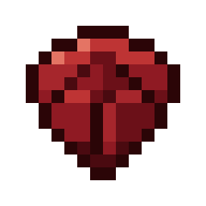
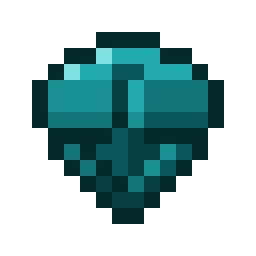

# Special Gemstones

> **TL;DR** — Two emerald-priced gemstones that permanently double or halve the size of the creature you right-click — and the first way to grow a wolf big enough to ride.

<!-- vpa:meta:start -->
|  |  |
|---|---|
| **Module ID** | `special_gemstones` |
| **Side** | Client + Server |
| **Requires** | — |
| **Works with** | [Quark](https://modrinth.com/mod/quark) <sub>tested 4.1-482</sub> |
| **Download** | [`vpa_special_gemstones.jar`](https://github.com/GeraldHofbauerWeb/vanillaplusadditions/releases/latest/download/vpa_special_gemstones.jar) · also needs `vpa_core` |
| **Config section** | `[modules.special_gemstones]` |
| **Since** | `v1.0.0-beta.100` |
<!-- vpa:meta:end -->

## What it does

Two gemstones, cut from emeralds. Hold one in your main hand and right-click a living creature:

| | <br>Growth Gemstone | <br>Shrinking Gemstone |
|---|---|---|
| Size | × 2 | ÷ 2 |
| Health, attack, speed, jump, step height, armour | × 1.5 | × 0.82 |
| A creeper's blast radius | 3 → 4 | 3 → 2 |
| A vanilla wolf at 1.0 becomes | 2.0 — **and no further** | 0.5 — and no further |

**One step, and only one.** A creature is in exactly one of three states — shrunk, natural, grown —
and a gemstone moves it one state. A second Growth Gemstone on an already-grown wolf is refused, so
the gemstones cannot be stacked into arbitrarily huge mobs. Using the opposite stone walks the
creature back:

```
shrunk  ←──  natural  ←──  grown
 ×0.5   ──→    ×1     ──→   ×2
```

The stats move with the size, but by less: twice as big should be noticeably stronger, not twice as
strong. That deliberately includes a horse's **hidden stats** — the health, movement speed and jump
strength that are rolled per animal and decide whether a horse is worth keeping.

### The stats follow the size, not the gemstone

The bonus is a function of how big a creature *is*, not of what was done to it:

| Size | Stats (`ADDITIVE`) | Stats (`MULTIPLICATIVE`) | An armoured wolf falls free for |
|---|---|---|---|
| 0.5 | × 0.82 | × 0.67 | 4.1 blocks |
| 1.0 | × 1.00 | × 1.00 | 5.0 blocks |
| 2.0 | × 1.50 | × 1.50 | 7.5 blocks |
| 3.0 | × 2.25 | × 1.90 | 11.2 blocks |
| 3.25 (Sif) | × 2.49 | × 1.99 | 12.5 blocks |

Both ladders agree at double size and part company past it. `ADDITIVE` counts whole blocks of extra
size, `MULTIPLICATIVE` counts doublings — which makes shrinking the exact inverse of growing and
keeps very large creatures noticeably tamer. There is no right answer; `stat_curve` picks, and the
fall figures above follow `battle_dogs`' own copy of the same choice.

So a wolf that **spawned** three times the usual size earns its 2.25 without anyone ever clicking it,
and armour that covers twice the animal covers twice the landing. The rungs are additive in size —
each whole block of extra size is worth another 1.5 — rather than keyed to `log2(size)`, which would
make three times as big worth only 1.87.

### Not every stat may travel the whole way

`scaled_attributes` entries can carry a cap — `minecraft:generic.movement_speed;1.25` — limiting how
far that one attribute's multiplier may get from 1. Two of them need it, and a mount is why.

`LivingEntity.getRiddenSpeed` *is* the mount's speed, and [`wolf_mount`](wolf_mount.md) overrides it
to `MOVEMENT_SPEED` times its own multiplier. The size bonus therefore lands on the ride one to one:
a size-3.25 wolf at the full 2.49× reached **0.75** movement speed, which is two and a half times a
normal wolf. In game that outran chunk loading — 36 fps down to 11 — and snagged on block edges,
because at nearly a block per tick the collision arrives before the step-up does. Speed is capped at
1.25.

Jump strength is **pinned** (`;1.0`, no scaling at all): a mount that launches is worse than one that
simply does not jump higher. Its own rolled value is untouched either way, which was the point.

**It tops up, it never stacks.** The target is the *species'* default value times the multiplier, and
a creature already stronger than that keeps exactly what it has. Sif is the reason this rule exists:
350 health at size 3.25 would otherwise be handed another 2.5× on top, and any hand-tuned boss from
another mod would be quietly rebalanced by us. Shrinking works the other way round — it scales down
what the creature actually has, because there the point is to take something away. A creature of
ordinary size is never touched at all, or the top-up would drag one that another mod deliberately
*weakened* back up to its species default.

The change is permanent and exactly reversible. It survives saving, chunk unload and a server
restart, the hitbox follows, and every player who can see the creature sees it change within a tick.
Walking a horse back to natural gives it its own rolled numbers back **bit for bit** — not a rounded
approximation of them.

### The creeper

A creeper's blast is the one thing that follows the size without being an attribute.
`Creeper.explodeCreeper` reads a plain `int` field — 3 by default, doubled while charged — and hands
it to `Level.explode`. There is nothing to attach a modifier to, and the `Explosion`'s own `radius`
is `private final`, so it cannot be adjusted at detonation time either: catching
`ExplosionEvent.Start` would mean cancelling the blast and starting a second one, which fires the
same event again and needs a recursion guard for no gain.

Writing the field is simpler and persists for free — vanilla already saves it as `ExplosionRadius`
in the creeper's NBT. The rounding is picked so the walk comes back exactly where it started:
growing floors, shrinking rounds, and both `3 → 4 → 3` and `3 → 2 → 3` hold at the default factor.

The blast follows `stat_factor`, not `scale_factor`, which at the defaults makes a grown creeper a
**4** — one short of a charged creeper's 6, rather than equal to it. A giant creeper should be worse
news than an ordinary one, not as bad as a lightning strike made it. `scale_creeper_blast = false`
turns it off entirely.

### Some creatures are born the wrong size

Two in a hundred creatures that spawn **naturally** come out an odd size — seven of ten large, three
of ten small. They are ordinary grown or shrunk creatures: same marker a gemstone leaves, same
size-derived stats, and a Shrinking Gemstone walks one back to normal.

Only natural and chunk-generation spawns count. A spawner, a spawn egg, a breeding or anything a
command placed is left alone, because those are someone *deliberately asking* for a creature — and
getting a giant instead is a nuisance rather than a surprise.

By default every hostile creature takes part, plus anything named in `natural_spawns.extra_entities`.
**Quark's Foxhound is named there**, and it is the interesting one: the Nether wolf already spawns
down there and already tames with coal, but it extends `Wolf` rather than `Monster`, so the hostile
rule alone would pass it by. Listing it is what turns it into a nether dog worth hunting for — the
animal existed, it only needed a reason to be big.

### A bigger creature leaves more behind

Loot and experience follow the size on the same ladder: a creature at twice the usual size drops half
again as much, one at three times drops 2.25×, a shrunk one drops less.

The interesting part is the fraction. Most mob drops are one or two items, so "× 1.5" has no honest
whole-number answer for a single bone — rounding up makes *every* kill a bonus kill, rounding down
erases the bonus entirely. So the remainder is settled by a **die roll**: one bone becomes one bone
plus a coin flip for a second. Ten kills then really do average fifteen bones instead of ten or
twenty.

One deliberate exception: something that dropped at all never drops nothing, so a shrunk creature's
single bone stays a bone. And overflow past a stack's limit becomes further stacks rather than being
clamped, or a giant carrying 60 arrows would lose the difference to the 64 ceiling.

Players are excluded outright. A player's drops are their own inventory, and handing out copies of it
would be a dupe.

### What stays out of reach

A creature whose **natural** size is outside `min_natural_scale … max_natural_scale` (0.5 … 2.0 by
default) is refused in both directions. That is not a safety rail, it is the point: the oversized
wolf that makes a dungeon find worth telling people about stays exactly as rare as it was found. It
cannot be grown further, and it cannot be cut down to an ordinary wolf either.

### The wolf

This is the reason the module exists in this shape. [`wolf_mount`](wolf_mount.md) only lets you ride
a wolf whose `generic.scale` is at least `2.0`, and with its defaults **no naturally occurring wolf
qualifies** — that module was built around Sif from *Grim Kingdoms*, a plain `minecraft:wolf` on a
spawn egg with `generic.scale = 3.25`. Until now the only ways to get a rideable wolf were that
spawn egg or an `/attribute` command.

One Growth Gemstone on a tamed vanilla wolf lands on exactly `2.0`. No special case connects the two
modules; they simply read and write the same vanilla number.

It works the other way round too. `WolfMountRules.stillEligible` is re-checked while you ride, so
shrinking a wolf you are sitting on drops you off.

### When it refuses

A refused click costs you nothing — the gemstone stays in your hand and an action-bar line says why:

* the creature is on `denied_entities` (by default the Ender Dragon and the Wither);
* it is a player and `allow_players` is off;
* `require_tamed` is on and the animal is not yours;
* it is already one step out and cannot go further;
* its **natural** size is outside the reachable band (see above);
* **it would not fit.** Before growing anything the module scales the creature's current hitbox and
  asks the world whether that box is free. Without that check the animal ends up inside the ceiling
  and suffocates: `Entity.refreshDimensions` does look for a free spot nearby, but it gives up when
  there is none, and then it simply leaves the creature where it is.

### Where they come from

Both gemstones are cut around a **block of emerald**, ringed with four wart blocks and four amethyst
shards. The wart is what tells them apart, and it is deliberately from the Nether — the compact
dimension, where distance costs eight times less, is the right home for magic that changes how big
something is. Crimson reads as bigger, warped as smaller:

```
 A W A      A W A       A = minecraft:amethyst_shard
 W E W      W E W       E = minecraft:emerald_block
 A W A      A W A       W = nether_wart_block  -> Growth Gemstone   (crimson, bigger)
                        W = warped_wart_block  -> Shrinking Gemstone (warped, smaller)
```

That is **nine emeralds, thirty-six warts and four amethyst shards** for one gemstone, and one
gemstone is one permanent change to one creature. The price is meant to be felt: this is the mod's
first real emerald sink, and a rideable wolf should cost something.

Both shapes are **config keys**, not constants. `growth_recipe` and `shrinking_recipe` hold a whole
recipe in the format described in [`custom_crafting_recipes`](custom_crafting_recipes.md), so the
pack can re-price the gemstones — or make them uncraftable, by emptying the key — without waiting
for a release.

They also turn up in structure chests. Seven vanilla tables are listed by default, from an 8 % chance
in an abandoned mineshaft to 30 % in a woodland mansion; which of the two gemstones drops is an even
coin flip. The list is config-driven and takes any mod's chest table.

## Why it is built this way

### The size is vanilla's, not ours

`minecraft:generic.scale` has existed since 1.20.5 and every living entity has it, because
`LivingEntity.createLivingAttributes()` adds it. So there is nothing to store, nothing to sync and
nothing to render: the attribute is declared syncable, the server broadcasts it to everyone tracking
the entity, and `LivingEntity.aiStep` notices the change and calls `refreshDimensions()` itself.
The module writes one number and vanilla does the rest.

### Modifiers, not `setBaseValue` — because of the horses

The obvious implementation multiplies the attribute's base value. It is wrong here, and a horse is
why.

A horse's health, movement speed and jump strength are **rolled per animal** when it spawns. They are
its identity. Multiply those base values by 1.5 and divide them again later and you do not get the
horse back — you get rounding, and you have overwritten the only copy of the numbers that made this
horse yours. There is nothing left to restore from.

So the module never writes a base value. It adds one `ADD_MULTIPLIED_TOTAL` modifier per attribute,
under a fixed id, and removing it restores the original **bit for bit**:

```java
instance.removeModifier(GROWN_ID);
instance.removeModifier(SHRUNK_ID);
instance.addOrReplacePermanentModifier(
        new AttributeModifier(id, amount, AttributeModifier.Operation.ADD_MULTIPLIED_TOTAL));
```

That choice pays for itself a second time: **the modifiers are also the state**. A creature carrying
`vanillaplusadditions:gemstone_grown` is grown, one carrying `…:gemstone_shrunk` is shrunk, one
carrying neither is natural. Nothing else has to be stored, so there is no data attachment to sync
(entity attachments do not reach the client at all) and nothing that can drift out of step with the
size it is supposed to describe. Permanent modifiers are saved in the entity's own `"attributes"`
NBT and broadcast to every client tracking it.

`addOrReplacePermanentModifier` rather than `addPermanentModifier`: the latter throws
`IllegalArgumentException("Modifier is already applied on this attribute!")` on a second add with the
same id, which is exactly what a repeatable item would do.

**Health is carried as a fraction.** Growing a creature raises its maximum health, and vanilla does
not heal it — a wolf would come out of it at two thirds health for no reason, and a shrunk one would
be clamped down and could die outright. The module reads `health / maxHealth` before the change and
restores that ratio afterwards.

### Why the click is an event and not the item

The obvious hook, `Item#interactLivingEntity`, would never fire. `Player.interactOn` asks the
**entity** first:

```java
InteractionResult cancelResult = CommonHooks.onInteractEntity(this, entityToInteractOn, hand);
if (cancelResult != null) return cancelResult;                       // ← our event, first
...
InteractionResult interactionresult = entityToInteractOn.interact(this, hand);
if (interactionresult.consumesAction()) { ...; return interactionresult; }   // ← returns here
else if (!itemstack.isEmpty() && entityToInteractOn instanceof LivingEntity) {
    InteractionResult interactionresult1 = itemstack.interactLivingEntity(...);   // ← never reached
```

A tamed wolf, cat or axolotl consumes a right-click with any unknown item for its own sit/stand
toggle, a horse mounts, a breedable animal eats. The item hook would fail on exactly the animals
worth resizing. `PlayerInteractEvent.EntityInteract` runs before all of it.

Two details that matter and are easy to get wrong:

* the handler cancels with **`InteractionResult.sidedSuccess(isClientSide)`**, never with `PASS` — a
  `PASS` cancellation lets the client fall through to the use-item stage, the same trap
  [`axolotl_guardian`](axolotl_guardian.md) documents for the water bucket;
* only the **main hand** is handled, or the off-hand fires the same click a second time.

### The textures are drawn, not recoloured

`scripts/gen_gemstone_textures.py` builds both 16×16 icons out of geometry and two colour ramps. No
vanilla PNG is read, so the icons share no pixels with `emerald.png`. That is a deliberate answer to
the open backlog item *Abgeleitete Vanilla-Texturen aufloesen* — a tinted emerald would have been one
more entry on that list, in a mod that is published.

One silhouette, two palettes, the way the four `wolf_armor_*.png` icons already work. The gems are
distinguishable **twice**: by hue, and by an arrow pointing up against one pointing down, engraved in
the pavilion — because colour alone is no help to a colour-blind player holding both.

The hues are not free choices. They are the wart blocks each gem is cut around: crimson for the one
made with nether wart, warped teal for the one made with warped wart. The icon and the recipe tell
the player the same thing.

The arrow is **cut into** the stone, not drawn on it, and that is a lighting problem rather than a
drawing one. An engraving is a relief with the light reversed: the light falls in from the upper
left, so a groove lies in shadow along its top and left edge and catches the light along its bottom
and right. A bright shape with a shadow under it — the obvious first attempt — does exactly the
opposite and reads as a painted symbol every time.

Every tone is taken **relative to the facet the pixel sits on**, never from a fixed colour, so the cut
looks equally deep on the bright table and on the dark tip: the floor of the groove one step down its
ramp, the shadowed rim three, the lit rim two steps up. The arrow therefore stays the stone's own
colour throughout — it is all shadow and highlight, which is what makes it read as cut rather than
inlaid. Sebi picked this depth out of eight; a brighter filled core reads more clearly in a hotbar but
sits *on* the stone instead of *in* it.

Run it with `--check` to verify the committed PNGs are current.

## Compatibility and known limits

* **Three vanilla creatures ignore or cap the attribute, by their own code.** `EnderDragon`
  overrides `sanitizeScale` to return a hard `1.0F`, `Shulker` caps at `3.0F`, and slimes and magma
  cubes size themselves from their own `Size` data value instead of the attribute. The dragon and the
  Wither are on the default denylist so you get a readable refusal rather than a gemstone that
  silently does nothing; the shulker and the slimes are simply capped.
* **Stats follow, but not everything does.** Health, attack damage, movement speed, jump strength,
  step height and armour scale (`scaled_attributes`). Reach and anything a mod computes for itself do
  not.
* **The creeper's blast is the exception to "size, not gemstone".** It has no base value to measure a
  top-up against — it is one stored number — so it is walked up and down by the gemstones only. A
  creeper that spawned big gets the stat bonus but an ordinary blast.
* **A size change made by something else settles on the next load.** Stats are recomputed when a
  creature enters the world and right after a gemstone. If another mod resizes a creature mid-life,
  its stats follow when the chunk next reloads.
* **Modded creatures usually work**, since almost every entity inherits
  `createLivingAttributes()`. One whose attribute supplier was hand-rolled without `SCALE` is refused
  instead of crashing.
* **A shrunk mount is a dismounted mount.** See the wolf note above.
* **Only creatures at their natural size can be moved a second time.** Once a creature is grown, the
  only thing that works on it is the Shrinking Gemstone, and the other way round.
* **Entity ids in `denied_entities` are checked with `containsKey` first**, because
  `BuiltInRegistries.ENTITY_TYPE` is a `DefaultedRegistry` — its `get()` never returns null, so a
  typo would otherwise protect pigs instead of reporting itself.
* **In the standalone jar the items exist even with `enabled = false`**, because
  `StandaloneModuleBootstrap` registers regardless of the flag. Nothing responds to a click, and
  neither recipes nor loot are added.

## Under the hood

| File | Part |
|---|---|
| `modules/special_gemstones/SpecialGemstonesModule.java` | item registration, both interact events, the recipe reload listener, the loot-table listener, the denylist cache |
| `modules/special_gemstones/EntityScaling.java` | the decision and the attribute write: clamping, the space check, the denylist and ownership tests |
| `modules/special_gemstones/SizeDrops.java` | the loot multiplier, the die roll for the fraction and the stack overflow |
| `modules/special_gemstones/item/GemstoneItem.java` | the item, its direction flag and its tooltip |
| `modules/special_gemstones/config/SpecialGemstonesConfig.java` | the config keys and their defaults |
| `mixin/special_gemstones/CreeperExplosionRadiusAccessor.java` | the one private field a gemstone has to reach |
| `util/ConfiguredRecipes.java` | the shared recipe-string parser, lifted out of `custom_crafting_recipes` so both modules speak one format |
| `util/SizeScaling.java` | the one ladder — `factor^(size-1)` — that this module and `battle_dogs` both read |
| `scripts/gen_gemstone_textures.py` | the two item icons, generated and verifiable with `--check` |

<!-- vpa:config:start -->
## Configuration

Section `[modules.special_gemstones]` in `config/vanillaplusadditions-common.toml` (or `config/vpa_special_gemstones-common.toml` if you run the standalone jar).

Every module also has the universal `enabled` and `debug_logging` keys — see the [Configuration Guide](../guides/configuration.md).

| Key | Type | Default | Range | Effect |
|---|---|---|---|---|
| `allow_players` | boolean | `false` | — | Let the gemstones resize players too. Off by default: a shrunk player sees over no stair and a grown one suffocates in its own corridors. |
| `check_space` | boolean | `true` | — | Refuse to grow a creature when its new hitbox would not fit where it stands. Without it Entity.refreshDimensions gives up looking for a free spot and the animal suffocates inside the ceiling. |
| `consume_item` | boolean | `true` | — | Use up the gemstone on a successful change. Creative mode never consumes it, and a refused click never consumes it either. |
| `denied_entities` | list of strings | `minecraft:ender_dragon, minecraft:wither` | — | Entity types the gemstones refuse to touch. The Ender Dragon ignores the attribute anyway (its sanitizeScale returns a hard 1.0F), but listing it turns a gemstone that silently does nothing into a readable refusal. Ids are validated with containsKey, because ENTITY_TYPE is a DefaultedRegistry and an unknown id would otherwise resolve to minecraft:pig. |
| `drop_factor` | double | `1.5` | 1.0 ~ 8.0 | What one rung of the size ladder is worth in LOOT when a creature dies, on the curve stat_curve picks. A fractional result is settled by a DIE ROLL rather than rounded: most mob drops are one or two items, so rounding up would make every kill a bonus kill and rounding down would erase the bonus entirely. At 1.5x a single bone is one bone plus a coin flip for a second, so ten kills really do average fifteen bones. Overflow past a stack's limit becomes further stacks rather than being clamped. A player's own drops are never touched — that would be a dupe. 1.0 switches it off. |
| `growth_recipe` | string | `emerald block, 4 crimson wart blocks, 4 amethyst shards` | — | The crafting recipe for the Growth Gemstone, in the same format custom_crafting_recipes uses: recipe_id;result_item;result_count;pattern;keys. Editable so the pack can re-price the gemstones without a new build. An empty string makes the gemstone uncraftable. |
| `loot_tables` | list of strings | `seven vanilla structure chests, 8% to 30%` | — | Chests that may contain a gemstone, as loot_table;chance. The chance is rolled once per chest and which of the two gemstones drops is an even 50/50. Applied through LootTableLoadEvent, so any mod's chest table can be added. |
| `max_natural_scale` | double | `2.0` | 0.0625 ~ 16.0 | Largest NATURAL size a creature may have for the gemstones to work on it. Anything already bigger is out of their reach on purpose: an oversized wolf from a dungeon, or Sif from Grim Kingdoms, stays exactly as rare as it was found and can be neither grown further nor cut down to an ordinary size. |
| `min_natural_scale` | double | `0.5` | 0.0625 ~ 16.0 | Smallest NATURAL size a creature may have for the gemstones to work on it — the size it was born with, read from the attribute's base value, not the size it is now. |
| `natural_spawns.chance` | double | `0.02` | 0.0 ~ 1.0 | Chance that a naturally spawning creature comes out an odd size. Only MobSpawnType.NATURAL and CHUNK_GENERATION count — never a spawner, a spawn egg, a breeding or anything a command placed, because those are someone deliberately asking for a creature and getting a giant instead would be a nuisance rather than a surprise. 0 switches it off. |
| `natural_spawns.extra_entities` | list of strings | `quark:foxhound` | — | Creatures that take part although they are not hostile, by entity id. Quark's Foxhound is here by default: a Nether wolf that already spawns down there and tames with coal, but it extends Wolf rather than Monster, so the hostile rule alone would pass it by. An oversized one is the closest thing to Sebi's 'nether dogs that are already +1' — the mob exists, it only needed a reason to be big. |
| `natural_spawns.hostile` | boolean | `true` | — | Let every hostile creature (anything extending Monster) take part. Off means only extra_entities does. |
| `natural_spawns.shrink_share` | double | `0.3` | 0.0 ~ 1.0 | Of the creatures that come out odd, the share that come out SMALL rather than large. 0 makes every one of them a giant, 1 makes every one tiny. |
| `require_tamed` | boolean | `false` | — | Only allow resizing creatures that belong to the player holding the gemstone — any OwnableEntity whose owner UUID matches. A safety switch for shared servers; off by default so a giant creeper stays possible. |
| `scale_creeper_blast` | boolean | `true` | — | Let a creeper's blast follow its size, scaled by stat_factor. The explosion is the one stat that is not an attribute — Creeper.explodeCreeper reads a plain int field — so it is handled separately, by writing that field. At the defaults a grown creeper goes from 3 to 4 and a shrunk one down to 2, and a charged creeper still doubles on top. Rounding is chosen so the walk is reversible: growing floors, shrinking rounds, and 3 -> 4 -> 3 holds. |
| `scale_experience` | boolean | `true` | — | Let the dropped experience follow drop_factor too, settled by the same die roll. Off leaves XP alone and scales only the items. |
| `scale_factor` | double | `2.0` | 1.05 ~ 8.0 | How much one gemstone changes the SIZE: the Growth Gemstone multiplies generic.scale by it, the Shrinking Gemstone divides by it. A creature is only ever one step from its natural size — shrunk, natural or grown — so with the default the reachable sizes are x0.5, x1 and x2 and nothing further. The cap is the design: without it the gemstones would stack into arbitrarily huge mobs. |
| `scaled_attributes` | list of strings | `max_health, attack_damage, movement_speed;1.25, jump_strength;1.0, step_height, armor` | — | The attributes that follow the size, scaled by stat_factor as a top-up against the species default. An entry may carry a CAP after a semicolon: the furthest that attribute's multiplier may get from 1 in either direction, where 1.0 pins it (no scaling at all) and anything below 1 means no limit. Speed is capped at 1.25 because a mount reads MOVEMENT_SPEED straight through — LivingEntity.getRiddenSpeed, which wolf_mount overrides to exactly that value times its own multiplier — so a size-3.25 wolf at the full 2.49x reached 0.75 movement speed, outran chunk loading and snagged on every block edge, because at nearly a block per tick the collision arrives before the step-up does. Jump strength is pinned outright: a mount that launches is worse than one that does not jump higher. A creature that lacks an attribute skips it. |
| `shrinking_recipe` | string | `emerald block, 4 warped wart blocks, 4 amethyst shards` | — | The crafting recipe for the Shrinking Gemstone, same format as growth_recipe. |
| `stat_curve` | enum (ADDITIVE, MULTIPLICATIVE) | `ADDITIVE` | — | Which ladder the stats climb, from util/SizeScaling. Both agree at double size (1.5) and part company past it: ADDITIVE counts whole blocks of extra size, so 3.0 is worth 2.25 and Sif's 3.25 is 2.49; MULTIPLICATIVE counts doublings, so 3.0 is 1.90 and Sif 1.99, and shrinking becomes the exact inverse of growing. There is no right answer — switch to compare in game. |
| `stat_factor` | double | `1.5` | 1.0 ~ 8.0 | What one whole block of extra SIZE is worth in stats, as factor^(size-1). At the default of 1.5 a creature at twice the usual size is 1.5x, one at three times is 2.25x and Sif at 3.25 is 2.49x. The rungs are additive in size on purpose: three times as big should be worth 1.5 twice over. The bonus is derived from the size itself, so a creature that SPAWNED big earns it without a gemstone — but it only ever tops up to the species default times the multiplier and never stacks on a creature that is already stronger than that. Set to 1.0 to change size only and leave every stat alone. |
<!-- vpa:config:end -->

## See also

* [Wolf Mount](wolf_mount.md) — what a Growth Gemstone unlocks
* [Battle Dogs](battle_dogs.md) — where a bigger wolf's longer free fall is paid out, riders included
* [Custom Crafting Recipes](custom_crafting_recipes.md) — the recipe-string format the two recipe keys use
* [Configuration Guide](../guides/configuration.md)
* [All modules](../../README.md#modules)
