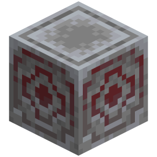

# Stationary Chunk Loader

> **TL;DR** — A craftable Chunk Anchor block that, while it receives a redstone signal, keeps its own
> chunk (and optionally a ring of chunks around it) loaded and ticking with no player nearby.

<!-- vpa:meta:start -->
|  |  |
|---|---|
| **Module ID** | `stationary_chunk_loader` |
| **Side** | Client + Server |
| **Requires** | — |
| **Works with** | [Create](https://modrinth.com/mod/create) <sub>tested 6.0.10</sub>, [Create Aeronautics](https://modrinth.com/mod/create-aeronautics) |
| **Download** | [`vpa_stationary_chunk_loader.jar`](https://github.com/GeraldHofbauerWeb/vanillaplusadditions/releases/latest/download/vpa_stationary_chunk_loader.jar) · also needs `vpa_core`, `vpa_debug_overlay` |
| **Config section** | `[modules.stationary_chunk_loader]` |
| **Since** | `v1.0.0-beta.22` |
<!-- vpa:meta:end -->

## What it does

A **Chunk Anchor** block that force-loads its chunk (plus a configurable radius) while
redstone-powered — for redstone clocks and Create contraptions that must keep running in unloaded
chunks. Vanilla's own answer to that problem is `/forceload`, an operator command holding a list of
chunk coordinates; this is a block you craft, place in the machine room and wire into the same lever
that switches the machine.

<table>
<tr>
<td width="110" align="center"></td>
<td width="110" align="center"></td>
</tr>
<tr>
<td align="center">powered — loading</td>
<td align="center">no signal — idle</td>
</tr>
</table>

**The redstone signal is not optional.** An anchor with no signal is an ordinary decorative block: it
loads nothing, and its position never enters the module's list of anchors — the chunk-loading
machinery never hears about it. Any vanilla-style signal does — a lever, a comparator, a Create
Redstone Link receiver — because the block only ever asks `level.hasNeighborSignal(pos)`.

The second condition is easy to miss: by default the whole system only runs **while at least one
player is online**, anywhere on the server. Log off for the night and every anchor in every dimension
pauses; the first player to join starts them all again. That is the `only_while_players_online`
switch, and it is on by default.

This is the fixed counterpart to the [loader rail](minecart_chunk_loading.md), which loads chunks
transiently around a travelling minecart. For a contraption that does not move, the anchor is the
simpler answer: no cart, no timeout.

## In detail

### Two switches, and both have to be on

| Switch | Scope | Default | Checked |
|---|---|---|---|
| Redstone `POWERED` | per block | off (unless placed into an existing signal) | at placement and on every neighbour update |
| `only_while_players_online` | the whole server | `true` | every server tick |

The player gate is deliberately blunt: it counts players on the server
(`server.getPlayerList().getPlayerCount() > 0`) and asks nothing about dimensions or distance. An
anchor in the Nether keeps loading while its owner is in the Overworld, and stops when the last
person leaves the server. Set the key to `false` and the anchors run on an empty server as well —
which is the point for an overnight farm, and the reason the key exists. On a dedicated server that
is the whole story; in single-player the same key has a sting in the tail, which the limits table
below spells out.

### The radius counts chunks, not blocks

`chunk_load_radius` is a Chebyshev radius in chunks around the anchor's own chunk, so an anchor
forces a (2R+1)×(2R+1) square:

| `chunk_load_radius` | Chunks forced per anchor |
|---|---|
| `0` (default) | 1 — the anchor's own chunk |
| `1` | 9 (3×3) |
| `2` | 25 (5×5) |
| `8` (maximum) | 289 (17×17) |

The default of 0 is the honest one and also the trap: a contraption that straddles a chunk border is
half outside the anchored area. Either raise the radius or place a second anchor on the other side —
two anchors cost two chunk tickets, a radius of 1 costs nine.

The chunks are forced **ticking**, not merely held in memory: the call is
`controller.forceChunk(level, anchorPos, x, z, true, true)`, with the ticking flag set, so block
entities and redstone in them keep running.

### Changing the radius does not resize a running anchor

The radius is read at the moment an anchor is forced and then kept in the anchor's own set of chunk
positions; both `addAnchor` and `resume` skip an anchor that is already in the in-memory map. Editing
the config while the server runs therefore changes nothing that is already loaded. The new value
takes effect on the next release/resume cycle, of which there are three:

* the last player leaves and someone rejoins (with the default player gate),
* the server restarts,
* the anchor loses its redstone signal and gets it back.

### Pause, resume and restart

No chunk ticket is trusted across a world load. NeoForge would reinstate the ones it persisted, but
the module registers its ticket controller with a validation callback that **drops every block ticket
it owns whenever a world loads**, and rebuilds the whole set from persistent data instead:

```java
(level, helper) -> new ArrayList<>(helper.getBlockTickets().keySet())
        .forEach(owner -> helper.removeAllTickets(owner));
```

What persists is a plain set of anchor positions per dimension, stored as packed `BlockPos` longs in
the `vanillaplusadditions_chunk_anchor` saved data. `resume` walks that set and re-forces each entry;
`releaseAll` drops the tickets when the last player leaves but keeps the set, so the pause is
reversible. A powered anchor is written to the set even while force-loading is paused.

### Nothing checks whether the anchor is still there

`resume` re-forces every stored position without looking at the block that stands there. Entries
leave the set through one path only: the block reporting itself inactive, which it does when its
signal drops or when it is broken. An anchor that disappears without a block update — an external
world editor, or the block becoming unknown because the module was switched off — leaves its position
in the file, and those chunks are force-loaded again on every resume. The module registers no command,
so there is no in-game way to list or clear them; the manual fix is deleting
`data/vanillaplusadditions_chunk_anchor.dat` in that dimension's folder while the server is down.

### The border overlay

With the [Debug Overlay](debug_overlay.md) switched on — goggles worn, numpad&nbsp;+ pressed —
every Chunk Anchor within 8 chunks draws the area it forces as a box: **green** while it is powered,
**grey** while it has no signal. The box is 24 blocks tall above and below the anchor rather than a
full chunk column, which keeps it readable indoors.

Three caveats. The box is drawn from the **client's** `chunk_load_radius`, and the config is not synced —
on a server whose value differs, the drawn square is the wrong size and the server's value is the one
that counts. The search behind it is brute force: every 20 ticks it walks all non-air sections of
a 17×17 chunk area block by block — up to some 28 million block-state reads, once a second. It only
runs while the overlay is actually on, but it is not free. And the renderer keeps both its last scan
time and its last result across a world change, so joining a world whose game time is lower than that
of the one you left leaves the old world's boxes on screen until the new clock passes that timestamp.

## Items, blocks and recipes

| | Block | Details |
|---|---|---|
|  | **Chunk Anchor** | Cyan map colour, metal sounds, hardness 3.0 / blast resistance 6.0, **no tool required** — it breaks by hand, slowly. Lodestone top and sides; the powered model swaps the side texture for one with a dark red core. No block entity, no comparator output, no light, no GUI; `powered` is its only blockstate property. |

Breaking it always returns exactly one Chunk Anchor. That is a `getDrops` override rather than a loot
table, so no tool, Silk Touch or Fortune condition applies to it.

**Recipe** — shaped, category *misc*: four iron ingots and four ender pearls ringing one eye of ender.

```
 I P I        I = Iron Ingot
 P Y P        P = Ender Pearl     →  Chunk Anchor
 I P I        Y = Eye of Ender
```

Like every recipe in this mod it is registered in code on `AddReloadListenerEvent`, not as a datapack
JSON — see the [Custom Crafting Recipes module](custom_crafting_recipes.md) for the reasoning. The
injection is gated on the module being enabled, so turning the module off makes the anchor
uncraftable at the next datapack reload.

<!-- vpa:config:start -->
## Configuration

Section `[modules.stationary_chunk_loader]` in `config/vanillaplusadditions-common.toml` (or `config/vpa_stationary_chunk_loader-common.toml` if you run the standalone jar).

Every module also has the universal `enabled` and `debug_logging` keys — see the [Configuration Guide](../guides/configuration.md).

| Key | Type | Default | Range | Effect |
|---|---|---|---|---|
| `chunk_load_radius` | int | `0` | 0 ~ 8 | Chunk radius (Chebyshev) force-loaded around a Chunk Anchor; 0 = only the anchor's own chunk, 1 = a 3x3 area, 2 = a 5x5 area, higher = more chunks kept loaded and ticking (more server load). Read when an anchor is forced and on resume (StationaryChunkLoaderModule.java:140,168; StationaryChunkLoaderManager.java:56-70). StationaryChunkLoaderConfig.java:19-23. |
| `only_while_players_online` | boolean | `true` | — | Only keep anchor chunks loaded while at least one player is online; anchors pause when the last player leaves and are re-forced on server start / first join (false = keep loading with nobody online). Evaluated every server tick at StationaryChunkLoaderModule.java:130-150. StationaryChunkLoaderConfig.java:25-30. |
<!-- vpa:config:end -->

## Compatibility and known limits

| Limit | Effect |
|---|---|
| No redstone signal | The anchor does nothing at all and its position never enters the saved anchor set. Its own module javadoc says "permanently keeps the chunk it stands in (plus a configurable radius) loaded" and forgets to mention the signal, and the README does not mention it either; the block's javadoc spells it out, as do the manager's and the border renderer's. The module-level description omits it, and `ChunkAnchorData`'s javadoc goes further and contradicts it, claiming an anchor "keeps its chunk loaded until the block is broken" when losing the signal releases it too. |
| Empty server | With the default `only_while_players_online = true`, every anchor pauses when the last player logs out. Overnight production needs `false`. |
| `only_while_players_online = false` in single-player | The gate is a plain field on the module object, and that object lives as long as the game process does. With the key off the gate is permanently on, so the transition that calls `resume` can fire only once per launch: open another world — or the same one again — without quitting the game and its stored anchors are never re-forced, until each one is unpowered and powered again. Only restarting the game clears the flag; a dedicated server starts a fresh process with the world and is unaffected. |
| `chunk_load_radius` edited at runtime | Anchors already loading keep the radius they were forced with. Needs a release/resume cycle — see above. |
| A stale entry in the saved data | Force-loads chunks forever, invisibly. No command lists or clears them; the file has to be removed by hand. |
| Turning the module off | Block *and* item are only registered for an enabled module, so a world built with anchors meets unknown block ids on the next load. Use redstone to switch an anchor off, not the config. |
| Two anchors with overlapping areas | Each anchor owns its own tickets (the owner is the anchor's block position), so switching one off releases only its own chunks; the overlap stays loaded for the other one. |
| The overlay without `debug_overlay` | The border renderer plugs into that module's framework, which is why the standalone jar hard-requires `vpa_debug_overlay`. The force-loading itself never touches it. |
| The overlay without Create | The goggles check falls back to the `vanillaplusadditions:arm_goggles` item tag on the head slot (Create: Aeronautics' aviator's goggles), and in a standalone install that tag ships only with `vpa_arm_target_overlay`. Chunk loading is unaffected — this module holds no Create reference and no compile dependency on it. |
| A dimension unloading | In-memory tracking for that level is dropped without releasing. The tickets themselves were persisted by NeoForge in the level's own forced-chunk data and are handed back when the level loads again — where the validation callback above drops them. The saved anchor set is untouched, but nothing re-forces it at load time: the module has no `LevelEvent.Load` handler, so a dimension that comes back mid-session stays unanchored until the next player-gate transition or a server restart. |
| A ticking ticket is not a player | The module asks the chunk system to load and tick an area. Whatever a given farm needs beyond that is outside its reach. <!-- TODO: exactly which vanilla systems (mob spawning, spawn-eligibility) a forced ticking chunk does and does not cover cannot be proven from this repository --> |
| Bundle vs. standalone | The jar is `vpa_stationary_chunk_loader` ("Vanilla Plus: Chunk Anchor") and needs `vpa_core` **and** `vpa_debug_overlay`; it is declared incompatible with the all-in-one bundle, where `debug_overlay` sits in the same jar anyway. |

## Under the hood

No mixins, no commands, no keybinds of its own, no network payloads, no block entity. The module
registers itself on the game bus with `NeoForge.EVENT_BUS.register(this)` in `onInitialize`.

| Event | Bus | Purpose |
|---|---|---|
| `RegisterTicketControllersEvent` | mod | Registers the `vanillaplusadditions:stationary_chunk_loader` ticket controller with the drop-everything-on-load callback, and hands it to the manager |
| `ServerTickEvent.Post` | game | The player gate: `resume` on the transition into "loading", `releaseAll` on the transition out. Gated on `isModuleEnabled()` |
| `LevelEvent.Unload` | game | Drops in-memory tracking for that `ServerLevel`. The one handler that does *not* re-check `isModuleEnabled()` |
| `AddReloadListenerEvent` | game | Adds `vanillaplusadditions_chunk_anchor_recipe`. Gated on `isModuleEnabled()` |
| `RenderLevelStageEvent` (`AFTER_TRANSLUCENT_BLOCKS`), `ClientTickEvent.Post` | game, client | Not subscribed here — `debug_overlay`'s dispatcher calls the renderer this module registers in `onClientSetup` |

The block is the other entry point. It calls the module's two static callbacks itself, from
`onPlace` (placed into an existing signal), `neighborChanged` (the signal flipped) and `onRemove`
(broken or replaced), so nothing polls block states server-side.

| Class | Role |
|---|---|
| `modules/stationary_chunk_loader/StationaryChunkLoaderModule` | Registration, ticket controller, player gate, the two block callbacks, the recipe listener |
| `.../StationaryChunkLoaderManager` | Which anchor forces which chunks, per level; `addAnchor` / `removeAnchor` / `resume` / `releaseAll` |
| `.../ChunkAnchorData` | The `SavedData` set of anchor positions, one per dimension |
| `.../block/ChunkAnchorBlock` | `POWERED`, the three transitions, the `getDrops` override |
| `.../client/AnchorBorderRenderer` | The green/grey box, plus the palette scan that finds anchors |
| `.../config/StationaryChunkLoaderConfig` | The two keys |
| `standalone/stationary_chunk_loader/StationaryChunkLoaderStandalone` | `@Mod("vpa_stationary_chunk_loader")` entry point |

**The asymmetric enable check.** `onAnchorActive` returns early for a disabled module,
`onAnchorInactive` does not. Harmless in practice: a disabled module never registers the block, so
there is nothing to report inactive.

**The state is never re-derived.** `POWERED` is read at placement and on neighbour updates and
nowhere else. An anchor whose surroundings changed without a block update keeps whatever state it
had, and the persisted set follows the block state, not the world.

**Recipe injection.** The reload listener copies the whole recipe map into a `LinkedHashMap`, adds
`vanillaplusadditions:chunk_anchor` and calls `RecipeManager.replaceRecipes` — a full replace, once
per datapack reload. Several modules stack this same pattern.

**Assets and lang.** The module ships no data files at all: two block models, one blockstate, one
item model, one texture and a single lang key (`block.vanillaplusadditions.chunk_anchor`), all of
which live in `vpa_core` for a standalone install. The block's javadoc promises the active state
"shows a red glowing centre" — the red is real, the glow is not: the powered model is a plain
`cube_bottom_top` with no emissive flag, and the block sets no light level.

**Two more stale comments.** `StationaryChunkLoaderManager.forgetLevel` says the tickets "vanish with
the level" — they do not; NeoForge has already written them into the level's own forced-chunk data,
and it is the module's own validation callback that removes them at the next load. And
`ChunkAnchorData`'s javadoc says an anchor "keeps its chunk loaded until the block is broken" — it
also stops the moment the redstone signal drops.

**Testing.** This repository has no unit tests, and nothing here records a runtime test of this
module. Its whole directory was written in one commit and never touched again.

## See also

* [Minecart Chunk Loading](minecart_chunk_loading.md) — the same idea around a travelling cart
* [Train Chunk Loading](train_chunk_loading.md) — and around a Create train
* [Debug Overlay](debug_overlay.md) — the goggles-and-numpad-+ switch the anchor boxes hang on
* [Custom Crafting Recipes](custom_crafting_recipes.md) — why recipes are built in code here
* [Configuration Guide](../guides/configuration.md) — where the config file lives
* [All modules](../../README.md#-modules)
